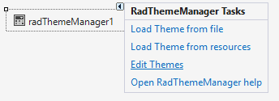
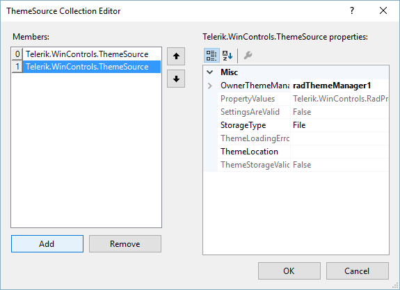

# Add Remove Theme Files

>important RadThemeManager cannot load the theme if it is saved as package (tssp file). This is shown in the following article: [using custom themes](https://docs.telerik.com/devtools/winforms/styling-and-appearance/using-custom-themes)
To edit the list of themes loaded into a Theme Manager, follow these steps:

1. Select the RadThemeManager control, and then open its __Smart Tag__ menu. 

    

1. Select __Edit Themes__ to open the __ThemeSource Collection Editor__.

    

1. Click __OK__ when you are finished working in the editor.

## To Add a New Theme to the Theme Manager

1. Click __Add__.

1. Choose the __StorageType__ for the theme. Select __Resource__ or __File__.

1. Set the __ThemeLocation__ (resource name or file location).

## To Remove a Theme from the Resource Manager

1. Select the theme that you wish to remove.

1. Click __Remove__.

## To Change the Properties for an Existing Theme

1. Select the theme that you wish to edit.

1. Set the __StorageType__ and __ThemeLocation__ properties to your desired values. 

>caution When setting the __ThemeLocation__ for a __Resource__ storage type be sure to include the project namespace. The naming convention for ThemeManager to find the resource is \<my project namespace\>.\<theme name\>.xml. In project "MyProject" with theme resource file "MyTheme.xml", the fully qualified resource name should be entered as "MyProject.MyTheme.XML".
>

# See Also
* [Adding RadThemeManager to a Form]()

* [Applying a Theme to a Control]()

* [Load Themes from a Resource]()

* [Load Themes from an External File]()

