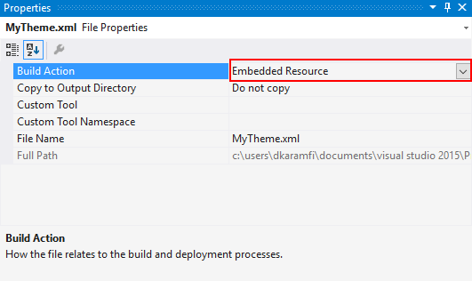
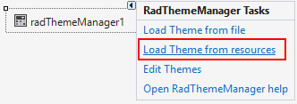

# Load Themes from a Resource

>important RadThemeManager cannot load the theme if it is saved as package (tssp file). This is shown in the following article: [using custom themes]()

To load a theme from a resource into a Theme Manager, follow these steps:

1. Add a __RadThemeManager__ control to your form.

1. Add the XML file containing the theme to your Microsoft Visual Studio project.

1. In the Properties window for the XML file, set the __Build Action__ to __Embedded Resource__.

    

1. Select the RadThemeManager control and open its Smart Tag menu.
          

1. Select the __Load Theme From Resources task__.  

    

1. Enter your theme's name in the __Load Theme__ dialog box, and then click __OK__.
    

1. Using the same approach, load the  __theme repository file__ and all other theme files that you need.

>important If the form with the theme manager will be opened multiple time in the life cycle of the application, the theme manager needs to be diposed explicitly. A suitable place to call its Dispose method is the Closing event of the form.
>

# See Also
* [Adding RadThemeManager to a Form]()

* [Applying a Theme to a Control]()

* [Add Remove Theme Files]()

* [Load Themes from an External File]()
