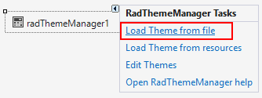
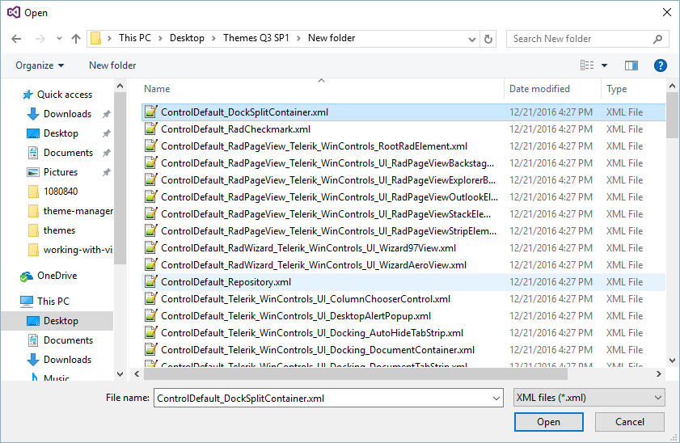

# Load Themes from an External File

>important RadThemeManager cannot load the theme if it is saved as package (tssp file). This is shown in the following article: [using custom themes]()

## 

|RELATED VIDEOS||
|----|----|
|[Changing Themes at Run Time with Telerik UI for WinForms](http://tv.telerik.com/watch/winforms/visualstylebuilder/changing-themes-at-run-time-with-radcontrols-winforms) In this video, you will learn how to give your users the ability to choose between Telerik themes and custom themes at run time. (Runtime: 08:42)||

To load a theme from an external file into a Theme Manager, follow these steps:
        

1. Add a RadThemeManager control to your form.

1. Select the RadThemeManager control, and then open its __Smart Tag__ menu.

    

1. Select __Load Theme From File__.
            

1. Find your theme in the __Open File__ dialog box, and then click __Open__. 

    

>caution It is up to you to choose a theme that makes sense for the controls on the form that you are customizing. Theme Manager does not check the theme to make sure that its customizations apply to the controls currently on the form.
>

# See Also
* [Adding RadThemeManager to a Form]()

* [Applying a Theme to a Control]()

* [Add Remove Theme Files]()

* [Load Themes from a Resource]()

