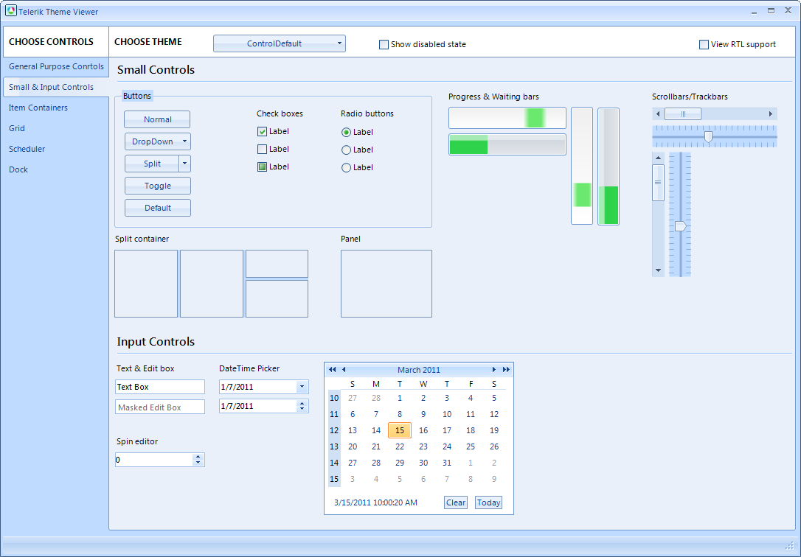
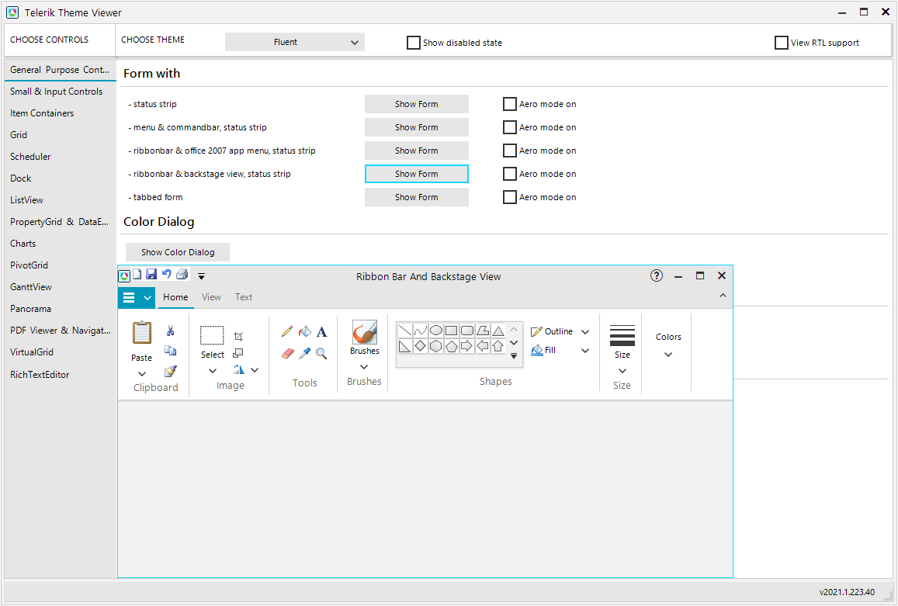
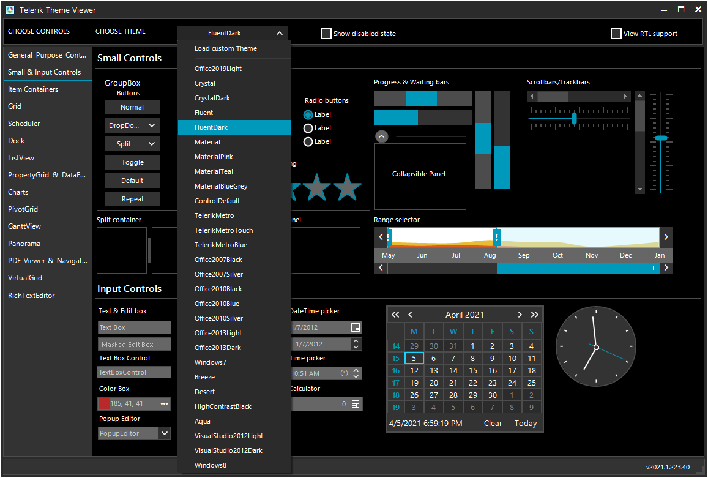

# ThemeViewer

ThemeViewer is a tool that gives you the ability to preview a custom or a predefined theme for all controls of the suite.

The controls are placed on different pages which can be selected from the left panel and some controls are placed on separate forms in order to be displayed correctly.

Switching between the different themes and loading custom themes is available from the drop down button on the top of the form:

Additionally, you have the opportunity to change a variety of settings that concern the theming of the controls, such as RightToLeft, Disabled and Aero mode.
