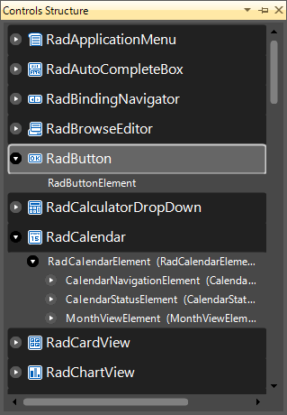
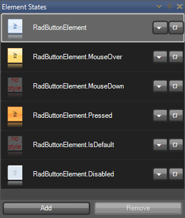
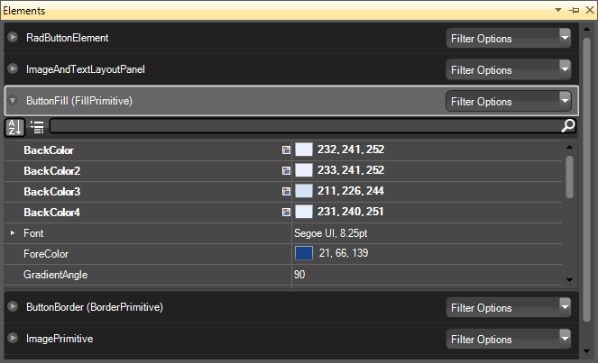
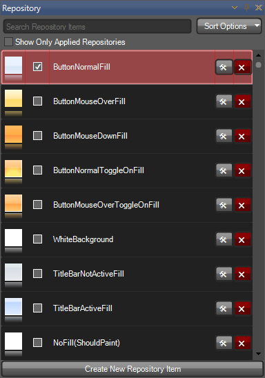
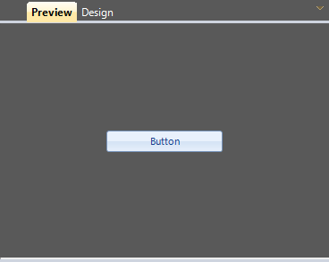

# Architecture

## Anatomy of Visual Style Builder

Visual Style Builder is an end-user application that allows for fast and intuitive styling of all controls in the Windows Forms suite. Application is divided into the following major parts:

## Control Metadata Tree

## Element States

This part lists all the VisualStates, visible as defined by the associated
StateManager, for the currently selected metadata in the Metadata Tree.

## Elements Grid

This part contains all the ElementMetadata instances, associated with an
ItemMetadata. These are definitions for all the elements that may be styled. As
seen from the screen, this list contains definition for the RadButtonElement
itself as well as for its primitive children that do not have own StateManager.
An embedded PropertyGrid allows for editing of properties directly in the grid
itself.

## Repository

This part lists all the repository items available for the currently edited
theme. Items are filtered by the type of the currently selected element in the
Elements Grid – for example if a FillPrimitive is selected the only Fill
repository items are listed.

## Preview/Design View

This part displays an instance of the currently selected control in the
metadata tree. Two different views are supplied – Preview and Design – where
the preview one simply hosts the control while the design one adds extended
functionality over the hosted control.

## Visual Style Builder Selection Path

Selection in Control Metadata Tree, Element States and Elements Grid
completely defines all the conditions needed for an element to be styled. We
have the selected item, its state and the actual element instance that will
have the style settings applied. All operations in the Visual Style Builder are related to its current selection path.
