# Getting Started

## Overview

The purpose of this article is to introduce Telerik WinForms Visual Style Builder by describing the process of creating a simple theme for the RadButton control. This article emphasizes on all tricky moments that might occur while using the Visual Style Builder and explains them so that the user does not experience any issues when theming controls. The tutorial begins with the creation of all needed repository items for styling a RadButton control and after that shows how to apply them.

## Creating a new Theme

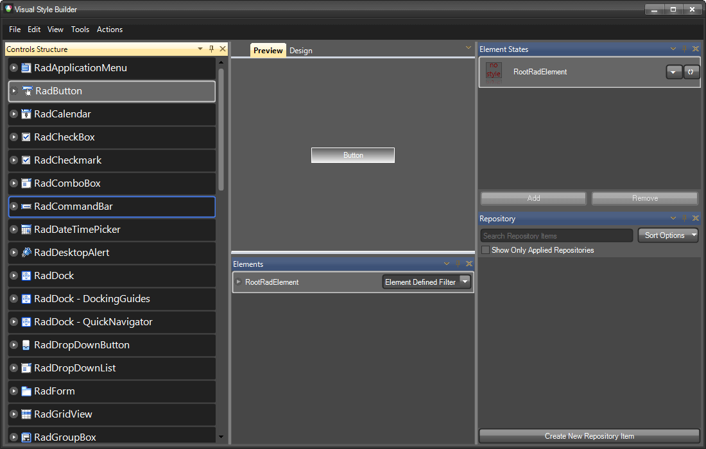

Below the Preview part of the form you can see the Elements Grid which displays the currently available elements for the current tree view selection that can be styled. In general, these are the elements which, once styled, sum up to the final appearance of the corresponding control. On the image above you can see the RootRadElement currently displayed. When selecting a control from the tree view on the left, normally its root element is displayed in the elements grid. You can use this element to apply common styles for the whole control that are inherited throughout the element hierarchy (the hierarchy that begins from the RootRadElement) like Font, ForeColor etc.

To apply a style to the RootRadElement you can choose two approaches:

* Creating a new repository item and applying it

* Directly modifying the RootRadElement’s properties from the property grid

In this article we are going to demonstrate how to create and apply a repository item that defines the ForeColor and the Font of the button.

## Creating a new Repository Item

>note For more information on repository items, check the [Theme Repository]() topic.
>

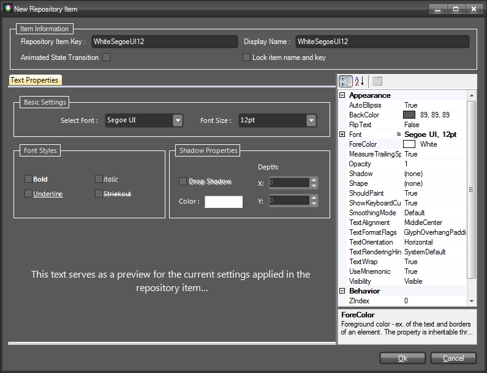

This is the Text Repository Item editor dialog. As discussed in the Theme Repository article, each repository item has a unique key and a display name. You can edit these properties by using the corresponding text boxes at the upper part of the form. In this demonstration, the repository item is called ‘WhiteSegoeUI12’. Its key is given the same value.

>tip Note: It is important to give your repository items clear and straightforward names related either to their appearance, or to the cases they are used in. Good repository item names might be:
* PressedButtonFill
* OrangeLinearFill
* TransparentFill
>

In this way you will be able to quickly associate the repository item with the appearance it will give to the element or the case it is used in (pressed/hovered button etc.). In our case, the name of the Repository Item is ‘WhiteSegoeUI12’ and, obviously, it describes the settings contained in this item:

* Font is set to Segoe UI with size 12

* ForeColor is set to White 

Note that the property grid on the right shows these properties in bold style which means that their values are explicitly defined in the repository item. Only the explicitly defined values are applied to an element when later associated with the corresponding repository item.

After finishing editing the repository item, you should click on the OK button. The dialog will be closed and the new repository item will be visible in the repository tool window of the main form:

Now, we are going to create a few repository items that will define the styles for the button’s background for its different states. To do this, expand the RadButton node in the tree view on the left and select the RadButtonElement child node. By changing the selection in the tree view, the content of the Elements grid will also be changed with the corresponding elements that can be styled. You will see the most important elements that build the button as shown in the picture below:

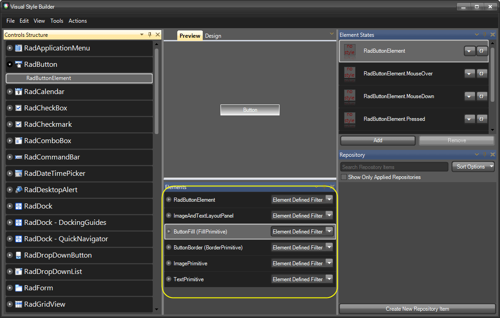

Having selected the ButtonFill element in the Elements grid, click on the "Create New Repository Item" button. You will see the Fill Repository Item Editor Dialog that allows you to create different styles of fills. In this dialog, select the "Office Glass Rect" tab and from the combo box with predefined styles, choose *Orange*. The dialog should look the following way:

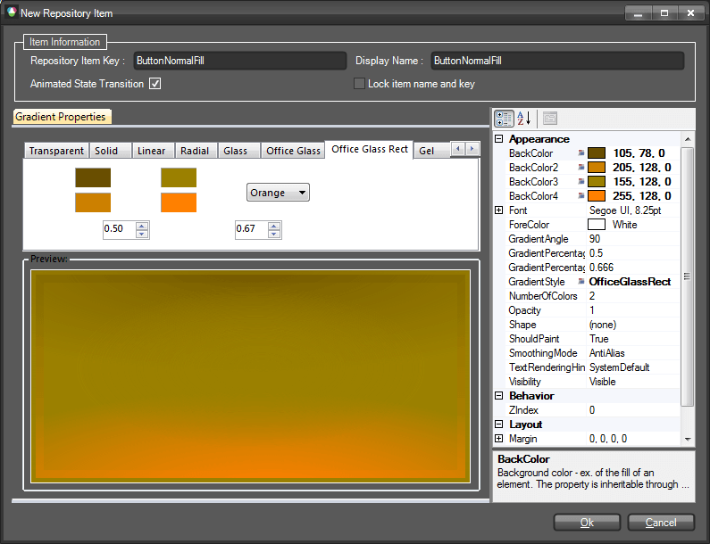

Give the repository item a key and a name as follows: `ButtonNormalFill`, `ButtonNormalFill`, and check the "Animated State Transition" checkbox to enable animated style transition for this repository item. Save the repository item by clicking OK and click on the "Create New Repository Item" button again. By following the same steps described above, crate another two fill repository items with office glass rect style and colors as follows: yellow and red. Name them `ButtonHoverFill ` and `ButtonPressedFill`. The repository should look as follows after creating all items:

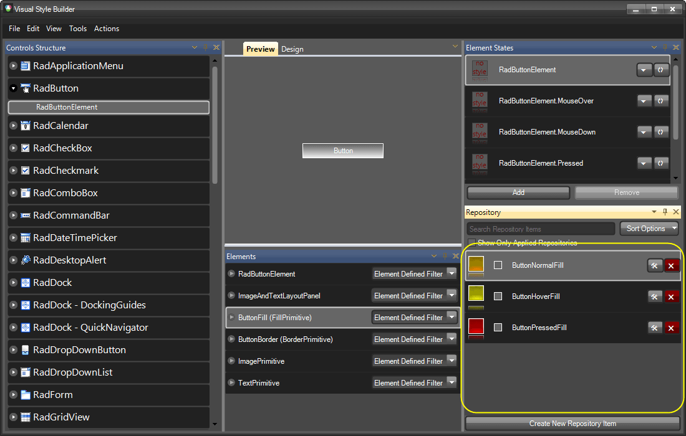

Now we are going to create a few border repository items which we are going to use later for styling the button. To do this, select the ButtonBorder element in the Elements grid and click on the "Create New Repository Item" button to display the "Border Repository Item Editor" dialog. In the dialog, give a key and a name for the repository item as follows: `ButtonNormalBorder`, `ButtonNormalBorder`. Set the __ForeColor__ property to *Orange* and also the Width property to 2. The dialog should look as follows:

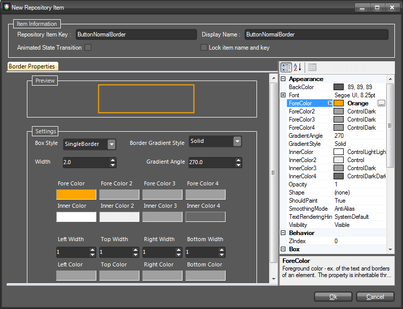

Make sure the "Animated State Transition" checkbox is checked and save the new repository item by clicking OK. The repository item will be created and added to the current repository. Now repeat the same steps to create two more repository items with the following colors: yellow and red. For the yellow repository item define key and name as follows: `ButtonHoverBorder`, `ButtonHoverBorder`, and for the red item define key and name as follows: `ButtonPressedBorder`, `ButtonPressedBorder`. The repository tool window should look the following way after adding the new items:

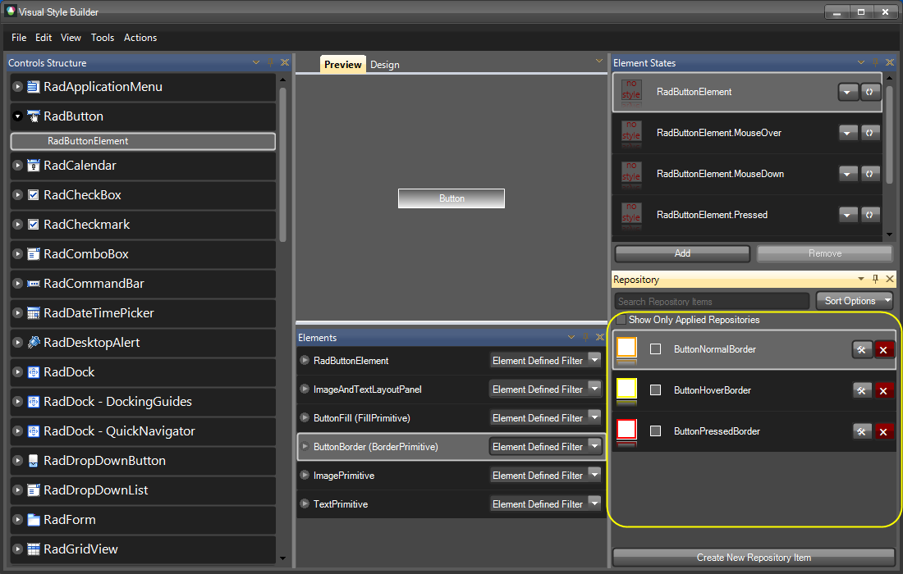

Now that we have created all the repository items needed to style our button, we are going to associate them with the corresponding elements for the corresponding states of the button (normal, mouseover, pressed).

We will start with the RootRadElement and will associate the SegoeUI12White repository item with its default. To do so, select the RadButton node in the tree view on the left, find the SegoeUI12White repository item, drag it and drop it on the RootRadElement state shown in the Element States tool window. The repository item style will be applied to the RootRadElement for its default state, and the repository item will be highlighted in red to notify that the item is associated with the selected state as shown on the picture below:

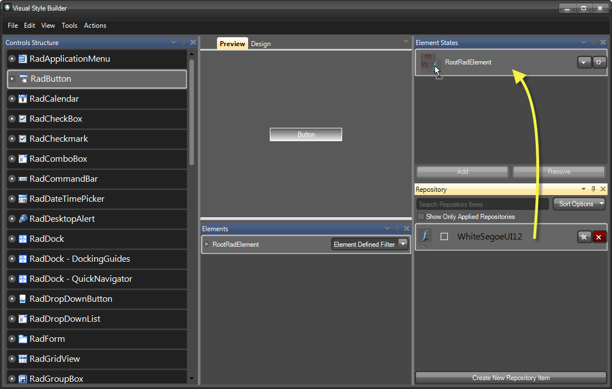

As you can see on the picture, the button has acquired the Segoe UI 12 font and a white forecolor. Now, we are going to style the background of the button for its Normal, MouseOver and Pressed states. To do so, select the RadButtonElement child node of the RadButton node in the tree view on the left. In the Elements grid below the Preview pane make sure the ButtonFill element is selected. Find the ButtonNormalFill repository item and by using drag-and-drop operation, associate it with the default - RadButtonElement –state of the button. You will see how the button changes its appearance to reflect the new styles applied from the associated repository item as shown on the picture below:

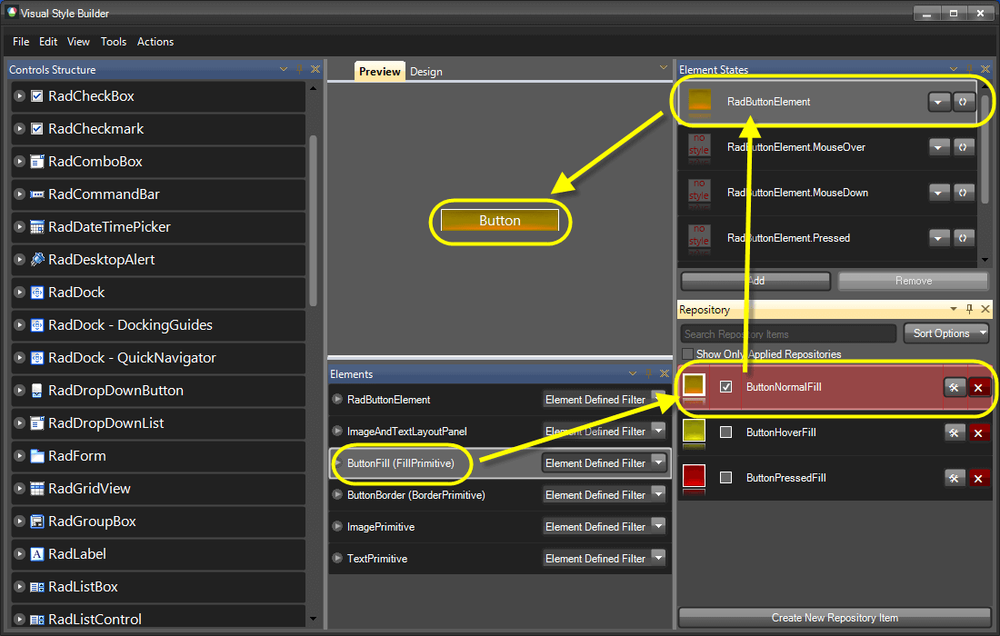

Repeat the steps above by associating the ButtonHoverFill item with the RadButtonElement.MouseOver state, and the ButtonPressedFill with the RadButtonElement.Pressed state. At the end the Visual Style Builder’s main form should look the following way:

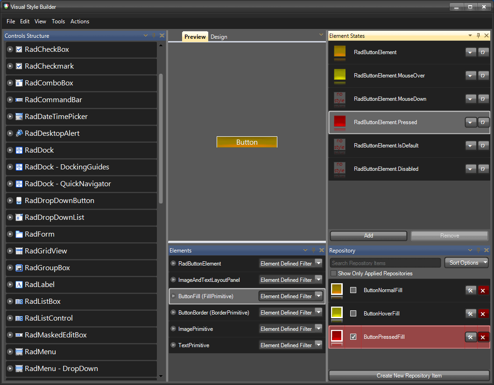

If you hover/press the button in the Preview pane, you will see how the different styles are applied for the corresponding states.

Now, we are going to associate the border repository items with the corresponding button states to achieve more accomplished look of the button. To do this, select the ButtonBorder element from the Elements grid: the border repository items will be displayed in the repository so that you can use them to style the button:

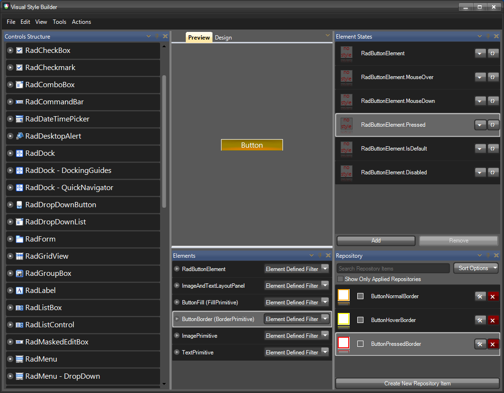

Now, by using the same approach demonstrated above, you can associate the repository items with the states of the button as follows:

* ButtonNormalBorder goes to the default RadButtonElement state

* ButtonHoverBorder goes to RadButtonElement.MouseOver state

* ButtonPressedBorder goes to RadButtonElement.Pressed state 

At the end, the Visual Style Builder main form should look the following way (the arrows demonstrate the repository item-state associations):

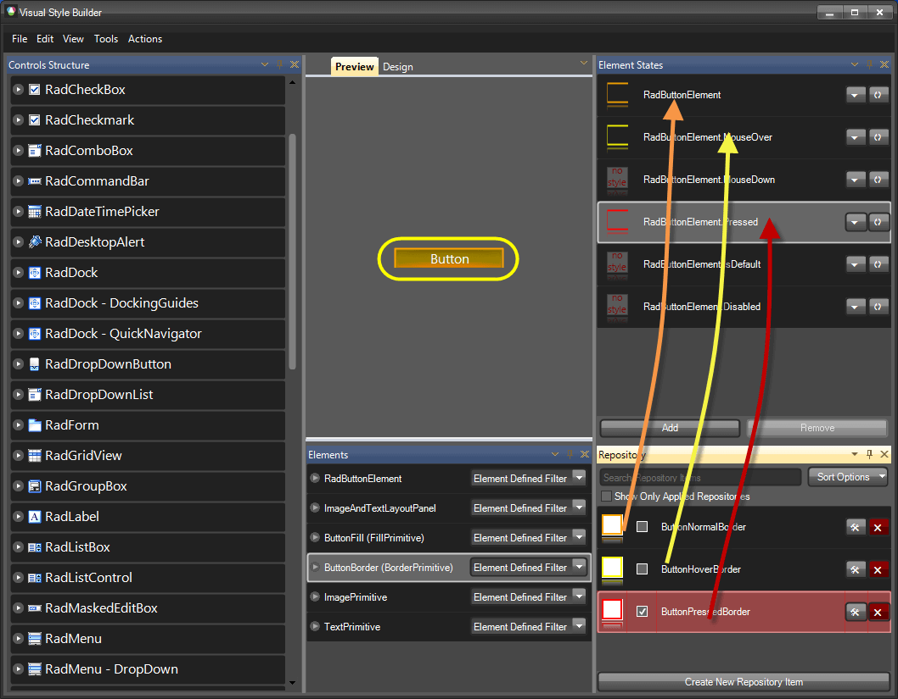

With this, you have finished styling the RadButton control. Now, you can save the theme and use it throughout your application. For further information on how to handle loading/saving themes, read the Handling Themes help article.

>caution It is important to know that styles applied for a given state are not reset when the item goes to another state. This might confuse those who are not familiar with this behavior.
__Scenario:__ We have a button with Normal, MouseOver and Pressed states. We also have a couple of repository items which we use to style the button for the different states. Let’s say that the first repository item we assign fill to the button for its Normal state, which sets its BackColor, BackColor2, BackColor3, GradientStyle  and NumberOfColors properties. The NumberOfColors property is set to 3 and the GradientStyle property is set to Linear. After associating the repository item to the Normal state of the button, the styles are applied correctly. Now, let’s say that we associate another repository item with the MouseOver state of the button that defines settings for the BackColor, BackColor2, BackColor3, BackColor4 properties, also for the GradientStyle (=Linear), but does not define setting for the NumberOfColors property. In this case, when we hover the button, the fill will not look as expected since its BackColor4 property value will not be visible. The reason for this will be that the NumberOfColors property will remain set to 3 as defined by the repository item assigned to the Normal state of the item.
__The main conclusion that we should make here is that each state must be assigned a style that defines all properties needed for the expected appearance of the element.__ This is the general approach when styling items in order to avoid confusion.
For more information see [Precedence Example: Visibility Property]() at the end of this tutorial.
>

| RELATED VIDEOS |  |
| ------ | ------ |
|[What's New in Visual Style Builder for R1 2010](http://tv.telerik.com/watch/winforms/visualstylebuilder/whats-new-visual-style-builder-q1-2010) In this video, you will learn about all of the incredible new features included with the R1 2010 version of Visual Style Builder. (Runtime: 15:13)||
|[Styling Basics with Visual Style Builder for WinForms](http://tv.telerik.com/watch/winforms/visualstylebuilder/styling-basics-with-visual-style-builder-winforms) In this video, you will learn how to create a basic theme using repositories in Visual Style Builder for WinForms. You will then learn how to use this theme in your Telerik UI for WinForms based applications. (Runtime: 09:12)||
|[Introduction to the Visual Style Builder for WinForms](http://tv.telerik.com/watch/winforms/visualstylebuilder/introduction-new-visual-style-builder-winforms) In this recorded webinar, you will learn how to build themes using the latest version of Visual Style Builder. You will also learn what Theme Repositories are and how they make creating themes easier. (Runtime: 42:56)||
|[Changing Themes at Run Time with Telerik UI for WinForms](http://tv.telerik.com/watch/winforms/visualstylebuilder/changing-themes-at-run-time-with-radcontrols-winforms) In this video, you will learn how to give your users the ability to choose between Telerik themes and custom themes at run time. (Runtime: 08:42)|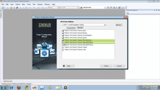|
