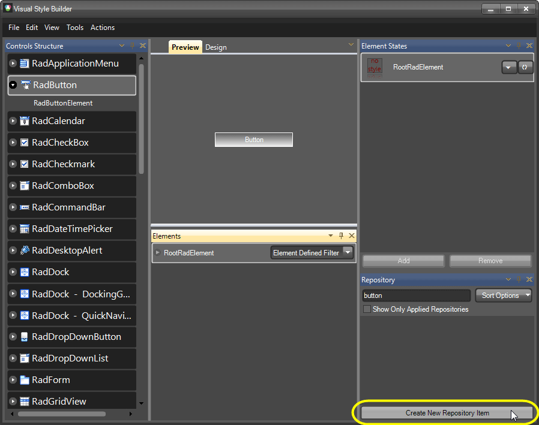
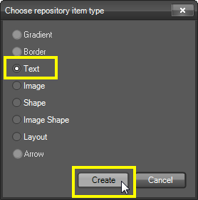
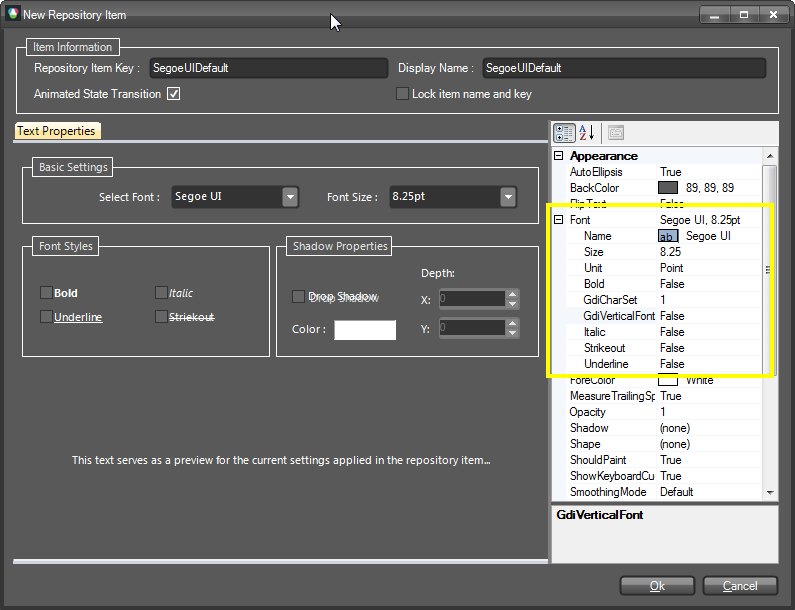
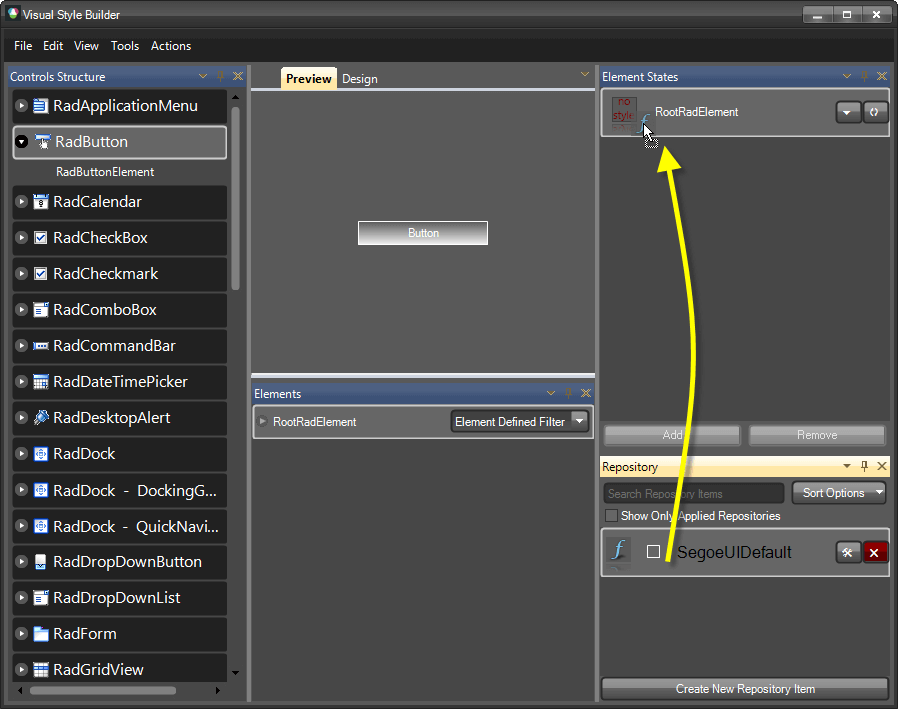
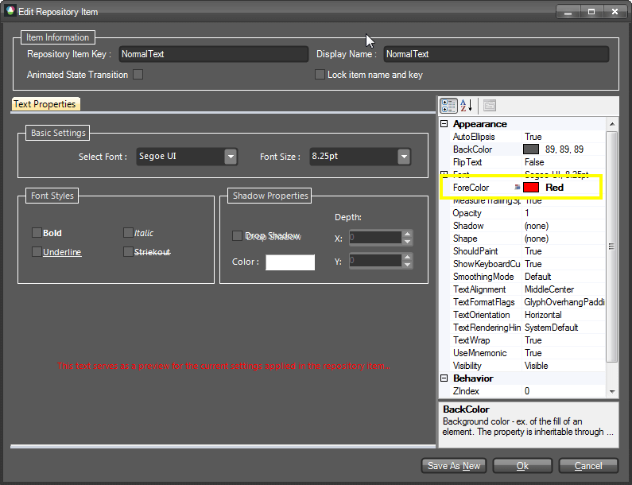

# Applying Font repository items

It is a good practice to create and drag Text repository items to RootRadElement. The [Font property is an ambient property](http://msdn.microsoft.com/en-us/library/system.windows.forms.control.font.aspx), so when you have many TextPrimitives in one control, setting the Text repository item to RootRadElement will set the desired font to all TextPrimitives. Please note that you should create additional Text items defining only the text color in the cases where the text should have different appearance across different states. Let' take a look at the following example:

Imagine that you have to create a theme for RadButton. The Font of the RadButton's TextPrimitive should be set by a Text repository item to RootRadElement while the colors of the RadButton's Text should be set by Text repository items set to the TextPrimitive:

1. Select RadButton from the Controls Structure window.

2. Select RootRadElement from the Elements window.

3. Press the Create New Repository Item button to create a new Text repository item.

    

4. Select Text and press the Create to create the new repository.

    

5. Set the Font property only.

    

6. Set the name of the Text repository item SegoeUIDefault and save it.

7. Apply the newly created Text repository item to the RootRadElement.

    

Next, we should create Text repository items defining only the ForeColor. These items will be called NormalText, MouseOverText and MouseDownText. This will allow us to have different text colors for the different states.

1. Select RadButton >> RadButtonElement from the Controls Structure window.

2. Select TextPrimitive from the Elements window.

3. Create NormalText, MouseOverText and MouseDownText Text repository items. Please note that you should set ForeColor only:

    

4. Drop the newly created repository items to the appropriate states:

    

As a result you get a RadButton with customized text. But what is the benefit of creating a separate Text repository item that sets only the Font? And why we should drop this Text item to RootRadElement?

1. A separate repository item which sets only the Font should be created, because if we decide to change the font of a TextPrimitive, we should do it only in one repository items (but not in three, for example NormalText, MouseOverText and MouseDownText).
2. In the cases where a control contains more than one TextPrimitive, setting a repository item at RootRadElement level will define to Font for all TextPrimitives, since the Font property is an ambient property.

# See Also
* [Color Blending]()

* [Loading Predefined Themes]()

* [Loading themes created with the old VSB]()

* [Precedence Example Visibility Property]()

* [Property Precedence Rules]()

* [Saving and Loading Theme Files]()
