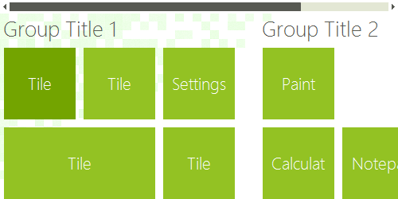
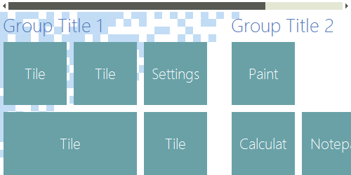
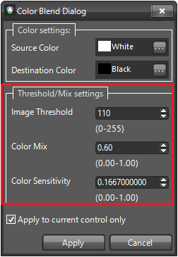

# Color Blending

## Overview

Visual Style Builder provides a color blending functionality making it easy to completely transform an existing theme. While preserving the overall look of the selected theme this feature allows you to define a new color, blend it with an existing one and at the end apply it to a single control or to all the controls from the suite. The pictures below show the result after modifying the __TelerikMetro__ theme.

|TelerikMetro before change | TelerikMetro after change|
|----|----|
||

>note In order to access the ColorBlendDialog, you should open Visual Style Builder, select the Tools menu item and click the Blend Color item.
>

## Color Settings

This group defines the colors to be blended.
        
>caption Fig.3 Color Settings

* __Source Color__: The color which is currently being used.
            

* __Destination Color__: Target color with which the source color is going to be blended.
            

## Threshold/Mix Settings

The items in this group specify how exactly the blending process will be performed.
        
>caption Fig.4 Threshold/Mix Settings

* __Image Threshold__: Blends the destination color to images used in the themes having the source color as background.
   

* __Color Mix__: Specifies the weight with which the destination color will be blended to the source color.
  

* __Color Sensitivity__: Defines a factor determining how colors different than the source and destination will be affected by the blending operation.
            
