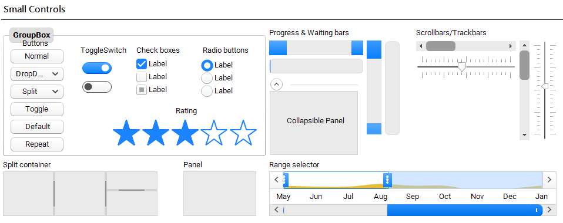
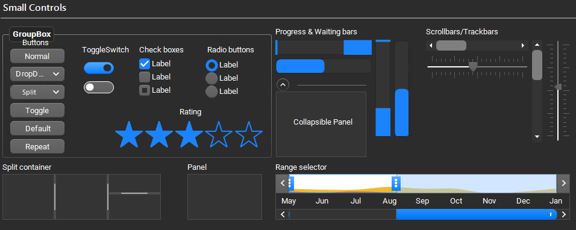
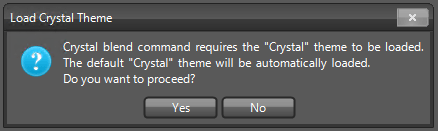
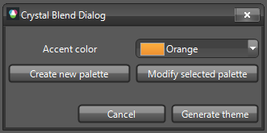
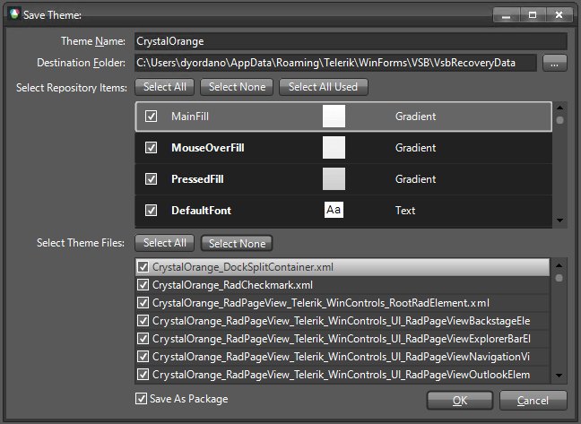
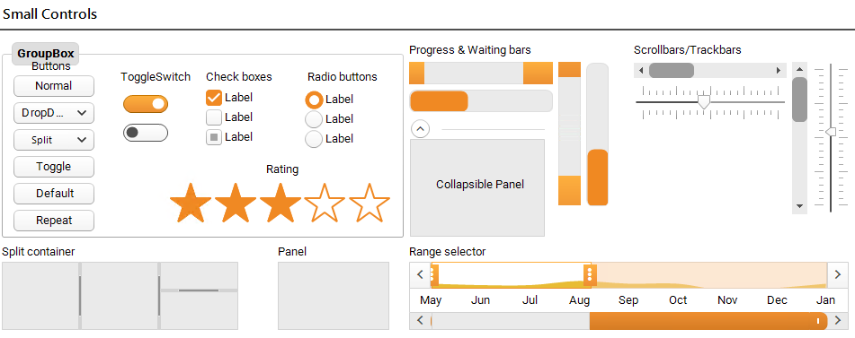
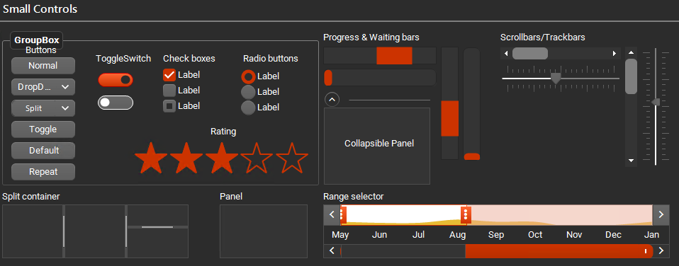

# Crystal Themes Blending

Telerik UI for WinForms suite offers optimized themes which provide additional features such as custom fonts, built-in animations, gradients and shadows. The Visual Style Builder tool provides a functionality to blend the colors of an existing theme so that a completely new theme can be created for couple of minutes. 

The Crystal themes as well as the Fluent and Material themes are designed to work with predefined set of colors - primary and accent for the Material themes, and entire palettes for the Crystal and Fluent themes. The tutorial here will demonstrate how a new Crystal theme can be created. The same steps can be also followed with the CrystalDark theme.

>caption Figure 1: Crystal Theme

>caption Figure 2: Crystal Dark Theme

## Generate Crystal Variation

[Visual Style Builder]() provides an easy way to generate different color variations of the **Crystal** and **CrystalDark** themes. Crystal theme blending uses the basic Crystal theme by executing a series of predefined commands. 

Select *Tools >> Generate Crystal Variation* menu item:

>caption Figure 3: Generate Crystal Variation

 

>note If you already have loaded a customized Crystal theme (but not a Crystal variation) it will remain loaded when generating a Crystal variation.
This will open the **Crystal Blend Dialog** from which you can create a new palette or modify the selected one.

>caption Figure 4: Crystal Blend Dialog

If you click the **Generate theme** button, a new variation of the Crystal theme will be exported using the selected colors.

>caption Figure 5: Save the Theme
 

After loading the custom theme in [Theme Viewer]() the primary/accent colors are replaced:

>caption Figure 6: Load CrystalOrange theme variation

>caption Figure 7: Load CrystalDarkGreen theme variation
  

# See Also

* [Color Blending]()
* [Material Theme Blending]()
