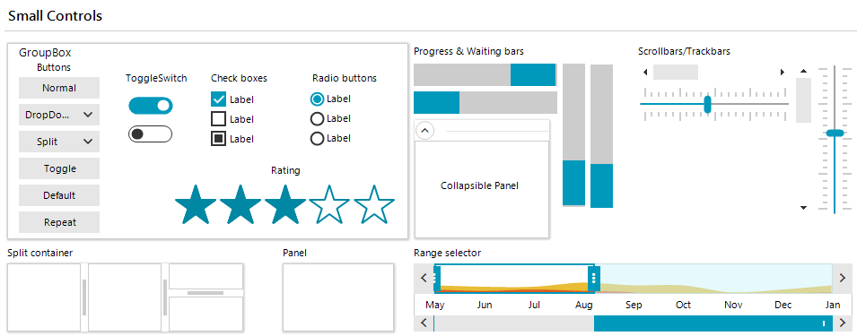
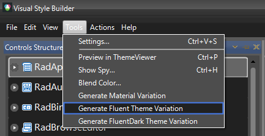
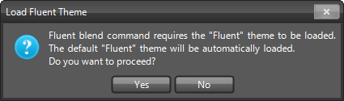
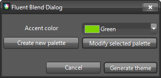
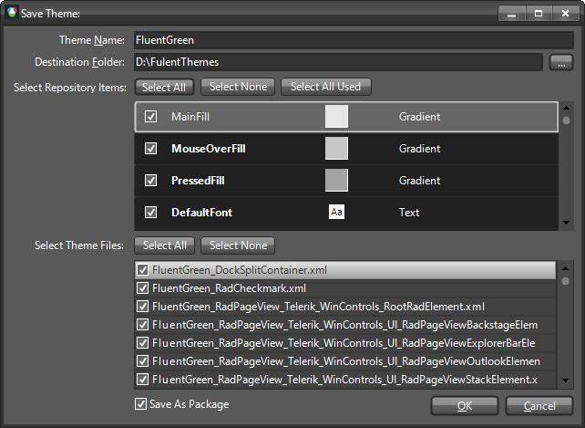
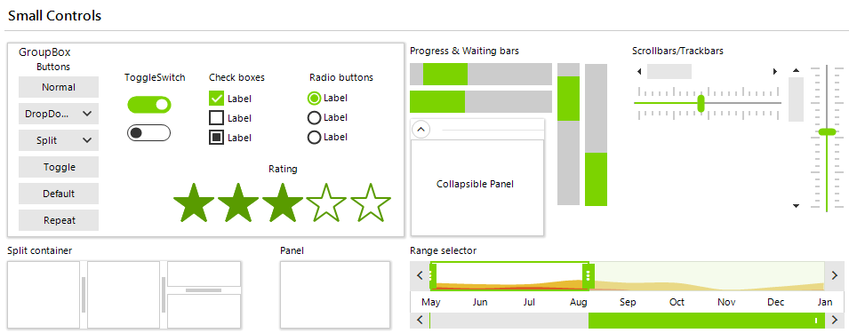
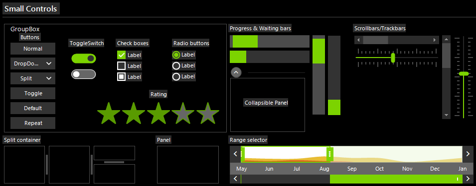

# Fluent Themes Blending

Telerik UI for WinForms suite offers a touch optimized theme which provides additional features such as custom fonts, built-in animations and shadows. The Visual Style Builder tool provides a functionality to blend the colors of an existing theme so that a completely new theme can be created for couple of minutes. 

The Fluent themes as well as the Material themes are designed to work with predefined set of colors - primary and accent for the Material themes, and entire palettes for the Fluent themes. The tutorial here will demonstrate how a new Fluent theme can be created. The same steps can be also followed with the FluentDark theme.

>caption Figure 1: Fluent Theme

>caption Figure 2: Fluent Dark Theme

## Generate Fluent Variation

[Visual Style Builder]() provides an easy way to generate different color variations of the **Fluent** and **FluentDark** themes. Fluent theme blending uses the basic Fluent theme by executing a series of predefined commands. 

Select *Tools >> Generate Fluent Variation* menu item:

>caption Figure 3: Generate Fluent Variation

 

>note If you already have loaded a customized Fluent theme (but not a Fluent variation) it will remain loaded when generating a Fluent variation.
This will open the **Fluent Blend Dialog** from which you can create a new palette or modify the selected one.

>caption Figure 4: Fluent Blend Dialog

If you click the **Generate theme** button, a new variation of the Fluent theme will be exported using the selected colors.

>caption Figure 5: Save the Theme
 

After loading the custom theme in [Theme Viewer]() the primary/accent colors are replaced:

>caption Figure 6: Load FluentGreen theme variation

>caption Figure 7: Load FluentDarkGreen theme variation
  

# See Also

* [Color Blending]()
* [Material Theme Blending]()
