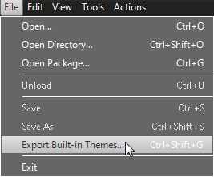
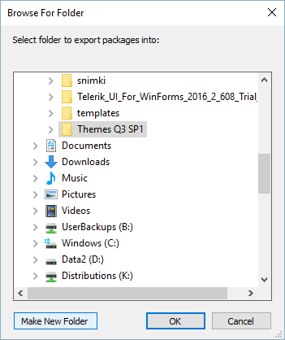
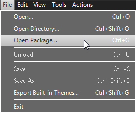
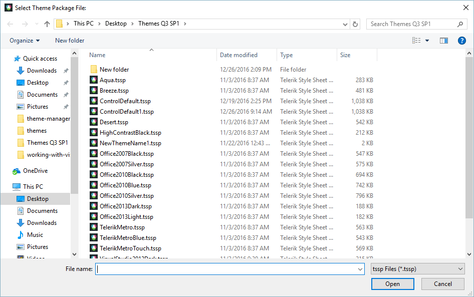
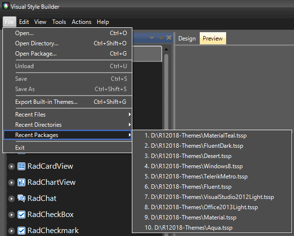

# Loading Predefined Themes

One of the most exciting features of RadCotnrols for WinForms is that their appearance can be easily customized. Visual Style Builder is the tool that makes the process of customization effortless and pleasant. It allows Telerik customers to create brand new themes from scratch and also modify existing themes. More specifically, VSB provides the opportunity to load and customize a default Telerik theme. This tutorial illustrates how you can extract and load the default Telerik themes in the Visual Style Builder.

1\. Open the Visual Style Builder (VSB). You can achieve that through Start Button >> All Programs >> Telerik >> UI for Winforms [version] >> Tools >> Visual Style Builder.

2\. Once the VSB is opened, click the File in the VSB menu and then select __Export Built-in Themes__ item:

A dialog window will ask you to select folder where you would like to export packages.(For example, you can create a new folder and name it MyThemesFolder):

3\. Click again the File item and select Open Package:

4\. When the dialog opens, navigate the folder you chose in step 2 (i.e. navigate to MyThemesFolder). There you should be able to find all Telerik default themes. Select one of the themes and click Open.

5\. The Visual Style Builder tool also has menu items for the recent files, folders and packages. This functionality comes handy when working with different themes saved at different folders:

# See Also
* [Applying Font repository items]()

* [Color Blending]()

* [Loading themes created with the old VSB]()

* [Precedence Example Visibility Property]()

* [Property Precedence Rules]()

* [Saving and Loading Theme Files]()