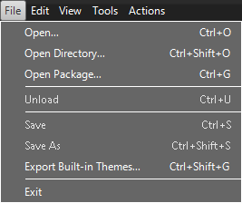
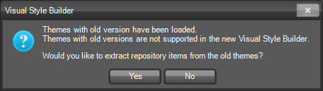
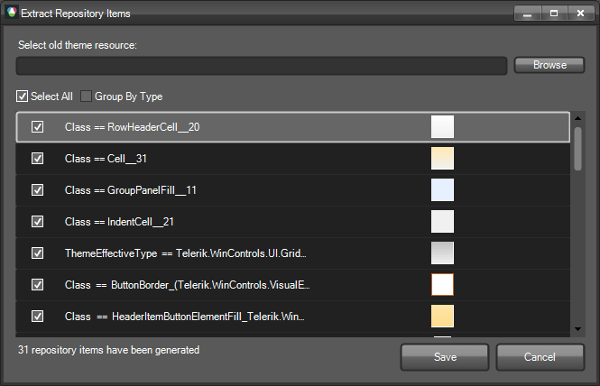
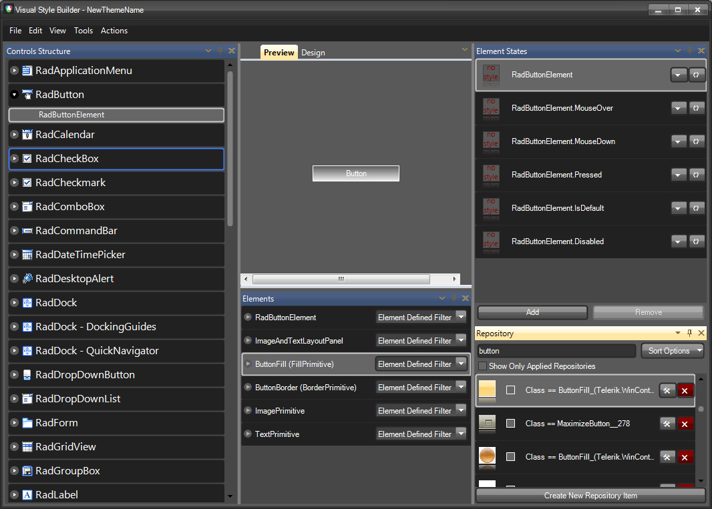

# Loading themes created with the old VSB

## Overview

Some of you have probably created custom themes for Telerik UI for WinForms using the old Visual Style Builder. The old and the new Visual Style Builder use different styling mechanisms, so the old themes cannot be edited in the new version. However, we created a service which allows you to load the style settings created in the old VSB and convert them to Repository Items. This will save you time, because you will not have to create new repository  items yourself.
        

## Loading an old theme

In the following example we will demonstrate how repository items are created based on the style settings of an old theme. Let's say we have xml theme files created for the whole Telerik UI for WinForms suite and the ThemeName of the xml files is Desert. We should load these files by choosing. the Open Directory/Open option: 

When you try to load old themes, you will be notified that these themes are not compatible with the new theming mechanism:

After you press OK to confirm, you will have to choose which of the possible repository items should be loaded in Visual Style Builder:

Finally, the desired repository items are loaded in Visual Style Builder:

