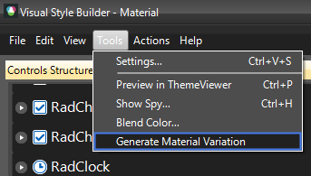
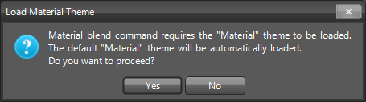
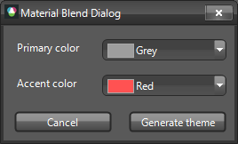
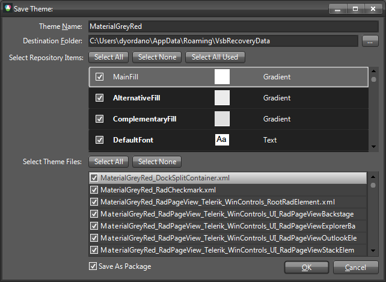
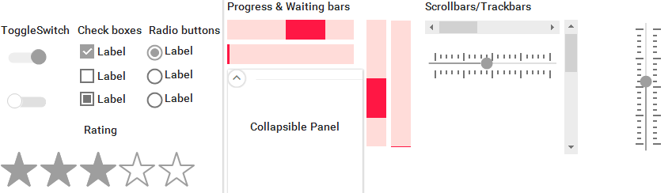

# Material Themes Blending

Telerik UI for WinForms suite offers a touch optimized theme which provides additional features such as custom fonts, built-in animations and shadows. We also have three other themes that are using the [Material]() theme as a foundation but have different colors:

* MaterialBlueGray
* MaterialPink
* MaterialTeal
     
>caption Figure 1: Material Themes

## Generate Material Variation

[Visual Style Builder]() provides an easy way to generate different color variations of the **Material** theme. Material theme blending uses the basic Material theme by executing a series of predefined commands. 

Select *Tools >> Generate Material Variation* menu item:

>caption Figure 2: Generate Material Variation

 

>tip If you already have loaded a customized Material theme (but not a Material variation) it will remain loaded when generating a Material variation.

This will open the **Material Blend Dialog** from which you can choose the **Primary color** and the **Accent color**:

>caption Figure 3: Material Blend Dialog

If you click the **Generate theme** button, a new variation of the Material theme will be exported using the selected colors.

>caption Figure 4: Save the Theme

 

After loading the custom theme in [Theme Viewer]() the primary/accent colors are replaced:

>caption Figure 5: Load Material theme's variation

 

# See Also

* [Touch Enabled Themes]()
* [Customizing the Material Theme]()
* [Color Blending]()
* [Fluent Theme Blending]()