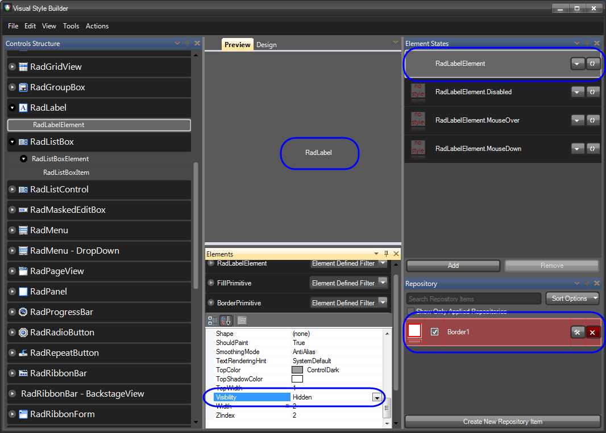
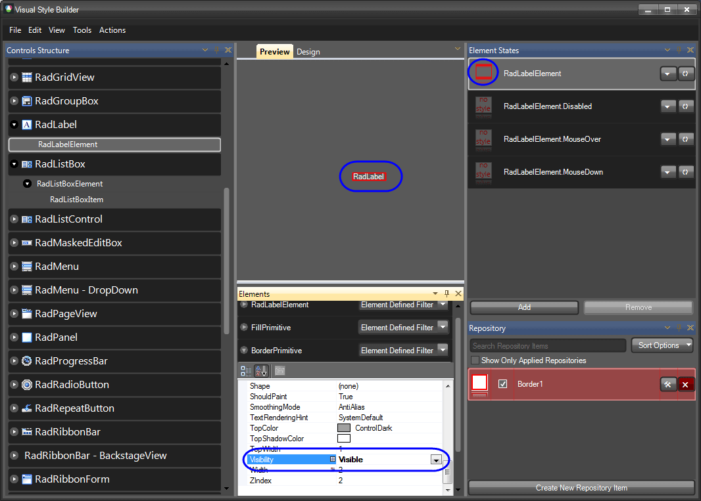

# Precedence Example: Visibility Property

There are cases in which you apply a repository item to an element, but this element still does not show any colors. As it is stated in [this article](), if not overridden, the default values of the element are used. Such is the case with RadLabelElement where you apply a border repository item to it, but you get no borders applied. The reason for this behavior is that the default value of the __Visibility__ property is *Hidden* and repository items do not set a value to this property by default, so the *Hidden* value is taken into consideration. 

>tip Border1 repository item is applied to the default RadLabelElement state, but the default Visibility value is Hidden, and since it is not overridden, the fill is not visible.

In order to display the BorderPrimitive of the RadLabelElement, you should alter this property directly in the property grid of the BorderPrimitive.

>tip When we set the Visibility property to Visible, we override the default value and the repository item colors become visible.

>tip 
This example concerns the Visibility property, but the rules described here are general and they are in force for all the properties that can be set by Visual Style Builder.
>

# See Also
* [Applying Font repository items]()

* [Color Blending]()

* [Loading Predefined Themes]()

* [Loading themes created with the old VSB]()

* [Property Precedence Rules]()

* [Saving and Loading Theme Files]()

