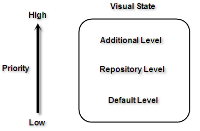
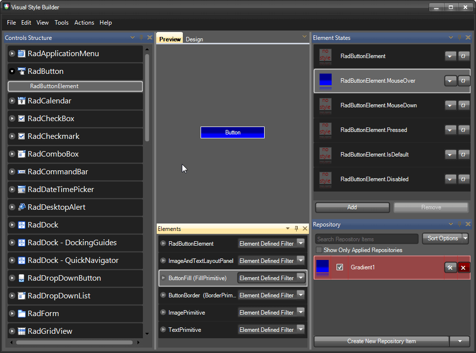

# Property Precedence Rules

## 

Visual Style Builder introduces a flexible and easy to understand system of property precedence rules. This allows you to fine tune the desired elements and eliminates the possibility of you asking yourself “Why am I getting this color here or there?”.

There are three levels at which properties can be applied: 

1. Default properties level. The properties at this level are shown by default in the property grid that you can see when you try to create a new repository item or in the property grid of the element itself. These properties can be overridden by any of the property levels that are listed below. Since these properties are default properties, they are not contained in the xml theme file that you save.

2. Repository items level. When you start creating a new repository item, you will notice that the properties that you tweak get a little square in the property grid. This square indicates that the default property is overridden and you have a custom value for that property. All the repository items are kept in a special repository xml file. An element refers to a repository items using the following xml pattern (assuming that Gradient1 is the key of the repository item):

````XML
<PropertySettingGroups>
  <XmlPropertySettingGroup BasedOn="Gradient1">
    <Selectors>
      <XmlVisualStateSelector VisualState="RadButtonElement.MouseOver" AutoUnapply="False">
        <ChildSelector xsi:type="XmlClassSelector" ElementClass="ButtonFill" AutoUnapply="False" xmlns:xsi="http://www.w3.org/2001/XMLSchema-instance" />
      </XmlVisualStateSelector>
    </Selectors>
  </XmlPropertySettingGroup>
</PropertySettingGroups>
````

>note The properties that are not set in the repository item property grid (i.e. they do not have the square indicator) should not be considered as default property values. Only the property grid of the element itself shows the default values.
>

3. Additional level allowing you to tweak an element overriding the default values and the values set by a repository item. In some cases you may want to tweak an element that has an assigned repository item without creating a new repository item. In such situations, you should click on the element and directly tweak its properties. These settings will override the repository item’s settings. The the xml code in this case looks like this (assuming that the Red color is set directly on the element):

````XML
<PropertySettingGroups>
  <XmlPropertySettingGroup BasedOn="Gradient1">
    <PropertySettings>
      <XmlPropertySetting Property="Telerik.WinControls.VisualElement.BackColor" Value="Red" />
    </PropertySettings>
    <Selectors>
      <XmlVisualStateSelector VisualState="RadButtonElement.MouseOver" AutoUnapply="False">
        <ChildSelector xsi:type="XmlClassSelector" ElementClass="ButtonFill" AutoUnapply="False" xmlns:xsi="http://www.w3.org/2001/XMLSchema-instance" />
      </XmlVisualStateSelector>
    </Selectors>
  </XmlPropertySettingGroup>
</PropertySettingGroups>
````

All the property levels can be considered as small particles in one bigger particle – VisualState. In other words these rules are valid between the property levels in a VisualState.



However, since the properties of different VisualStates are set to one and the same element, there is interaction between these properties as well. As it is stated at the beginning of this article, a default property value can be overridden by a custom property value. This rule is valid between the visual states in both directions – i.e. a default property value is overridden by a custom property value and a custom property value* is not* overridden by a default property value.

>caution The properties' values applied for a state are not reset when a control goes to another state. There should be values in the new state which explicitly override the values from the previous state.
>

For example, take the following case – we have a repository item applied to the IsMouseOver state and then we mouse hover and mouse leave the button. However, the button is still blue, even when the mouse pointer is not on the button. This is because the settings of the default visual state (RadButtonElement state) are default and they can’t override the settings provided by the repository item.


