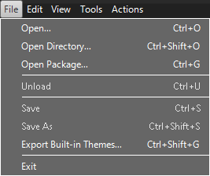
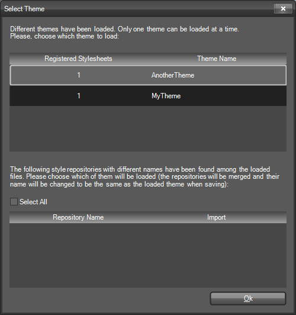
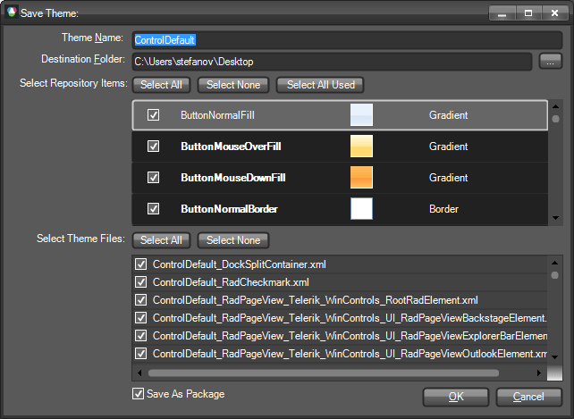
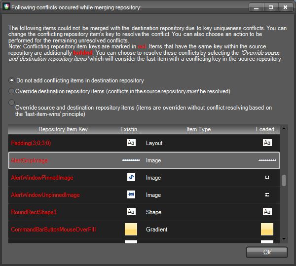

# Saving and Loading Theme Files

## Overview

The styles for each separate control are situated in a single XML
          file, accompanied by the name of the theme to which these styles belong and some further information
          needed by the mechanism to map the styles to the corresponding control. The following code snippet
          briefly demonstrates the common structure of a XML theme file:
        

#### __[XML] __

In general, the XML theme file contains Property Setting Groups that represent the style settings, StyleSheet Relations that map the styles to an element/control, and a Theme Name attribute.
          One of the new concepts that are introduced is the Theme Repository. The idea behind it is to store common style property settings that can be easily reused throughout the whole theme. Modifying a single repository item will change the appearance of all elements/controls that use this repository item. In this way a theme can be created and modified in minutes. The repository can be reused throughout different themes. However, there can be only one repository associated with a specific theme. The association of a repository with a theme is made by giving assigning the same name to the repository and the theme.
          Each theme can have a repository containing items that can be reused throughout the theme. A theme and a repository are connected by using the same name both for the theme and for the repository. The repository is situated in a separate XML file that generally has the following structure:
        

#### __[XML] __

As you can see, the repository contains a collection of Repository Items which contain property settings. Each repository item is uniquely identified by a key and additionally described by a name which is displayed to the user. The key is important when reusing the same repository item for different elements/controls throughout the Visual Style Builder.
          The Theme Name here is ‘MyTheme’ which means that this repository is associated with all XML theme files that have the same ThemeName attribute value.
        

## Loading Themes

In the new version of the WinForms Visual Style Builder you can create or modify one theme at a time,
          but for all Rad Controls simultaneously. You can load a theme by choosing one of the two menu options
          available:
        

The ‘Open’ option allows you to choose which theme files to load, whereas the ‘Open Directory’ option
          allows you to select a directory and load all theme files that are situated in the chosen directory.
          As already mentioned, the Visual Style Builder can load only one theme at a time. The difference
          between themes is made by the Theme Name. For example, if you have the following files:
        

* MyTheme_Telerik_WinControls_UI_RadButton.xml

* MyTheme_Telerik_WinControls_UI_RadMenu.xml

* AnotherTheme_Teleri_WinControls_UI_RadDropDownButton.xml

and assume that the both

* MyTheme_Telerik_WinControls_UI_RadButton.xml

* MyTheme_Telerik_WinControls_UI_RadMenu.xml

have their ThemeName attribute set to ‘MyTheme’, whereas the
          *AnotherTheme_Telerik_WinControls_UI_RadDropDownButton.xml* file defines the
          ThemeName as ‘AnotherTheme’, upon loading of all three files, the Visual Style Builder will display a
          dialog informing you that multiple themes are selected. In this dialog you can choose which of these
          themes should be actually loaded in the application:
        

The upper part of the dialog contains a Grid View that displays a row for each unique theme found in the files loaded.
          The row contains information about the number of files (Registered Stylesheets) for each theme, and the name of the theme.
          The lower part of the dialog contains a Grid View which is populated with repositories found in the loaded files
          that do not match a theme from list above, i.e. have different names. If you select a repository from this list, it
          will be merged with the repository of the selected theme, whereby any key uniqueness conflicts within the source and destination
          repositories must be resolved.
        

* If the theme being loaded has no repository, i.e. there is no XML file with the repository structure described above, an empty repository will be created when modifying the theme. If no repository items are added in this repository in the process of modifying the theme, no separate repository file will be saved at the end.
            

* If the theme being loaded has no repository but there are other repositories (with different names) found in the list of the loaded files, selecting this repositories by using the dialog above will merge them into one repository upon saving the theme.
            

After selecting a theme and pressing the Ok button,  the theme repositories found will be merged if needed and if there is already a loaded theme in the Visual Style Builder, the user will be prompted to safe their changes. After that, the old theme will be unloaded and the new theme will be loaded and applied to the controls accordingly. If the user clicks ‘Cancel’ on the save prompt, no action will be taken.
        

## Saving Themes

When you choose the Save option, the Visual Style Builder automatically detects whether a theme has been opened and edited. If yes, it simply overwrites the already loaded files with the new XML data. However, if you created a new theme without loading files, the Visual Style Builder will display the Save As dialog and will ask you to choose location and theme name for the newly created theme and its repository:
        

__Save as xml files__

The Save Theme dialog shows the current theme name, the destination folder where the theme will be saved, a list containing all repository items in the repository of the theme, and a list of all files that will be saved upon clicking the OK button. This list usually contains files that have been previously loaded and files that will be newly created based on the current changes made for the controls in the Visual Style Builder.

You can change the theme name by typing in the topmost text box. When you change the name of the theme, all file names will be updated on the fly to reflect the new theme name. In general, the name of a theme file is automatically generated by using the following pattern:

*<ThemeName>_<ControlType>.xml*

The repository items list shows all repository items found in the repository. The repository items that are used somewhere in the currently files which are to be saved are additionally bolded. You can choose to save all repository items, only the used ones or none of them.  If you choose the last option, no repository file will be saved. In this case, when you later load the same theme, you will not be able to load the repository and thus lose any styles that come from repository items.

In the theme files list you can choose which files to save by checking/unchecking the corresponding row. Each time you check/uncheck a file entry, the repository items list will be updated to reflect the currently used repository items.

When you click on the OK button all selected files will be saved. The repository will be saved in a separate file that has the following name pattern:

*<ThemeName>_Repository.xml*

>If you chose *not* to save certain files, you should keep in mind that the Visual Style Builder does not currently keep track of changes in separate theme files and therefore if you close the Visual Style Builder after saving, any unchecked files will not be saved.

__Save as a theme package__

Below the grid that displays the XML files you can see a checkbox called ‘Save As Package’. This option allows you to save the theme as a zipped package encapsulating all XML files checked for saving. If you choose to save the theme as a package, a single file with a ‘.tssp’ extension will be generated and stored at the desired location. If you uncheck this option, a list of XML files will be generated. A theme package can be later loaded and used in your application by utilizing the API of the ThemeResolutionService.

## Loading theme package

ThemeResolutionService exposes two methods that allow you to load a theme package:

* LoadPackageResource. This method loads a theme package file that is contained in the project as an [EmbeddedResource](http://msdn.microsoft.com/en-us/library/0c6xyb66(VS.80).aspx). This is the preferable method for loading a theme package since the resource path to the package is not changed when the application is deployed. The path construction is *DefaultProjectNamespace.ThemeFolder.ThemePackageFile*. The *ThemeFolder* part should only be used if the package is contained in a folder under the main project directory and if the project programming language is C#. In VB.NET project you do not need to include *ThemeFolder* part even if the package file is contained in a folder.
            

#### __[C#] Loading package resource__

{{source=..\SamplesCS\Themes\UsingCustomThemes.cs region=LoadPackageResource}}
	            ThemeResolutionService.LoadPackageResource("SamplesCS.CustomTheme.tssp");
	{{endregion}}

#### __[VB.NET] Loading package resource__

{{source=..\SamplesVB\Themes\UsingCustomThemes.vb region=LoadPackageResource}}
	        ThemeResolutionService.LoadPackageResource("SamplesVB.CustomTheme.tssp")
	{{endregion}}

* LoadPackageFile. This method loads a file from a specified directory on the system. Depending on how the directory is defined (full or relative), the path to the package may change when the application is deployed on another machine.

#### __[C#] Loading package file__

{{source=..\SamplesCS\Themes\UsingCustomThemes.cs region=LoadPackageFile}}
	            ThemeResolutionService.LoadPackageFile(@"C:\CustomTheme.tssp");
	{{endregion}}

#### __[VB.NET] Loading package file__

{{source=..\SamplesVB\Themes\UsingCustomThemes.vb region=LoadPackageFile}}
	        ThemeResolutionService.LoadPackageFile("C:\CustomTheme.tssp")
	{{endregion}}

## Merging Repositories

When you load a theme with a repository in the Visual Style Builder, you are able to merge its repository with another one by loading the XML file representing the new repository. The merging process is performed in the following steps:

* Merge all repository items that do not have conflicting keys

* Identify the conflicting repository items

* Resolve the conflicts and commit the merge transaction

If repository item key conflicts are discovered, the following dialog is displayed to the user:
        

In the Grid View you can see the conflicting repository items both in the source and destination repositories. The left side of the Grid View (highlighted in yellow) shows the already existing repository items. The right side – highlighted with green – shows the repository items in the currently loaded repository. The conflicting keys are presented in red. By modifying the value of a conflicting key in the Grid View, you can resolve a conflict. The new key value will be assigned to the currently loaded item and it will be successfully added in the existing repository.

There are also a few options how repositories are merged. These options are available to you as radio buttons above the Grid View on the dialog. The options are as follows:
        

* Do not add conflicting items in destination repository

* Override destination repository items (conflicts in the source repository must be resolved)

* Override source and destination repository items (items are overridden without conflict resolving based on the ‘last-item-wins’ principle)

The first option instructs the Visual Style Builder to add the repository items from the source repository that do not conflict with the already existing items.
        

The second option means that destination (existing) items that have the same keys as the currently loaded items will be overridden. However, if there are items with the same key within the currently loaded repository, these conflicts have to be resolved.
        

The third option entirely ignores repository item conflicts. Items are overridden based on their position in the list as they are loaded from the XML file – the last item found with a conflicting key wins.
        

>Generally, repository item conflicts within the same repository should not happen. Since the Visual Style Builder checks for key uniqueness each time you add/edit repository items, it is not possible to save a repository that contains items with the same key.

