# Windows11 Themes Blending

Telerik UI for WinForms suite offers a touch optimized theme which provides additional features such as custom fonts, built-in animations and shadows. The Visual Style Builder tool provides a functionality to blend the colors of an existing theme so that a completely new theme can be created for couple of minutes. We also have four different Windows11 themes that share similar design but have different colors:

 * **Windows11**
 * **Windows11Dark**
 * **Windows11Compact**
 * **Windows11CompactDark**

The Windows11 themes are designed to work with predefined set of colors. The tutorial here will demonstrate how a new **Windows11** theme can be created. The same steps can be also followed with the other Windows11 themes.

>caption Figure 1: Windows11 Theme
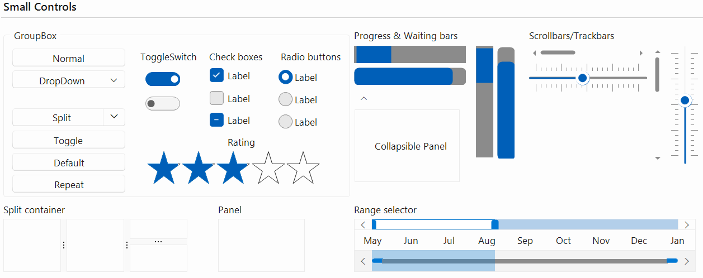

>caption Figure 2: Windows11Dark Theme
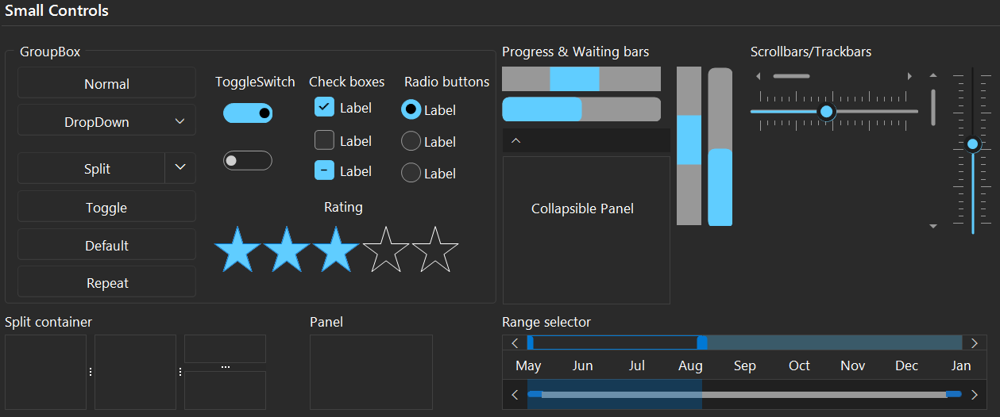

>caption Figure 3: Windows11Compact Theme
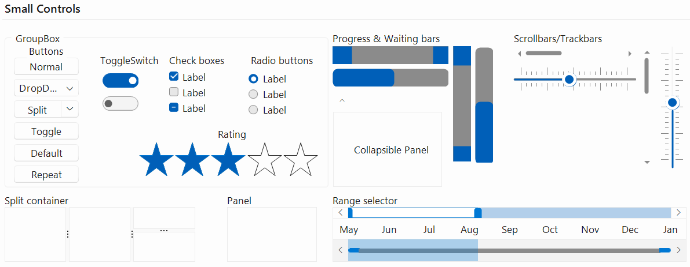

>caption Figure 4: Windows11CompactDark Theme
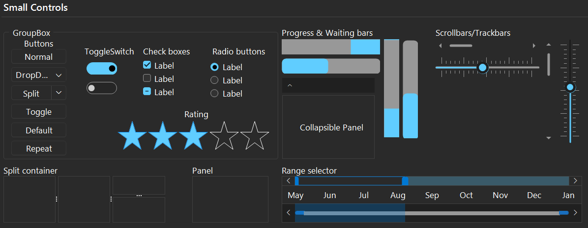

## Generate Windows11 Variation

[Visual Style Builder]() provides an easy way to generate different color variations of the above Windows11 themes. Office2019Light theme blending uses the basic Office2019Light theme by executing a series of predefined commands.

Select *Tools >> Generate Office2019Light Variation* menu item:

>caption Figure 4: Generate Office2019Light Variation
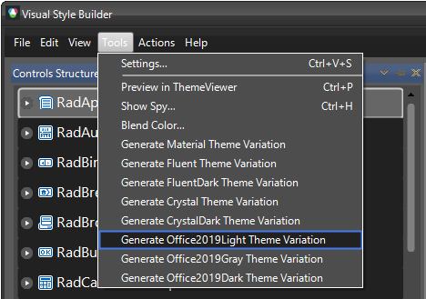

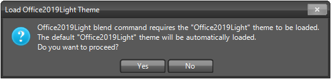

>note If you already have loaded a customized Office2019Light theme (but not a Office2019Light variation) it will remain loaded when generating a Office2019Light variation. This will open the **Office2019 Blend Dialog** from which you can create a new palette or modify the selected one.

>caption Figure 5: Office2019 Blend Dialog

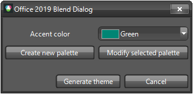

If you want to create a brand new palette you can click on the *Create New palette* button and it will open **New Palette Dialog**:

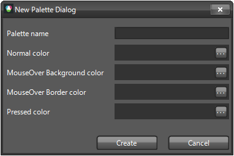

If you want to edit the existing pallete then click on the *Modify selected palette* button and it will open **Modify Palette Dialog**. You will be able to modify any of the existing colors:

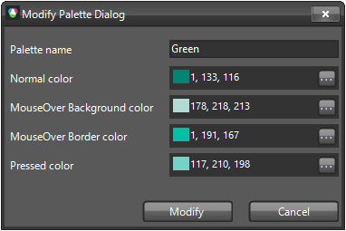

When you are ready with picking colors for the palette you can click the **Generate theme** button. A new variation of the Office2019Light theme will be exported using the selected colors.

>caption Figure 6: Save the Theme
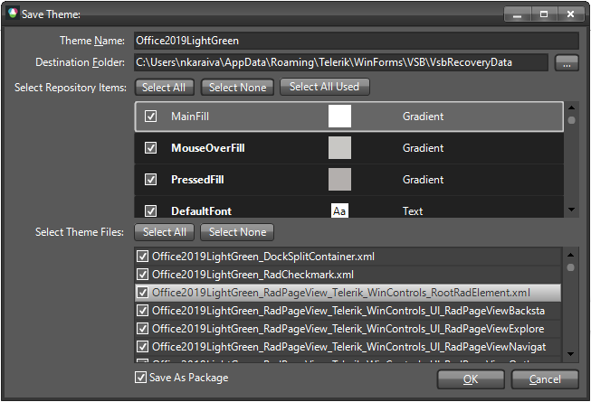

After loading the custom theme in [Theme Viewer]() the primary/accent colors are replaced:

>caption Figure 7: Load Office2019LightGreen theme variation
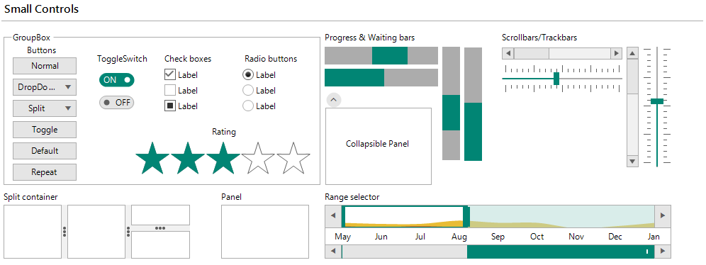

>note You can use the same approach for the Office2019Gray and Office2019Dark themes.

>caption Figure 8: Load Office2019DarkOrange theme variation

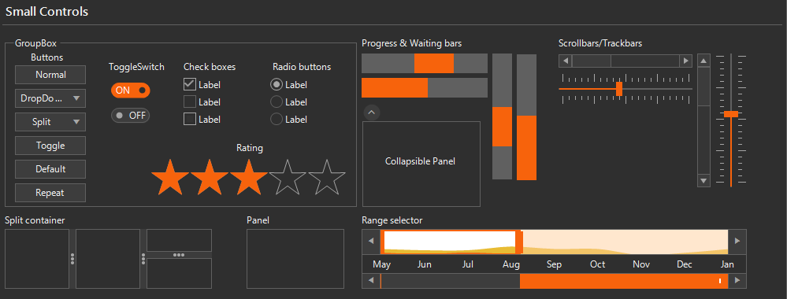

# See Also

* [Color Blending]()
* [Material Theme Blending]()
* [Fluent Theme Blending]()
