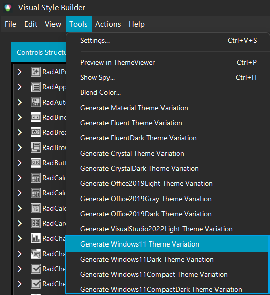
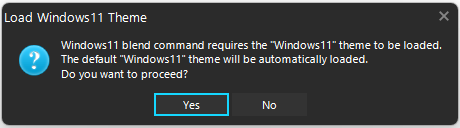
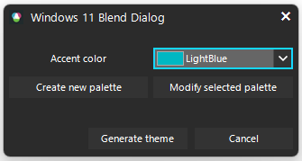
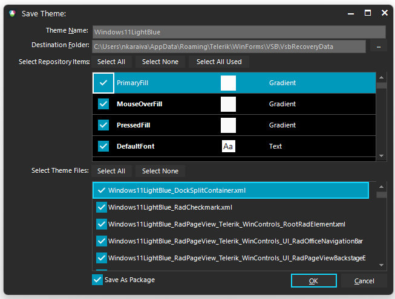
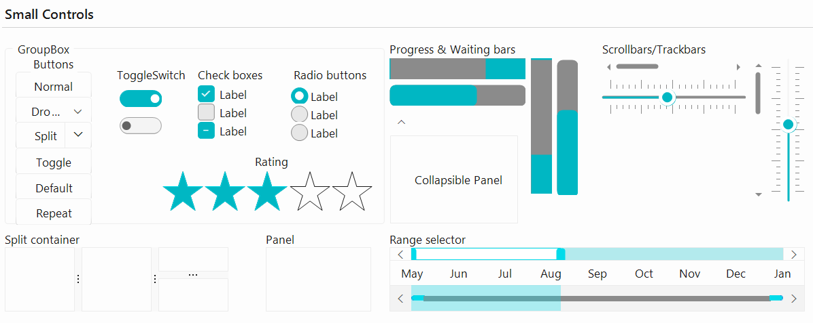
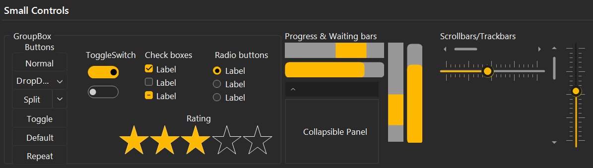

# Windows11 Themes Blending

Telerik UI for WinForms suite offers a touch-optimized theme that provides additional features such as custom fonts, built-in animations, and shadows. The Visual Style Builder tool provides a functionality to blend the colors of an existing theme so that a completely new theme can be created in a couple of minutes. We also have four different Windows11 themes that share similar design but have different colors:

 * **Windows11**
 * **Windows11Dark**
 * **Windows11Compact**
 * **Windows11CompactDark**

The Windows11 themes are designed to work with a predefined set of colors. The tutorial here will demonstrate how a new **Windows11** theme can be created. The same steps can be also followed with the other Windows11 themes.

>caption Figure 1: Windows11 Theme

>caption Figure 2: Windows11Dark Theme

>caption Figure 3: Windows11Compact Theme

>caption Figure 4: Windows11CompactDark Theme

## Generate Windows11 Variation

[Visual Style Builder]() provides an easy way to generate different color variations of the above Windows11 themes. Windows11 theme blending uses the basic Windows11 theme by executing a series of predefined commands. 

To start generating theme blending select *Tools >> Generate Windows11 Theme Variation* menu item:
 Below you can find the other options available:

    * **Generate Windows11Dark Theme Variation**
    * **Generate Windows11Compact Theme Variation**
    * **Generate Windows11CompactDark Theme Variation**

>caption Figure 5: Generate Windows11 Theme Variation

>note If you already have loaded a customized Windows11 theme (but not a Windows11 theme  variation) it will remain loaded when generating a Windows11 variation. This will open the **Windows11 Blend Dialog** from which you can create a new palette or modify the selected one.

>caption Figure : Windows11 Blend Dialog

If you want to create a brand new palette you can click on the *Create New palette* button and it will open **New Palette Dialog**.

If you want to edit the existing palette then click on the *Modify selected palette* button and it will open **Modify Palette Dialog**. You will be able to modify any of the existing colors.

Once you get ready with picking colors for the palette you can click the **Generate theme** button. A new variation of the Windows11 theme will be exported using the selected colors. Then, save the theme:

>caption Figure 6: Save the Theme

Your custom theme variation is ready to use. After loading the custom theme in [Theme Viewer]() the primary/accent colors are replaced:

>caption Figure 7: Load Windows11LightBlue theme variation

>note You can use the same approach for all the other Windows11 themes.

>caption Figure 8: Load Windows11CompactDarkYellow theme variation

## See Also

* [Color Blending]()
* [Material Theme Blending]()
* [Fluent Theme Blending]()
