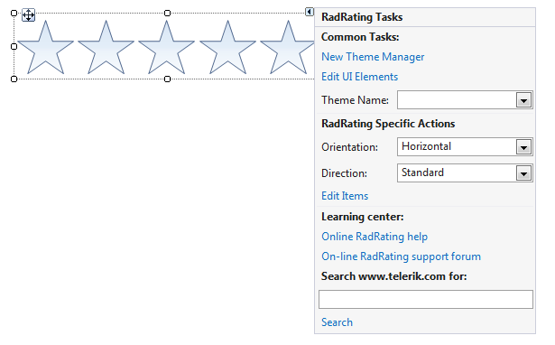
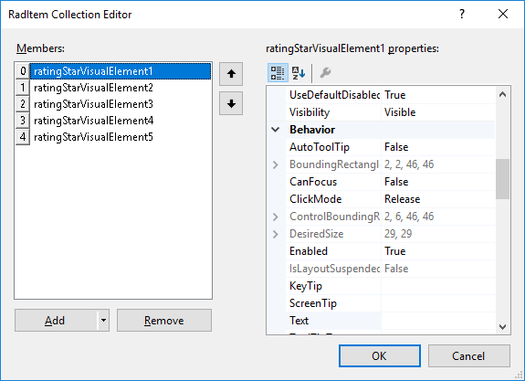

# Design time

The *Smart Tag* of __RadRating__ lets you quickly configure your control. You can display the *Smart Tag* by clicking the small rightward-pointing arrow located in the upper right corner of the control.

Adding items to __RadRating__ at design time is possible through the *Items* collection of the control. This collection is accessible by using the *Smart Tag* or the *Items* collection property in the property grid.

Both of these will open RadItem Collection Editor, from where, by clicking the Add button you can add items to the collection. Additionally, on the right hand side, you will see a property grid, where you can change the properties of each item individually.
        
