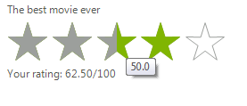

# Getting Started


Below are the basic steps needed to get started with __RadRating__ control in Visual Studio:

1. Drag __RadRating__ from the Visual Studio Toolbox to the form.

    

1. Set the *Caption* to “The best movie ever”.

1. Set the *SelctionMode* to “HalfItem”.

1. In the code behind subscribe to the *ValueChanged* event, where you can calculate and display the average rating:

{{source=..\SamplesCS\TrackAndStatus\Rating\RatingGettingStarted.cs region=GettingStarted}} 
{{source=..\SamplesVB\TrackAndStatus\Rating\RatingGettingStarted.vb region=GettingStarted}} 

````C#
        
double averageRating = 0;
int numberOfChanges = 0;
        
public RatingGettingStarted()
{
    InitializeComponent();
    
    this.radRating1.Caption = "The best movie ever";
    this.radRating1.Description = "Your rating:";
    this.radRating1.SelectionMode = Telerik.WinControls.UI.RatingSelectionMode.HalfItem;
    this.radRating1.ValueChanged += radRating1_ValueChanged;
}
        
private void radRating1_ValueChanged(object sender, EventArgs e)
{
    Telerik.WinControls.UI.RadRating rating = sender as Telerik.WinControls.UI.RadRating;
    if (rating != null)
    {
        averageRating += (double)rating.Value;
        numberOfChanges++;
        double result = averageRating / numberOfChanges;
        rating.Description = string.Format("Your rating: {0:F2}/{1}", result, rating.Maximum);
    }
}

````
````VB.NET
Private averageRating As Double = 0
Private numberOfChanges As Integer = 0
Public Sub New()
    InitializeComponent()
    Me.RadRating1.Caption = "The best movie ever"
    Me.RadRating1.Description = "Your rating:"
    Me.RadRating1.SelectionMode = Telerik.WinControls.UI.RatingSelectionMode.HalfItem
    AddHandler Me.RadRating1.ValueChanged, AddressOf radRating1_ValueChanged
End Sub
Private Sub radRating1_ValueChanged(sender As Object, e As EventArgs)
    Dim rating As Telerik.WinControls.UI.RadRating = TryCast(sender, Telerik.WinControls.UI.RadRating)
    If rating IsNot Nothing Then
        averageRating += CDbl(rating.Value)
        numberOfChanges += 1
        Dim result As Double = averageRating / numberOfChanges
        rating.Description = String.Format("Your rating: {0:F2}/{1}", result, rating.Maximum)
    End If
End Sub

````

{{endregion}} 

5\. Press F5 to run the application.


