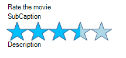
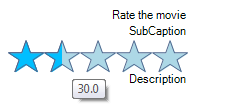
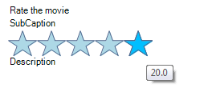

# Properties and events

## Properties

* *ShowItemToolTips* - by default __RadRating__ shows tooltips when hovering the items. The user can disable this functionality by setting *ShowItemToolTips* property to False:

{{source=..\SamplesCS\TrackAndStatus\Rating\RatingGettingStarted.cs region=ShowItemToolTips}} 
{{source=..\SamplesVB\TrackAndStatus\Rating\RatingGettingStarted.vb region=ShowItemToolTips}} 

````C#

            this.radRating1.ShowItemToolTips = false;
````
````VB.NET
        Me.RadRating1.ShowItemToolTips = False
        '
````

{{endregion}} 




* *RightToLeft* - __RadRating__ supports RightToLeft functionality. It is disabled by default, so you should enable it:

{{source=..\SamplesCS\TrackAndStatus\Rating\RatingGettingStarted.cs region=RightToLeft}} 
{{source=..\SamplesVB\TrackAndStatus\Rating\RatingGettingStarted.vb region=RightToLeft}} 

````C#
            
            this.radRating1.RightToLeft = System.Windows.Forms.RightToLeft.Yes;
````
````VB.NET

        Me.RadRating1.RightToLeft = System.Windows.Forms.RightToLeft.Yes
        '
````

{{endregion}} 




* *Direction* property can be used to control the hover direction.

{{source=..\SamplesCS\TrackAndStatus\Rating\RatingGettingStarted.cs region=Direction}} 
{{source=..\SamplesVB\TrackAndStatus\Rating\RatingGettingStarted.vb region=Direction}} 

````C#
            
            this.radRating1.Direction = RatingDirection.Reversed;
````
````VB.NET
        Me.RadRating1.Direction = RatingDirection.Reversed
        '
````

{{endregion}} 




* *Orientation* - the default __RadRating__ orientation is Horizontal. It is allowed to change it to Vertical:

{{source=..\SamplesCS\TrackAndStatus\Rating\RatingGettingStarted.cs region=Orientation}} 
{{source=..\SamplesVB\TrackAndStatus\Rating\RatingGettingStarted.vb region=Orientation}} 

````C#
            
            this.radRating1.Orientation = Orientation.Vertical;
            this.radRating1.AutoSize = true;
````
````VB.NET

        Me.RadRating1.Orientation = Orientation.Vertical
        Me.RadRating1.AutoSize = True

        '
````

{{endregion}} 


* *Caption, Subcaption and Description* – specify texts for the captions of __RadRating__:

{{source=..\SamplesCS\TrackAndStatus\Rating\RatingGettingStarted.cs region=Captions}} 
{{source=..\SamplesVB\TrackAndStatus\Rating\RatingGettingStarted.vb region=Captions}} 

````C#
            
            this.radRating1.Caption = "Rate the movie";
            this.radRating1.Description = "Description";
            this.radRating1.Subcaption = "SubCaption";
````
````VB.NET
        Me.RadRating1.Caption = "Rate the movie"
        Me.RadRating1.Description = "Description"
        Me.RadRating1.Subcaption = "SubCaption"
        '
````

{{endregion}} 


* *SelectionMode* - determines how precisely the user will select the value:

{{source=..\SamplesCS\TrackAndStatus\Rating\RatingGettingStarted.cs region=SelectionPrecise}} 
{{source=..\SamplesVB\TrackAndStatus\Rating\RatingGettingStarted.vb region=SelectionPrecise}} 

````C#
            
            this.radRating1.SelectionMode = Telerik.WinControls.UI.RatingSelectionMode.Precise;
````
````VB.NET

        Me.RadRating1.SelectionMode = Telerik.WinControls.UI.RatingSelectionMode.Precise

        '
````

{{endregion}} 


{{source=..\SamplesCS\TrackAndStatus\Rating\RatingGettingStarted.cs region=SelectionHalfItem}} 
{{source=..\SamplesVB\TrackAndStatus\Rating\RatingGettingStarted.vb region=SelectionHalfItem}} 

````C#

            this.radRating1.SelectionMode = Telerik.WinControls.UI.RatingSelectionMode.HalfItem;
````
````VB.NET

        Me.RadRating1.SelectionMode = Telerik.WinControls.UI.RatingSelectionMode.HalfItem

        '
````

{{endregion}} 


{{source=..\SamplesCS\TrackAndStatus\Rating\RatingGettingStarted.cs region=SelectionFullItem}} 
{{source=..\SamplesVB\TrackAndStatus\Rating\RatingGettingStarted.vb region=SelectionFullItem}} 

````C#

            this.radRating1.SelectionMode = Telerik.WinControls.UI.RatingSelectionMode.FullItem;
````
````VB.NET

        Me.RadRating1.SelectionMode = Telerik.WinControls.UI.RatingSelectionMode.FullItem

        '
````

{{endregion}} 


* *Minimum* and *Maximum* – specifies the range of __RadRating__:#_[C#]_

{{source=..\SamplesCS\TrackAndStatus\Rating\RatingGettingStarted.cs region=Ranges}} 
{{source=..\SamplesVB\TrackAndStatus\Rating\RatingGettingStarted.vb region=Ranges}} 

````C#
            
            this.radRating1.Minimum = 10;
            this.radRating1.Maximum = 40;
````
````VB.NET
        Me.RadRating1.Minimum = 10
        Me.RadRating1.Maximum = 40
        '
````

{{endregion}} 


* *Value* - sets or gets the value of the __RadRating__:

{{source=..\SamplesCS\TrackAndStatus\Rating\RatingGettingStarted.cs region=Value}} 
{{source=..\SamplesVB\TrackAndStatus\Rating\RatingGettingStarted.vb region=Value}} 

````C#

            this.radRating1.Value = 43.4;
````
````VB.NET

        Me.RadRating1.Value = 43.4
        '
````

{{endregion}} 

## Events

* *ValueChanging* – occurs when the value is being changed. This event can be cancelled.

* *ValueChanged* – occurs when the value has been changed.
