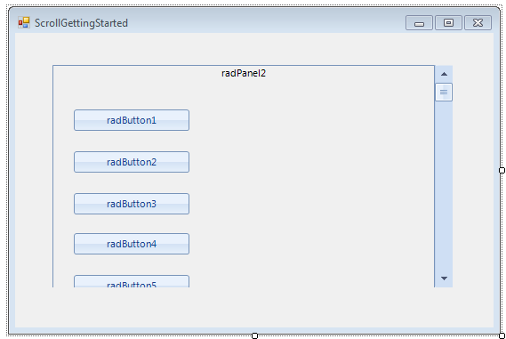
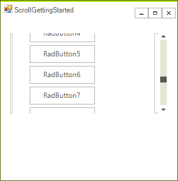

# Getting Started

## 

Using Telerik scrollbars is a bit more intricate compared to using the standard scrollbars because you have to handle scroll event manually. The rest of this article demonstrates how you can use two panels to implement scrolling for the content of the second panel.

Add a RadPanel to your form (Office2007Blue theme was used for both panels. This theme is contained in the Miscellaneous theme component):


Add a RadVScrollbar in the panel and dock it to the *Right*:


Add another RadPanel in the already added one and set its height to the *total* height you want to be available upon scrolling. This value can be statics e.g. 1000 pixels or dynamic determined by the scrollable content. For the purpose, of this example it is set to 1000 pixels. 


The next step is to add controls to the second RadPanel (the controls which are to be scrolled):


{{source=..\SamplesCS\TrackAndStatus\ScrollBar\ScrollGettingStarted.cs region=buttons}} 
{{source=..\SamplesVB\TrackAndStatus\ScrollBar\ScrollGettingStarted.vb region=buttons}} 

````C#
for (int i = 1; i < 15; i++)
{
    RadButton button = new RadButton();
    button.Location = new Point(30, i * 30 + 5 * i);
    button.Size = new Size(70, 30);
    button.Text = "RadButton" + i.ToString();
    this.radPanel2.Controls.Add(button);
}

````
````VB.NET
For i As Integer = 1 To 14
    Dim button As New RadButton()
    button.Location = New Point(30, i * 30 + 5 * i)
    button.Size = New Size(70, 30)
    button.Text = "RadButton" & i.ToString()
    Me.RadPanel2.Controls.Add(button)
Next i

````

{{endregion}} 

>note You can add controls by drag and drop at design time as well.
>



Then subscribe to the Scroll event of the vertical scrollbar and assign its negated value to the Top property of the second RadPanel:#_[C#]_


{{source=..\SamplesCS\TrackAndStatus\ScrollBar\ScrollGettingStarted.cs region=scroll}} 
{{source=..\SamplesVB\TrackAndStatus\ScrollBar\ScrollGettingStarted.vb region=scroll}} 

````C#
void radVScrollBar1_Scroll(object sender, ScrollEventArgs e)
{
    this.radPanel2.Top = -this.radVScrollBar1.Value;
}

````
````VB.NET
Private Sub radVScrollBar1_Scroll(ByVal sender As Object, ByVal e As ScrollEventArgs)
    Me.RadPanel2.Top = -Me.RadVScrollBar1.Value
End Sub

````

{{endregion}} 


The last required step is to set the __Maximum__ property of the scrollbar to reflect the size of the __scrollable height__ which is the __total height__ of the scrollable content minus the __visible height__. For the example of this section in particular, that is the height of the second panel minus the height of the first panel.


{{source=..\SamplesCS\TrackAndStatus\ScrollBar\ScrollGettingStarted.cs region=maximum}} 
{{source=..\SamplesVB\TrackAndStatus\ScrollBar\ScrollGettingStarted.vb region=maximum}} 

````C#
this.radVScrollBar1.Maximum = this.radPanel2.Size.Height - this.radPanel1.Size.Height;

````
````VB.NET
Me.RadVScrollBar1.Maximum = Me.RadPanel2.Size.Height - Me.RadPanel1.Size.Height

````

{{endregion}} 


