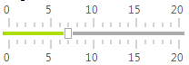

# Modes

RadTrackBar supports three different modes - __SingleThumb__, __StartFromTheBeginning__ and __Range__. Each of these modes defineS own functionality and behavior. You can change the mode of the control via its __TrackBarMode__ property.
      

## SingleThumb

In this mode RadTrackBar works like standard TrackBar. It contains one thumb and its value can be accessed through the __Value__ property of RadTrackBar. To receive notification when value is changed you can use the __ValueChanged__ event.



## StartFromTheBeginning

In this mode RadTrackBar looks like RadTrackBar in SingleThumb mode, but it can contain more than one thumb. To show more than one thumb you should add the desired Ranges (__TrackBarRange__) in __Ranges__ collection of control. For example:

{{source=..\SamplesCS\TrackAndStatus\TrackBar\TrackBarPropertiesAndEvents.cs region=TrackBarModeStartFromTheBeginning}} 
{{source=..\SamplesVB\TrackAndStatus\TrackBar\TrackBarPropertiesAndEvents.vb region=TrackBarModeStartFromTheBeginning}} 

````C#
this.radTrackBar1.TrackBarMode = Telerik.WinControls.UI.TrackBarRangeMode.StartFromTheBeginning;
this.radTrackBar1.Ranges.Add(new TrackBarRange(0, 5, "MyRange1"));
this.radTrackBar1.Ranges.Add(new TrackBarRange(0, 15, "MyRange2"));

````
````VB.NET
Me.RadTrackBar1.TrackBarMode = Telerik.WinControls.UI.TrackBarRangeMode.StartFromTheBeginning
Me.RadTrackBar1.Ranges.Add(New TrackBarRange(0, 5, "MyRange1"))
Me.RadTrackBar1.Ranges.Add(New TrackBarRange(0, 15, "MyRange2"))

````

{{endregion}} 


In order to access the values of the thumbs in this mode you should go through the __Ranges__ collection and check the values of each __TrackBarRange__. Please, note that even though __TrackBarRange__ has both __Start__ and __End__ properties, in this mode RadTrackBar uses only the __End__ property, so you should access it order to take the value of some range.

{{source=..\SamplesCS\TrackAndStatus\TrackBar\TrackBarPropertiesAndEvents.cs region=accessValuesStartFromTheBeginningMode}} 
{{source=..\SamplesVB\TrackAndStatus\TrackBar\TrackBarPropertiesAndEvents.vb region=accessValuesStartFromTheBeginningMode}} 

````C#
float fitstRangeValue = this.radTrackBar1.Ranges[0].End;
float secondRangeValue = this.radTrackBar1.Ranges[1].End;

````
````VB.NET
Dim fitstRangeValue As Single = Me.RadTrackBar1.Ranges(0).[End]

````

{{endregion}} 

To receive notification when the Value is changed in this mode, you should use the __CollectionChanged__ event of the __Ranges__ collection:

{{source=..\SamplesCS\TrackAndStatus\TrackBar\TrackBarPropertiesAndEvents.cs region=Ranges_CollectionChangedEvent}} 
{{source=..\SamplesVB\TrackAndStatus\TrackBar\TrackBarPropertiesAndEvents.vb region=Ranges_CollectionChangedEvent}} 

````C#
void Ranges_CollectionChanged(object sender, Telerik.WinControls.Data.NotifyCollectionChangedEventArgs e)
{
    if (e.Action == Telerik.WinControls.Data.NotifyCollectionChangedAction.ItemChanged) 
    {
        foreach (object item in e.NewItems)
        {
            TrackBarRange range = item as TrackBarRange;
            if (range != null)
            {
                Console.WriteLine("Range {0} value {1}",range.Text, range.End);
            }
        }
    }
}

````
````VB.NET
Private Sub Ranges_CollectionChanged(sender As Object, e As Telerik.WinControls.Data.NotifyCollectionChangedEventArgs)
    If e.Action = Telerik.WinControls.Data.NotifyCollectionChangedAction.ItemChanged Then
        For Each item As Object In e.NewItems
            Dim range As TrackBarRange = TryCast(item, TrackBarRange)
            If range IsNot Nothing Then
                Console.WriteLine("Range {0} value {1}", range.Text, range.[End])
            End If
        Next
    End If
End Sub

````

{{endregion}} 

## Range

This mode allows you to define one or more __Ranges__ with __Start__ and __End__ values.  In this mode there is a limitation that prevents the __Ranges__ to overlap each other. To display a second range, you should add  the desired __Range (TrackBarRange)__ in __Ranges__ collection of the control. For example:

{{source=..\SamplesCS\TrackAndStatus\TrackBar\TrackBarPropertiesAndEvents.cs region=TrackBarModeRange}} 
{{source=..\SamplesVB\TrackAndStatus\TrackBar\TrackBarPropertiesAndEvents.vb region=TrackBarModeRange}} 

````C#
this.radTrackBar1.TrackBarMode = Telerik.WinControls.UI.TrackBarRangeMode.Range;
this.radTrackBar1.Ranges[0].Start = 2;
this.radTrackBar1.Ranges[0].End = 5;
this.radTrackBar1.Ranges.Add(new TrackBarRange(10, 15));

````
````VB.NET
Me.RadTrackBar1.TrackBarMode = Telerik.WinControls.UI.TrackBarRangeMode.Range
Me.RadTrackBar1.Ranges(0).Start = 2
Me.RadTrackBar1.Ranges(0).[End] = 5
Me.RadTrackBar1.Ranges.Add(New TrackBarRange(10, 15))

````

{{endregion}} 


To receive notification when the Value is changed in this mode, you should use the __CollectionChanged__ event of the __Ranges__ collection:

{{source=..\SamplesCS\TrackAndStatus\TrackBar\TrackBarPropertiesAndEvents.cs region=Ranges_CollectionChangedEvent}} 
{{source=..\SamplesVB\TrackAndStatus\TrackBar\TrackBarPropertiesAndEvents.vb region=Ranges_CollectionChangedEvent}} 

````C#
void Ranges_CollectionChanged(object sender, Telerik.WinControls.Data.NotifyCollectionChangedEventArgs e)
{
    if (e.Action == Telerik.WinControls.Data.NotifyCollectionChangedAction.ItemChanged) 
    {
        foreach (object item in e.NewItems)
        {
            TrackBarRange range = item as TrackBarRange;
            if (range != null)
            {
                Console.WriteLine("Range {0} value {1}",range.Text, range.End);
            }
        }
    }
}

````
````VB.NET
Private Sub Ranges_CollectionChanged(sender As Object, e As Telerik.WinControls.Data.NotifyCollectionChangedEventArgs)
    If e.Action = Telerik.WinControls.Data.NotifyCollectionChangedAction.ItemChanged Then
        For Each item As Object In e.NewItems
            Dim range As TrackBarRange = TryCast(item, TrackBarRange)
            If range IsNot Nothing Then
                Console.WriteLine("Range {0} value {1}", range.Text, range.[End])
            End If
        Next
    End If
End Sub

````

{{endregion}} 

>note The __Ranges__ collection of RadTrackBar contains one default range that is used to display a default range for all Modes. This collection should always contain at least one range, so if you execute the *Clear* method of the collection all ranges except the first one will be removed.
>

>note When the mode is changed from __StartFromTheBeginning__ to something else, the __Radnges__ collection will be reset to prevent overlappings that are not allowed in the other modes.
>

