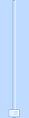
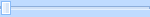
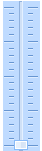

# Programming RadTrackBar

## Properties

Here are the most important RadTrackBar properties that you can use to change its appearance and behavior:
        

* The __Minimum__ and __Maximum__ properties specify the lower end and upper end of the range which thumbs can scroll over.

{{source=..\SamplesCS\TrackAndStatus\TrackBar\TrackBarPropertiesAndEvents.cs region=minMax}} 
{{source=..\SamplesVB\TrackAndStatus\TrackBar\TrackBarPropertiesAndEvents.vb region=minMax}} 

````C#
            this.radTrackBar1.Minimum = 10;
            this.radTrackBar1.Maximum = 120;
````
````VB.NET
        Me.RadTrackBar1.Minimum = 10
        Me.RadTrackBar1.Maximum = 120
        '
````

{{endregion}} 

* The __Value__ property sets or gets the value of the thumb in *SingleThumb* mode of RadTrackBar

{{source=..\SamplesCS\TrackAndStatus\TrackBar\TrackBarPropertiesAndEvents.cs region=Value}} 
{{source=..\SamplesVB\TrackAndStatus\TrackBar\TrackBarPropertiesAndEvents.vb region=Value}} 

````C#
            this.radTrackBar1.Value = 5;
````
````VB.NET
        Me.RadTrackBar1.Value = 5
        '
````

{{endregion}} 


* The __TickStyle__ property controls whether the tick marks are drawn on one or both sides of the control.
              The default value is *Both*.
            

* Setting __TickStyle__ to *None* will disable the ticks.


{{source=..\SamplesCS\TrackAndStatus\TrackBar\TrackBarPropertiesAndEvents.cs region=tickStyleNone}} 
{{source=..\SamplesVB\TrackAndStatus\TrackBar\TrackBarPropertiesAndEvents.vb region=tickStyleNone}} 

````C#
            this.radTrackBar1.TickStyle = Telerik.WinControls.Enumerations.TickStyles.None;
````
````VB.NET
        Me.RadTrackBar1.TickStyle = Telerik.WinControls.Enumerations.TickStyles.None
        '
````

{{endregion}} 




* Setting __TickStyle__ to *Both* will enable ticks on both sides.

{{source=..\SamplesCS\TrackAndStatus\TrackBar\TrackBarPropertiesAndEvents.cs region=tickStyleBoth}} 
{{source=..\SamplesVB\TrackAndStatus\TrackBar\TrackBarPropertiesAndEvents.vb region=tickStyleBoth}} 

````C#
            this.radTrackBar1.TickStyle = Telerik.WinControls.Enumerations.TickStyles.Both;
````
````VB.NET
        Me.RadTrackBar1.TickStyle = Telerik.WinControls.Enumerations.TickStyles.Both
        '
````

{{endregion}} 


* Setting __TickStyle__ to *TopLeft* will show only the ticks on the top side, when the Orientation is Horizontal. If the Orientation is set to Vertical, only the ticks on the left side will be shown:


{{source=..\SamplesCS\TrackAndStatus\TrackBar\TrackBarPropertiesAndEvents.cs region=tickStyleTop}} 
{{source=..\SamplesVB\TrackAndStatus\TrackBar\TrackBarPropertiesAndEvents.vb region=tickStyleTop}} 

````C#
            this.radTrackBar1.TickStyle = Telerik.WinControls.Enumerations.TickStyles.TopLeft;
````
````VB.NET
        Me.RadTrackBar1.TickStyle = Telerik.WinControls.Enumerations.TickStyles.TopLeft
        '
````

{{endregion}} 


* Setting __TickStyle__ to *BottomRight* will show only the ticks on the down side, when the Orientation is Horizontal. If the Orientation is set to Vertical, only the ticks on the right side will be shown:

{{source=..\SamplesCS\TrackAndStatus\TrackBar\TrackBarPropertiesAndEvents.cs region=tickStyleBottom}} 
{{source=..\SamplesVB\TrackAndStatus\TrackBar\TrackBarPropertiesAndEvents.vb region=tickStyleBottom}} 

````C#
            this.radTrackBar1.TickStyle = Telerik.WinControls.Enumerations.TickStyles.BottomRight;
````
````VB.NET
        Me.RadTrackBar1.TickStyle = Telerik.WinControls.Enumerations.TickStyles.BottomRight
        '
````

{{endregion}} 


* The __Orientation__ property can be set to __Horizontal__ or __Vertical__ to determine the overall orientation of the control. The default value is *Horizontal*, but if you set it to *Vertical*, you will get the following result:

{{source=..\SamplesCS\TrackAndStatus\TrackBar\TrackBarPropertiesAndEvents.cs region=orientationVertical}} 
{{source=..\SamplesVB\TrackAndStatus\TrackBar\TrackBarPropertiesAndEvents.vb region=orientationVertical}} 

````C#
            this.radTrackBar1.Orientation = Orientation.Vertical;
````
````VB.NET
        Me.RadTrackBar1.Orientation = Orientation.Vertical
        '
````

{{endregion}} 




* The __LargeChange__ property sets the change in value that one click of the mouse outside of the slider makes.  Let's say that the position of your thumb is at the beginning of the RadTrackBar (at position 0), the value of this property is *5* and you click on tick number 14. The thumb will reposition itself to tick number *5*, following the step determined by the __LargeChange__ property. However, if the __LargeChange__  has value 0, the thumb will move to position 14.


{{source=..\SamplesCS\TrackAndStatus\TrackBar\TrackBarPropertiesAndEvents.cs region=largeChange}} 
{{source=..\SamplesVB\TrackAndStatus\TrackBar\TrackBarPropertiesAndEvents.vb region=largeChange}} 

````C#
            this.radTrackBar1.LargeChange = 5;
````
````VB.NET
        Me.RadTrackBar1.LargeChange = 5
        '
````

{{endregion}} 

* The __TextOrientation__ property controls the orientation of the associated texts, whether they should appear horizontally or vertically.  The default value is Horizontal, here is how to change it to vertical:

{{source=..\SamplesCS\TrackAndStatus\TrackBar\TrackBarPropertiesAndEvents.cs region=textorientation}} 
{{source=..\SamplesVB\TrackAndStatus\TrackBar\TrackBarPropertiesAndEvents.vb region=textorientation}} 

````C#
            this.radTrackBar1.TextOrientation = Orientation.Vertical;
````
````VB.NET
        Me.RadTrackBar1.TextOrientation = Orientation.Vertical
        '
````

{{endregion}} 


* The __LabelStyle__ property controls whether the labels should be drawn. The default value is None.

* __Both__ - will show the labels on both sides


{{source=..\SamplesCS\TrackAndStatus\TrackBar\TrackBarPropertiesAndEvents.cs region=labelsStyleBoth}} 
{{source=..\SamplesVB\TrackAndStatus\TrackBar\TrackBarPropertiesAndEvents.vb region=labelsStyleBoth}} 

````C#
            this.radTrackBar1.LabelStyle = Telerik.WinControls.UI.TrackBarLabelStyle.Both;
````
````VB.NET
        Me.RadTrackBar1.LabelStyle = Telerik.WinControls.UI.TrackBarLabelStyle.Both
        '
````

{{endregion}} 


* __TopLeft__ - will show only the labels on the top side, when the Orientation is Horizontal. If the Orientation is set to Vertical, only the labels on the left side will be shown:

{{source=..\SamplesCS\TrackAndStatus\TrackBar\TrackBarPropertiesAndEvents.cs region=labelsStyleTopLeft}} 
{{source=..\SamplesVB\TrackAndStatus\TrackBar\TrackBarPropertiesAndEvents.vb region=labelsStyleTopLeft}} 

````C#
            this.radTrackBar1.LabelStyle = Telerik.WinControls.UI.TrackBarLabelStyle.TopLeft;
````
````VB.NET
        Me.RadTrackBar1.LabelStyle = Telerik.WinControls.UI.TrackBarLabelStyle.TopLeft
        '
````

{{endregion}} 


* __BottomRight__ - will show only the labels on the bottom side, when the Orientation is Horizontal.  If the Orientation is set to Vertical, only the labels on the right side will be shown:


{{source=..\SamplesCS\TrackAndStatus\TrackBar\TrackBarPropertiesAndEvents.cs region=labelsStyleBottomRight}} 
{{source=..\SamplesVB\TrackAndStatus\TrackBar\TrackBarPropertiesAndEvents.vb region=labelsStyleBottomRight}} 

````C#
            this.radTrackBar1.LabelStyle = Telerik.WinControls.UI.TrackBarLabelStyle.BottomRight;
````
````VB.NET
        Me.RadTrackBar1.LabelStyle = Telerik.WinControls.UI.TrackBarLabelStyle.BottomRight
        '
````

{{endregion}} 


* The __ShowButtons__ property controls the visibility of the navigation buttons in RadTrackBar. By default these buttons are not displayed. To show them, set the property to true.

{{source=..\SamplesCS\TrackAndStatus\TrackBar\TrackBarPropertiesAndEvents.cs region=ShowButtons}} 
{{source=..\SamplesVB\TrackAndStatus\TrackBar\TrackBarPropertiesAndEvents.vb region=ShowButtons}} 

````C#
            this.radTrackBar1.ShowButtons = true;
````
````VB.NET
        Me.RadTrackBar1.ShowButtons = True
        '
````

{{endregion}} 


* The __LargeTickFrequency__ property sets the spacing between the large tick marks. The default value is 5.

{{source=..\SamplesCS\TrackAndStatus\TrackBar\TrackBarPropertiesAndEvents.cs region=LargeTickFrequency}} 
{{source=..\SamplesVB\TrackAndStatus\TrackBar\TrackBarPropertiesAndEvents.vb region=LargeTickFrequency}} 

````C#
            this.radTrackBar1.LargeTickFrequency = 10;
````
````VB.NET
        Me.RadTrackBar1.LargeTickFrequency = 10
        '
````

{{endregion}} 


* The __SmallTickFrequency__ property sets the spacing between the small tick marks. The default value is 1.

{{source=..\SamplesCS\TrackAndStatus\TrackBar\TrackBarPropertiesAndEvents.cs region=SmallTickFrequency}} 
{{source=..\SamplesVB\TrackAndStatus\TrackBar\TrackBarPropertiesAndEvents.vb region=SmallTickFrequency}} 

````C#
            this.radTrackBar1.SmallTickFrequency = 2;
````
````VB.NET
        Me.RadTrackBar1.SmallTickFrequency = 2
        '
````

{{endregion}} 


* The __TrackBarMode__ property determinates in which mode the control will operate.  Each [mode]() has different functionality and behavior.
            

* __SingleThumb__

{{source=..\SamplesCS\TrackAndStatus\TrackBar\TrackBarPropertiesAndEvents.cs region=TrackBarModeSingleThumb}} 
{{source=..\SamplesVB\TrackAndStatus\TrackBar\TrackBarPropertiesAndEvents.vb region=TrackBarModeSingleThumb}} 

````C#
            this.radTrackBar1.TrackBarMode = Telerik.WinControls.UI.TrackBarRangeMode.SingleThumb;
````
````VB.NET
        Me.RadTrackBar1.TrackBarMode = Telerik.WinControls.UI.TrackBarRangeMode.SingleThumb
        '
````

{{endregion}} 


* __StartFromTheBeggining__

{{source=..\SamplesCS\TrackAndStatus\TrackBar\TrackBarPropertiesAndEvents.cs region=TrackBarModeStartFromTheBeginning}} 
{{source=..\SamplesVB\TrackAndStatus\TrackBar\TrackBarPropertiesAndEvents.vb region=TrackBarModeStartFromTheBeginning}} 

````C#
            this.radTrackBar1.TrackBarMode = Telerik.WinControls.UI.TrackBarRangeMode.StartFromTheBeginning;
            this.radTrackBar1.Ranges.Add(new TrackBarRange(0, 5, "MyRange1"));
            this.radTrackBar1.Ranges.Add(new TrackBarRange(0, 15, "MyRange2"));
````
````VB.NET
        Me.RadTrackBar1.TrackBarMode = Telerik.WinControls.UI.TrackBarRangeMode.StartFromTheBeginning
        Me.RadTrackBar1.Ranges.Add(New TrackBarRange(0, 5, "MyRange1"))
        Me.RadTrackBar1.Ranges.Add(New TrackBarRange(0, 15, "MyRange2"))
        '
````

{{endregion}} 


* __Range__

{{source=..\SamplesCS\TrackAndStatus\TrackBar\TrackBarPropertiesAndEvents.cs region=TrackBarModeRange}} 
{{source=..\SamplesVB\TrackAndStatus\TrackBar\TrackBarPropertiesAndEvents.vb region=TrackBarModeRange}} 

````C#
            this.radTrackBar1.TrackBarMode = Telerik.WinControls.UI.TrackBarRangeMode.Range;
            this.radTrackBar1.Ranges[0].Start = 2;
            this.radTrackBar1.Ranges[0].End = 5;
            this.radTrackBar1.Ranges.Add(new TrackBarRange(10, 15));
````
````VB.NET
        Me.RadTrackBar1.TrackBarMode = Telerik.WinControls.UI.TrackBarRangeMode.Range
        Me.RadTrackBar1.Ranges(0).Start = 2
        Me.RadTrackBar1.Ranges(0).[End] = 5
        Me.RadTrackBar1.Ranges.Add(New TrackBarRange(10, 15))
        '
````

{{endregion}} 


* The __SnapMode__ property controls the way the thumb is moving in RadTrackBar. When this property is set to *SnapToTicks* the thumb is moving only at tick positions.  When the value is set to __None__ the slider is moving freely.

{{source=..\SamplesCS\TrackAndStatus\TrackBar\TrackBarPropertiesAndEvents.cs region=SnapModeOff}} 
{{source=..\SamplesVB\TrackAndStatus\TrackBar\TrackBarPropertiesAndEvents.vb region=SnapModeOff}} 

````C#
            this.radTrackBar1.SnapMode = TrackBarSnapModes.SnapToTicks;
````
````VB.NET
        Me.RadTrackBar1.SnapMode = TrackBarSnapModes.SnapToTicks
        '
````

{{endregion}}


* The __ThumbSize__ property sets the size of the thumbs.

{{source=..\SamplesCS\TrackAndStatus\TrackBar\TrackBarPropertiesAndEvents.cs region=ThumbSize}} 
{{source=..\SamplesVB\TrackAndStatus\TrackBar\TrackBarPropertiesAndEvents.vb region=ThumbSize}} 

````C#
            this.radTrackBar1.ThumbSize = new Size(16, 18);
````
````VB.NET
        Me.RadTrackBar1.ThumbSize = New Size(16, 18)
        '
````

{{endregion}} 


* The __ShowSlideArea__ property controls whether the line down the middle of the control where the slider rides is drawn. The default value is *true*. Setting it to false will produce the following result:


{{source=..\SamplesCS\TrackAndStatus\TrackBar\TrackBarPropertiesAndEvents.cs region=showSlideAreaFalse}} 
{{source=..\SamplesVB\TrackAndStatus\TrackBar\TrackBarPropertiesAndEvents.vb region=showSlideAreaFalse}} 

````C#
            this.radTrackBar1.ShowSlideArea = false;
````
````VB.NET
        Me.RadTrackBar1.ShowSlideArea = False
        '
````

{{endregion}} 


## Events

There are several events that you will find useful in the context of RadTrackBar:

* __ValueChanged__ event is fired after the user drags  the thumb and __drops__ it somewhere on the slider area, or when the __Value__ property is set. In this event, you can get the value of RadTrackBar from its __Value__ property.
            

* __LableFormatting__ event is used to formatt the labels.

{{source=..\SamplesCS\TrackAndStatus\TrackBar\TrackBarPropertiesAndEvents.cs region=TickFormattingEvent}} 
{{source=..\SamplesVB\TrackAndStatus\TrackBar\TrackBarPropertiesAndEvents.vb region=TickFormattingEvent}} 

````C#
        void radTrackBar1_TickFormatting(object sender, TickFormattingEventArgs e)
        {
            e.TickElement.Line1.BackColor = Color.Red;
        }
````
````VB.NET
    Private Sub radTrackBar1_TickFormatting(sender As Object, e As TickFormattingEventArgs)
        e.TickElement.Line1.BackColor = Color.Red
    End Sub
````

{{endregion}} 


* __TickFormatting__ event is used format the ticks. For example, the code sample below changes the color of the ticks to red:

{{source=..\SamplesCS\TrackAndStatus\TrackBar\TrackBarPropertiesAndEvents.cs region=LabelFormattingEvent}} 
{{source=..\SamplesVB\TrackAndStatus\TrackBar\TrackBarPropertiesAndEvents.vb region=LabelFormattingEvent}} 

````C#
        void radTrackBar1_LabelFormatting(object sender, LabelFormattingEventArgs e)
        {
            e.LabelElement.ForeColor = Color.Red;
        }
````
````VB.NET
    Private Sub radTrackBar1_LabelFormatting(sender As Object, e As LabelFormattingEventArgs)
        e.LabelElement.ForeColor = Color.Red
    End Sub
````

{{endregion}} 


