# Properties

|Property|Description||
|----|----|----|
|**TrackBarElement**|Gets the instance of RadTrackBarElement wrapped by this control. RadTrackBarElement is the main element in the hierarchy tree and encapsulates the actual functionality of RadTrackBar.||
|**Minimum** and **Maximum**|Specify the lower end and upper end of the range which thumbs can scroll over.||
|**Value**|Gets or sets the value of the thumb in *SingleThumb* mode of RadTrackBar||
|**TickStyle**|Controls whether the tick marks are drawn on one or both sides of the control. The default value is *Both*. Setting __TickStyle__ to *None* will disable the ticks. Setting __TickStyle__ to *Both* will enable ticks on both sides. Setting __TickStyle__ to *TopLeft* will show only the ticks on the top side, when the Orientation is Horizontal. If the Orientation is set to Vertical, only the ticks on the left side will be shown. Setting __TickStyle__ to *BottomRight* will show only the ticks on the down side, when the Orientation is Horizontal. If the Orientation is set to Vertical, only the ticks on the right side will be shown.|</br>  </br> 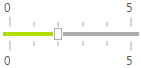</br> |
|**Orientation**|Gets or Sets the orientation of the RadTrackBar.|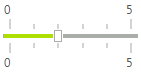</br>|
|**LargeChange**|Gets or sets the change in value that one click of the mouse outside of the slider makes. Let's say that the position of your thumb is at the beginning of the **RadTrackBar** (at position *0*), the value of this property is *5* and you click on tick number 14. The thumb will reposition itself to tick number *5*, following the step determined by the __LargeChange__ property. However, if the __LargeChange__  has value 0, the thumb will move to position 14.||
|**TextOrientation**|Gets or Sets the orientation of the text associated with TrackBar. Whether it should appear horizontal or vertical.|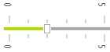|
|**LabelStyle**|Gets or Sets whether the RadTrackBar's labels should be drawn.The default value is None. *TopLeft* value will show only the labels on the top side, when the Orientation is Horizontal. If the Orientation is set to Vertical, only the labels on the left side will be shown.  *BottomRight* value will show only the labels on the bottom side, when the Orientation is Horizontal.  If the Orientation is set to Vertical, only the labels on the right side will be shown. *BottomRight* - will show only the labels on the bottom side, when the Orientation is Horizontal.  If the Orientation is set to Vertical, only the labels on the right side will be shown.|</br>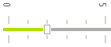</br></br>|
|**ShowButtons**|Controls the visibility of the navigation buttons in RadTrackBar. By default these buttons are not displayed. To show them, set the property to true.|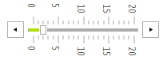|
|**LargeTickFrequency**|Sets the spacing between the large tick marks. The default value is *5*.|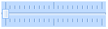|
|**SmallTickFrequency**|Sets the spacing between the small tick marks. The default value is 1.|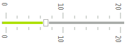|
|**TrackBarMode**|Determinates in which mode the control will operate.  Each [mode]() has different functionality and behavior.|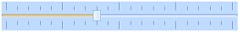|
|**Ranges**|Gets the TrackBarRangeCollection.||
|**SnapMode**|Controls the way the thumb is moving in RadTrackBar. When this property is set to *SnapToTicks* the thumb is moving only at tick positions.  When the value is set to __None__ the slider is moving freely.|</br>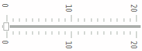|
|**ThumbSize**|Gets or Sets TrackBar's Size.||
|**ShowSlideArea**|Controls whether the line down the middle of the control where the slider rides is drawn. The default value is *true*.|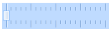|

# Events

|Event|Description|
|----|----|
|**ValueChanged**|Occurs after the user drags  the thumb and drops it somewhere on the slider area, or when the __Value__ property is set. In this event, you can get the value of RadTrackBar from its __Value__ property.|
|**LabelFormatting**|Occurs when a Label needs to be formatted.|
|**TickFormatting**|Occurs when a Tick needs to be formatted.|

#### Formatting ticks

{{source=..\SamplesCS\TrackAndStatus\TrackBar\TrackBarPropertiesAndEvents.cs region=TickFormattingEvent}} 
{{source=..\SamplesVB\TrackAndStatus\TrackBar\TrackBarPropertiesAndEvents.vb region=TickFormattingEvent}} 

````C#
void radTrackBar1_TickFormatting(object sender, TickFormattingEventArgs e)
{
    e.TickElement.Line1.BackColor = Color.Red;
}

````
````VB.NET
Private Sub radTrackBar1_TickFormatting(sender As Object, e As TickFormattingEventArgs)
    e.TickElement.Line1.BackColor = Color.Red
End Sub

````

{{endregion}} 

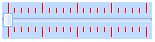

#### Formatting labels

{{source=..\SamplesCS\TrackAndStatus\TrackBar\TrackBarPropertiesAndEvents.cs region=LabelFormattingEvent}} 
{{source=..\SamplesVB\TrackAndStatus\TrackBar\TrackBarPropertiesAndEvents.vb region=LabelFormattingEvent}} 

````C#
void radTrackBar1_LabelFormatting(object sender, LabelFormattingEventArgs e)
{
    e.LabelElement.ForeColor = Color.Red;
}

````
````VB.NET
Private Sub radTrackBar1_LabelFormatting(sender As Object, e As LabelFormattingEventArgs)
    e.LabelElement.ForeColor = Color.Red
End Sub

````

{{endregion}} 


# See Also

* [Properties](http://docs.telerik.com/devtools/winforms/api/html/properties_t_telerik_wincontrols_ui_radtrackbar.htm)
* [Methods](http://docs.telerik.com/devtools/winforms/api/html/methods_t_telerik_wincontrols_ui_radtrackbar.htm)
* [Events](http://docs.telerik.com/devtools/winforms/api/html/events_t_telerik_wincontrols_ui_radtrackbar.htm)


