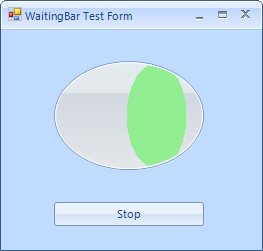

# Customizing RadWaitingBar

RadWaitingBar introduces rich API which allows you to easily customize 
      the visual appearance of RadWaitingBar programmatically. Below you will find scenarios that
      will increase your knowledge about RadWaitingBar's API, hence you will be able to
      customize it according to your requirements.      
      

## How to customize the text of RadWaitingBar

The text of RadWaitingBar is not displayed by default. To show the text, set the 
        __ShowText__ property of RadWaitingBar to true.
        To change the text content, use the
        __Text__ property of RadWaitingBar. To customize the text orientation,
        set the
        __AngleTransform__ property of the RadWaitingBarElement.TextElement. 
        To modify the text position,
        change the __TextAlignment__ property of RadWaitingBarElement.TextElement.        
        Here is a sample snippet:                 
			

#### __[C#]__

{{source=..\SamplesCS\TrackAndStatus\WaitingBar\CustomizingRadWaitingBar.cs region=text}}
	            this.radWaitingBar1.ShowText = true;
	            this.radWaitingBar1.Text = "Waiting...";
	            this.radWaitingBar1.WaitingBarElement.TextElement.AngleTransform = 180;
	            this.radWaitingBar1.WaitingBarElement.TextElement.TextAlignment = ContentAlignment.MiddleLeft;
	{{endregion}}

#### __[VB.NET]__

{{source=..\SamplesVB\TrackAndStatus\WaitingBar\CustomizingRadWaitingBar.vb region=text}}
	        Me.RadWaitingBar1.ShowText = True
	        Me.RadWaitingBar1.Text = "Waiting..."
	        Me.RadWaitingBar1.WaitingBarElement.TextElement.AngleTransform = 180
	        Me.RadWaitingBar1.WaitingBarElement.TextElement.TextAlignment = ContentAlignment.MiddleLeft
	        '#End Region
	
	        '#Region dash
	        Me.RadWaitingBar1.WaitingStyle = Telerik.WinControls.Enumerations.WaitingBarStyles.Dash
	        Dim dash As WaitingBarSeparatorElement = Me.RadWaitingBar1.WaitingBarElement.SeparatorElement
	        dash.NumberOfColors = 2
	        dash.BackColor = Color.Orange
	        dash.BackColor2 = Color.Yellow
	        dash.SweepAngle = 45
	        dash.StepWidth = 15
	        dash.SeparatorWidth = 10
	        dash.GradientPercentage = 0.25F
	        '#End Region
	
	        '#Region "waitingIndicators"
	        Me.RadWaitingBar1.WaitingBarElement.Indicators(0).BackColor = Color.LightGreen
	        Me.RadWaitingBar1.WaitingBarElement.Indicators(0).NumberOfColors = 1
	        Me.RadWaitingBar1.WaitingBarElement.Indicators(1).BackColor = Color.LightGreen
	        Me.RadWaitingBar1.WaitingBarElement.Indicators(1).NumberOfColors = 1
	        Dim separator As WaitingBarSeparatorElement = Me.RadWaitingBar1.WaitingBarElement.Indicators(0).SeparatorElement
	        Dim helpSeparator As WaitingBarSeparatorElement = Me.RadWaitingBar1.WaitingBarElement.Indicators(1).SeparatorElement
	
	        separator.Dash = True
	        helpSeparator.Dash = True
	
	        separator.NumberOfColors = 2
	        separator.BackColor = Color.Orange
	        separator.BackColor2 = Color.Yellow
	        separator.SweepAngle = 45
	        separator.StepWidth = 15
	        separator.SeparatorWidth = 10
	        separator.GradientPercentage = 0.25F
	
	        helpSeparator.NumberOfColors = 2
	        helpSeparator.BackColor = Color.Orange
	        helpSeparator.BackColor2 = Color.Yellow
	        helpSeparator.SweepAngle = 45
	        helpSeparator.StepWidth = 15
	        helpSeparator.SeparatorWidth = 10
	        helpSeparator.GradientPercentage = 0.25F
	        '#End Region
	
	        '#Region shape
	        Dim shape As New Telerik.WinControls.EllipseShape()
	        Me.RadWaitingBar1.WaitingBarElement.Shape = shape
	        Me.RadWaitingBar1.WaitingBarElement.ContentElement.Shape = shape
	        Me.RadWaitingBar1.WaitingBarElement.Indicators(0).Shape = shape
	        Me.RadWaitingBar1.WaitingBarElement.Indicators(1).Shape = shape
	        '#End Region
	    End Sub
	End Class

## How to customize RadWaitingBar’s Dash style 

To set the RadWaitingBar in dash style set the __WaitingStyle__
        property to __Dash__.
        To customize the appearance of the stripes-pattern, you need to access
        the RadWaitingBarElement.SeparatorElement. Here is a sample scenario:                         
			 

#### __[C#]__

{{source=..\SamplesCS\TrackAndStatus\WaitingBar\CustomizingRadWaitingBar.cs region=dash}}
	            this.radWaitingBar1.WaitingStyle = Telerik.WinControls.Enumerations.WaitingBarStyles.Dash;
	            WaitingBarSeparatorElement dash = this.radWaitingBar1.WaitingBarElement.SeparatorElement;
	            dash.NumberOfColors = 2;
	            dash.BackColor = Color.Orange;
	            dash.BackColor2 = Color.Yellow;
	            dash.SweepAngle = 45;
	            dash.StepWidth = 15;
	            dash.SeparatorWidth = 10;
	            dash.GradientPercentage = 0.25f;
	{{endregion}}

#### __[VB.NET]__

{{source=..\SamplesVB\TrackAndStatus\WaitingBar\CustomizingRadWaitingBar.vb region=dash}}
	        Me.RadWaitingBar1.WaitingStyle = Telerik.WinControls.Enumerations.WaitingBarStyles.Dash
	        Dim dash As WaitingBarSeparatorElement = Me.RadWaitingBar1.WaitingBarElement.SeparatorElement
	        dash.NumberOfColors = 2
	        dash.BackColor = Color.Orange
	        dash.BackColor2 = Color.Yellow
	        dash.SweepAngle = 45
	        dash.StepWidth = 15
	        dash.SeparatorWidth = 10
	        dash.GradientPercentage = 0.25F
	        '#End Region
	
	        '#Region "waitingIndicators"
	        Me.RadWaitingBar1.WaitingBarElement.Indicators(0).BackColor = Color.LightGreen
	        Me.RadWaitingBar1.WaitingBarElement.Indicators(0).NumberOfColors = 1
	        Me.RadWaitingBar1.WaitingBarElement.Indicators(1).BackColor = Color.LightGreen
	        Me.RadWaitingBar1.WaitingBarElement.Indicators(1).NumberOfColors = 1
	        Dim separator As WaitingBarSeparatorElement = Me.RadWaitingBar1.WaitingBarElement.Indicators(0).SeparatorElement
	        Dim helpSeparator As WaitingBarSeparatorElement = Me.RadWaitingBar1.WaitingBarElement.Indicators(1).SeparatorElement
	
	        separator.Dash = True
	        helpSeparator.Dash = True
	
	        separator.NumberOfColors = 2
	        separator.BackColor = Color.Orange
	        separator.BackColor2 = Color.Yellow
	        separator.SweepAngle = 45
	        separator.StepWidth = 15
	        separator.SeparatorWidth = 10
	        separator.GradientPercentage = 0.25F
	
	        helpSeparator.NumberOfColors = 2
	        helpSeparator.BackColor = Color.Orange
	        helpSeparator.BackColor2 = Color.Yellow
	        helpSeparator.SweepAngle = 45
	        helpSeparator.StepWidth = 15
	        helpSeparator.SeparatorWidth = 10
	        helpSeparator.GradientPercentage = 0.25F
	        '#End Region
	
	        '#Region shape
	        Dim shape As New Telerik.WinControls.EllipseShape()
	        Me.RadWaitingBar1.WaitingBarElement.Shape = shape
	        Me.RadWaitingBar1.WaitingBarElement.ContentElement.Shape = shape
	        Me.RadWaitingBar1.WaitingBarElement.Indicators(0).Shape = shape
	        Me.RadWaitingBar1.WaitingBarElement.Indicators(1).Shape = shape
	        '#End Region
	    End Sub
	End Class

## How to set Dash style only for the waiting indicators

The waiting indicators also support dash style. To customize the appearance of
        the indicators’ stripes-pattern, you need to access the SeparatorElements of all indicators.
        By default, the Indicators collection contains two indicators. Here is a sample scenario:
			 

#### __[C#]__

{{source=..\SamplesCS\TrackAndStatus\WaitingBar\CustomizingRadWaitingBar.cs region=waitingIndicators}}
	            this.radWaitingBar1.WaitingBarElement.Indicators[0].BackColor = Color.LightGreen;
	            this.radWaitingBar1.WaitingBarElement.Indicators[0].NumberOfColors = 1;
	            this.radWaitingBar1.WaitingBarElement.Indicators[1].BackColor = Color.LightGreen;
	            this.radWaitingBar1.WaitingBarElement.Indicators[1].NumberOfColors = 1;
	            WaitingBarSeparatorElement separator = this.radWaitingBar1.WaitingBarElement.Indicators[0].SeparatorElement;
	            WaitingBarSeparatorElement helpSeparator = this.radWaitingBar1.WaitingBarElement.Indicators[1].SeparatorElement;
	
	            separator.Dash = true;
	            helpSeparator.Dash = true;
	
	            separator.NumberOfColors = 2;
	            separator.BackColor = Color.Orange;
	            separator.BackColor2 = Color.Yellow;
	            separator.SweepAngle = 45;
	            separator.StepWidth = 15;
	            separator.SeparatorWidth = 10;
	            separator.GradientPercentage = 0.25f;
	
	            helpSeparator.NumberOfColors = 2;
	            helpSeparator.BackColor = Color.Orange;
	            helpSeparator.BackColor2 = Color.Yellow;
	            helpSeparator.SweepAngle = 45;
	            helpSeparator.StepWidth = 15;
	            helpSeparator.SeparatorWidth = 10;
	            helpSeparator.GradientPercentage = 0.25f;
	{{endregion}}

#### __[VB.NET]__

{{source=..\SamplesVB\TrackAndStatus\WaitingBar\CustomizingRadWaitingBar.vb region=waitingIndicators}}
	        Me.RadWaitingBar1.WaitingBarElement.Indicators(0).BackColor = Color.LightGreen
	        Me.RadWaitingBar1.WaitingBarElement.Indicators(0).NumberOfColors = 1
	        Me.RadWaitingBar1.WaitingBarElement.Indicators(1).BackColor = Color.LightGreen
	        Me.RadWaitingBar1.WaitingBarElement.Indicators(1).NumberOfColors = 1
	        Dim separator As WaitingBarSeparatorElement = Me.RadWaitingBar1.WaitingBarElement.Indicators(0).SeparatorElement
	        Dim helpSeparator As WaitingBarSeparatorElement = Me.RadWaitingBar1.WaitingBarElement.Indicators(1).SeparatorElement
	
	        separator.Dash = True
	        helpSeparator.Dash = True
	
	        separator.NumberOfColors = 2
	        separator.BackColor = Color.Orange
	        separator.BackColor2 = Color.Yellow
	        separator.SweepAngle = 45
	        separator.StepWidth = 15
	        separator.SeparatorWidth = 10
	        separator.GradientPercentage = 0.25F
	
	        helpSeparator.NumberOfColors = 2
	        helpSeparator.BackColor = Color.Orange
	        helpSeparator.BackColor2 = Color.Yellow
	        helpSeparator.SweepAngle = 45
	        helpSeparator.StepWidth = 15
	        helpSeparator.SeparatorWidth = 10
	        helpSeparator.GradientPercentage = 0.25F
	        '#End Region
	
	        '#Region shape
	        Dim shape As New Telerik.WinControls.EllipseShape()
	        Me.RadWaitingBar1.WaitingBarElement.Shape = shape
	        Me.RadWaitingBar1.WaitingBarElement.ContentElement.Shape = shape
	        Me.RadWaitingBar1.WaitingBarElement.Indicators(0).Shape = shape
	        Me.RadWaitingBar1.WaitingBarElement.Indicators(1).Shape = shape
	        '#End Region
	    End Sub
	End Class

## How to customize the shape of RadWatingBar

Different shapes can be applied to both the WaitingBarElement and 
        the waiting indicator. In the following example
        the WaitingBarElement and the waiting indicator have elliptical shape:        
         	  

#### __[C#]__

{{source=..\SamplesCS\TrackAndStatus\WaitingBar\CustomizingRadWaitingBar.cs region=shape}}
	            Telerik.WinControls.EllipseShape shape = new Telerik.WinControls.EllipseShape();
	            this.radWaitingBar1.WaitingBarElement.Shape = shape;
	            this.radWaitingBar1.WaitingBarElement.ContentElement.Shape = shape;
	            this.radWaitingBar1.WaitingBarElement.Indicators[0].Shape = shape;
	            this.radWaitingBar1.WaitingBarElement.Indicators[1].Shape = shape;
	{{endregion}}

#### __[VB.NET]__

{{source=..\SamplesVB\TrackAndStatus\WaitingBar\CustomizingRadWaitingBar.vb region=shape}}
	        Dim shape As New Telerik.WinControls.EllipseShape()
	        Me.RadWaitingBar1.WaitingBarElement.Shape = shape
	        Me.RadWaitingBar1.WaitingBarElement.ContentElement.Shape = shape
	        Me.RadWaitingBar1.WaitingBarElement.Indicators(0).Shape = shape
	        Me.RadWaitingBar1.WaitingBarElement.Indicators(1).Shape = shape
	        '#End Region
	    End Sub
	End Class

