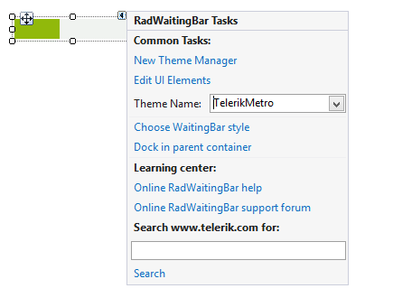

# Design Time

When you drag a __RadWaitingBar__ from the Toolbox and drop it onto the form, the waiting bar style gallery will offer you to pick up the desired type. It allows you to customize the appearance settings as well:

## Smart Tag

>caption Fig.1 Smart Tag

* __Common Tasks__

	* __New Theme Manager__: Adds a new __RadThemeManager__ component to the form.

	* __Edit UI elements__: Opens a dialog that displays the *Element Hierarchy Editor*. This editor lets you browse all the elements in the control.

	* __Theme Name__: Select a theme name from the drop down list of themes available for that control. Selecting a theme allows you to change all aspects of the controls visual style at one time.
	
* __Associated Control__: Specifies the associated control.

* __Choose WaitingBar style__: Opens the gallery.

* __Learning Center__: Navigate to the Telerik help, code library projects or support forum.

* __Search__: Search the Telerik site for a given string.

# See Also

* [Element Hierarchy Editor]()
* [Structure]()	
* [Getting Started]()	

