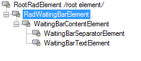
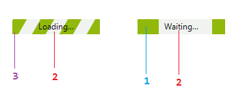

# Structure

>caption Fig.1 RadWaitingBar's elements hierarchy

 1. __WaitingBarIndicatorElement__
 2. __WaitingBarTextElement__
 3. __WaitingBarSeparatorElement__

>caption Fig.2 RadWaitingBar's structure

The __RadWaitingBarElement__ represents the entire __RadWaitingBar__ control. Any settings you make at this level will be inherited by all elements further down in the tree. The __WaitingBarContentElement__ wraps up the layout logic of the waiting bar and arranges the waiting indicators, the separator element, and the text element. The __WaitingBarSeparatorElement__ covers the __WaitingBarContentElement__’s area completely with a customizable stripe-pattern, hiding the waiting indicators. Stretched in the __WaitingBarContentElement__, the __WaitingBarTextElement__ displays the text of the __RadWaitingBar__. By default, __RadWaitingBar__ comprises two instances of __WaitingBarIndicatorElements__ which represent the control indicators. Each __WaitingBarIndicatorElement__ contains a __WaitingBarSeparatorElement__ in order to allow the waiting indicators to support dash style.   

# See Also

* [Design Time]()
* [Getting Started]()	
   
