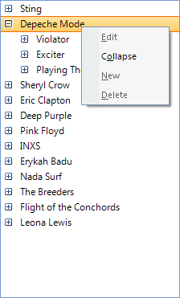
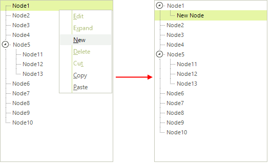
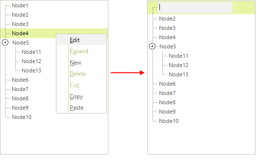
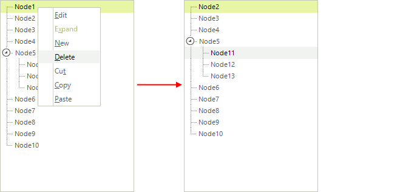

# Default Context Menu

RadTreeView displays a default context menu which appears when you right-click on a node.
        This menu contains 7 items and they are:
      

* __New__: A new sibling node is created.
          

* __Edit__: An editor appears at the position of the node
            from which the context menu is invoked. This editor allows you to change a property of the node.
          

* __Delete__: The node from which the menu is invoked is deleted.
          

* __Expand__/__Collapse__: Depending on the expaded state of the node, this menu item may display
            itself as "Expand" or "Collapse". When click the corresponding operations occurs.
          

* __Cut__: The node from which the context menu is invoked together with its child nodes (in short - the
            whole branch) is cut.
          

* __Copy__: The node from which the context menu is invoked together with its child nodes (in short - the
            whole branch) is copied.
          

* __Paste__: If there a cut or copied node (branch), this node is added as a sibling node
            to the node from which the context menu is invoked.
          

## Enabling the default context menu items

__Enabling the default context menu__

The default context menu is not enabled by default and if you
          right-click a node, it will not appear on the screen. In order to enable it, you should set the
          __AllowDefaultContextMenu__ property to *true*:
        

#### __[C#]__

{{source=..\SamplesCS\TreeView\ContextMenus\TreeViewMenus.cs region=defaultMenu}}
	            this.radTreeView1.AllowDefaultContextMenu = true;
	{{endregion}}

#### __[VB.NET]__

{{source=..\SamplesVB\TreeView\ContextMenus\TreeViewMenus.vb region=defaultMenu}}
	        Me.RadTreeView1.AllowDefaultContextMenu = True
	        '#End Region
	
	        '#Region "allowAdd"
	        Me.RadTreeView1.AllowAdd = True
	        '#End Region
	
	        '#Region "allowRemove"
	        Me.RadTreeView1.AllowRemove = True
	        '#End Region
	
	        '#Region "allowEdit"
	        Me.RadTreeView1.AllowEdit = True
	        '#End Region    
	
	        AddHandler RadTreeView1.ContextMenuOpening, AddressOf radTreeView1_ContextMenuOpening1
	
	    End Sub
	
	    '#Region "addingItems"
	    Private Sub radTreeView1_ContextMenuOpening(ByVal sender As Object, ByVal e As Telerik.WinControls.UI.TreeViewContextMenuOpeningEventArgs)
	        If e.Node.Level = 0 Then
	            Dim browseArtist As New RadMenuItem(String.Format("Browse {0}", e.Node.Text))
	            browseArtist.Name = "Artist"
	            AddHandler browseArtist.Click, AddressOf menuItem_Click
	            e.Menu.Items.Add(browseArtist)
	        End If
	
	        If e.Node.Level = 1 Then
	            Dim buyAlbum As New RadMenuItem("Buy this album!")
	            buyAlbum.Name = "Album"
	            AddHandler buyAlbum.Click, AddressOf menuItem_Click
	            e.Menu.Items.Add(buyAlbum)
	        End If
	
	        If e.Node.Level = 2 Then
	            Dim buySong As New RadMenuItem("Buy this song!")
	            buySong.Name = "Song"
	            AddHandler buySong.Click, AddressOf menuItem_Click
	            e.Menu.Items.Add(buySong)
	        End If
	    End Sub
	
	    Private Sub menuItem_Click(ByVal sender As Object, ByVal e As EventArgs)
	        Dim item As RadMenuItem = TryCast(sender, RadMenuItem)
	        Select Case item.Name
	            Case "Artist"
	                ' DO STH
	            Case "Album"
	                ' DO STH
	            Case "Song"
	                ' DO STH
	        End Select
	    End Sub
	    '#End Region
	
	    '#Region "removingItems"
	    Private Sub radTreeView1_ContextMenuOpening1(ByVal sender As Object, ByVal e As Telerik.WinControls.UI.TreeViewContextMenuOpeningEventArgs)
	        Dim rowView As DataRowView = CType(e.Node.DataBoundItem, DataRowView)
	        Dim row As DataRow = rowView.Row
	
	        For i As Integer = e.Menu.Items.Count - 1 To 0 Step -1
	            If e.Menu.Items(i).Name = "Delete" Then
	                If CBool(row.ItemArray(2)) = True Then
	                    e.Menu.Items.Remove(e.Menu.Items(i))
	                End If
	            End If
	
	            If e.Menu.Items(i).Name = "New" Then
	                If e.Node.Level = 0 Then
	                    e.Menu.Items.Remove(e.Menu.Items(i))
	                End If
	            End If
	        Next i
	    End Sub
	    '#End Region
	End Class

This will display only a small subset of all available menu items. Please note that only the *Expand/Collapse*
          item is enabled. All the other items are disabled and below you will see how to enable them.
          __Enabling the New item__

          To enable the New item, you should set the __AllowAdd__ property to *true*:
        

#### __[C#]__

{{source=..\SamplesCS\TreeView\ContextMenus\TreeViewMenus.cs region=allowAdd}}
	            this.radTreeView1.AllowAdd = true;
	{{endregion}}

#### __[VB.NET]__

{{source=..\SamplesVB\TreeView\ContextMenus\TreeViewMenus.vb region=allowAdd}}
	        Me.RadTreeView1.AllowAdd = True
	        '#End Region
	
	        '#Region "allowRemove"
	        Me.RadTreeView1.AllowRemove = True
	        '#End Region
	
	        '#Region "allowEdit"
	        Me.RadTreeView1.AllowEdit = True
	        '#End Region    
	
	        AddHandler RadTreeView1.ContextMenuOpening, AddressOf radTreeView1_ContextMenuOpening1
	
	    End Sub
	
	    '#Region "addingItems"
	    Private Sub radTreeView1_ContextMenuOpening(ByVal sender As Object, ByVal e As Telerik.WinControls.UI.TreeViewContextMenuOpeningEventArgs)
	        If e.Node.Level = 0 Then
	            Dim browseArtist As New RadMenuItem(String.Format("Browse {0}", e.Node.Text))
	            browseArtist.Name = "Artist"
	            AddHandler browseArtist.Click, AddressOf menuItem_Click
	            e.Menu.Items.Add(browseArtist)
	        End If
	
	        If e.Node.Level = 1 Then
	            Dim buyAlbum As New RadMenuItem("Buy this album!")
	            buyAlbum.Name = "Album"
	            AddHandler buyAlbum.Click, AddressOf menuItem_Click
	            e.Menu.Items.Add(buyAlbum)
	        End If
	
	        If e.Node.Level = 2 Then
	            Dim buySong As New RadMenuItem("Buy this song!")
	            buySong.Name = "Song"
	            AddHandler buySong.Click, AddressOf menuItem_Click
	            e.Menu.Items.Add(buySong)
	        End If
	    End Sub
	
	    Private Sub menuItem_Click(ByVal sender As Object, ByVal e As EventArgs)
	        Dim item As RadMenuItem = TryCast(sender, RadMenuItem)
	        Select Case item.Name
	            Case "Artist"
	                ' DO STH
	            Case "Album"
	                ' DO STH
	            Case "Song"
	                ' DO STH
	        End Select
	    End Sub
	    '#End Region
	
	    '#Region "removingItems"
	    Private Sub radTreeView1_ContextMenuOpening1(ByVal sender As Object, ByVal e As Telerik.WinControls.UI.TreeViewContextMenuOpeningEventArgs)
	        Dim rowView As DataRowView = CType(e.Node.DataBoundItem, DataRowView)
	        Dim row As DataRow = rowView.Row
	
	        For i As Integer = e.Menu.Items.Count - 1 To 0 Step -1
	            If e.Menu.Items(i).Name = "Delete" Then
	                If CBool(row.ItemArray(2)) = True Then
	                    e.Menu.Items.Remove(e.Menu.Items(i))
	                End If
	            End If
	
	            If e.Menu.Items(i).Name = "New" Then
	                If e.Node.Level = 0 Then
	                    e.Menu.Items.Remove(e.Menu.Items(i))
	                End If
	            End If
	        Next i
	    End Sub
	    '#End Region
	End Class

__Enabling the Edit item__
          To enable the Edit item, you should set the __AllowEdit__ property to *true*:
        

#### __[C#]__

{{source=..\SamplesCS\TreeView\ContextMenus\TreeViewMenus.cs region=allowEdit}}
	            this.radTreeView1.AllowEdit = true;
	{{endregion}}

#### __[VB.NET]__

{{source=..\SamplesVB\TreeView\ContextMenus\TreeViewMenus.vb region=allowEdit}}
	        Me.RadTreeView1.AllowEdit = True
	        '#End Region    
	
	        AddHandler RadTreeView1.ContextMenuOpening, AddressOf radTreeView1_ContextMenuOpening1
	
	    End Sub
	
	    '#Region "addingItems"
	    Private Sub radTreeView1_ContextMenuOpening(ByVal sender As Object, ByVal e As Telerik.WinControls.UI.TreeViewContextMenuOpeningEventArgs)
	        If e.Node.Level = 0 Then
	            Dim browseArtist As New RadMenuItem(String.Format("Browse {0}", e.Node.Text))
	            browseArtist.Name = "Artist"
	            AddHandler browseArtist.Click, AddressOf menuItem_Click
	            e.Menu.Items.Add(browseArtist)
	        End If
	
	        If e.Node.Level = 1 Then
	            Dim buyAlbum As New RadMenuItem("Buy this album!")
	            buyAlbum.Name = "Album"
	            AddHandler buyAlbum.Click, AddressOf menuItem_Click
	            e.Menu.Items.Add(buyAlbum)
	        End If
	
	        If e.Node.Level = 2 Then
	            Dim buySong As New RadMenuItem("Buy this song!")
	            buySong.Name = "Song"
	            AddHandler buySong.Click, AddressOf menuItem_Click
	            e.Menu.Items.Add(buySong)
	        End If
	    End Sub
	
	    Private Sub menuItem_Click(ByVal sender As Object, ByVal e As EventArgs)
	        Dim item As RadMenuItem = TryCast(sender, RadMenuItem)
	        Select Case item.Name
	            Case "Artist"
	                ' DO STH
	            Case "Album"
	                ' DO STH
	            Case "Song"
	                ' DO STH
	        End Select
	    End Sub
	    '#End Region
	
	    '#Region "removingItems"
	    Private Sub radTreeView1_ContextMenuOpening1(ByVal sender As Object, ByVal e As Telerik.WinControls.UI.TreeViewContextMenuOpeningEventArgs)
	        Dim rowView As DataRowView = CType(e.Node.DataBoundItem, DataRowView)
	        Dim row As DataRow = rowView.Row
	
	        For i As Integer = e.Menu.Items.Count - 1 To 0 Step -1
	            If e.Menu.Items(i).Name = "Delete" Then
	                If CBool(row.ItemArray(2)) = True Then
	                    e.Menu.Items.Remove(e.Menu.Items(i))
	                End If
	            End If
	
	            If e.Menu.Items(i).Name = "New" Then
	                If e.Node.Level = 0 Then
	                    e.Menu.Items.Remove(e.Menu.Items(i))
	                End If
	            End If
	        Next i
	    End Sub
	    '#End Region
	End Class

__Enabling the Delete item__
          To enable the Delete item, you should set the __AllowRemove__ property to *true*:
        

#### __[C#]__

{{source=..\SamplesCS\TreeView\ContextMenus\TreeViewMenus.cs region=allowRemove}}
	            this.radTreeView1.AllowRemove = true;
	{{endregion}}

#### __[VB.NET]__

{{source=..\SamplesVB\TreeView\ContextMenus\TreeViewMenus.vb region=allowRemove}}
	        Me.RadTreeView1.AllowRemove = True
	        '#End Region
	
	        '#Region "allowEdit"
	        Me.RadTreeView1.AllowEdit = True
	        '#End Region    
	
	        AddHandler RadTreeView1.ContextMenuOpening, AddressOf radTreeView1_ContextMenuOpening1
	
	    End Sub
	
	    '#Region "addingItems"
	    Private Sub radTreeView1_ContextMenuOpening(ByVal sender As Object, ByVal e As Telerik.WinControls.UI.TreeViewContextMenuOpeningEventArgs)
	        If e.Node.Level = 0 Then
	            Dim browseArtist As New RadMenuItem(String.Format("Browse {0}", e.Node.Text))
	            browseArtist.Name = "Artist"
	            AddHandler browseArtist.Click, AddressOf menuItem_Click
	            e.Menu.Items.Add(browseArtist)
	        End If
	
	        If e.Node.Level = 1 Then
	            Dim buyAlbum As New RadMenuItem("Buy this album!")
	            buyAlbum.Name = "Album"
	            AddHandler buyAlbum.Click, AddressOf menuItem_Click
	            e.Menu.Items.Add(buyAlbum)
	        End If
	
	        If e.Node.Level = 2 Then
	            Dim buySong As New RadMenuItem("Buy this song!")
	            buySong.Name = "Song"
	            AddHandler buySong.Click, AddressOf menuItem_Click
	            e.Menu.Items.Add(buySong)
	        End If
	    End Sub
	
	    Private Sub menuItem_Click(ByVal sender As Object, ByVal e As EventArgs)
	        Dim item As RadMenuItem = TryCast(sender, RadMenuItem)
	        Select Case item.Name
	            Case "Artist"
	                ' DO STH
	            Case "Album"
	                ' DO STH
	            Case "Song"
	                ' DO STH
	        End Select
	    End Sub
	    '#End Region
	
	    '#Region "removingItems"
	    Private Sub radTreeView1_ContextMenuOpening1(ByVal sender As Object, ByVal e As Telerik.WinControls.UI.TreeViewContextMenuOpeningEventArgs)
	        Dim rowView As DataRowView = CType(e.Node.DataBoundItem, DataRowView)
	        Dim row As DataRow = rowView.Row
	
	        For i As Integer = e.Menu.Items.Count - 1 To 0 Step -1
	            If e.Menu.Items(i).Name = "Delete" Then
	                If CBool(row.ItemArray(2)) = True Then
	                    e.Menu.Items.Remove(e.Menu.Items(i))
	                End If
	            End If
	
	            If e.Menu.Items(i).Name = "New" Then
	                If e.Node.Level = 0 Then
	                    e.Menu.Items.Remove(e.Menu.Items(i))
	                End If
	            End If
	        Next i
	    End Sub
	    '#End Region
	End Class

