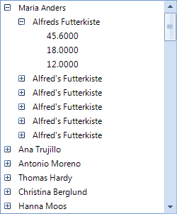

# Binding to Object-relational Data


## Binding RadTreeView to related data - custom objects

RadTreeView has the ability to bind to related data of custom objects which have member collections of related objects (ORM generated classes for example).
        

Consider the following class diagram: 


There are three classes named __Customer__, __Order__ and __Order_Detail__. The __Customer__ class represents a custom.
        

The data relations in the case of custom objects are represented by properties which provide references to collections of related objects. In this case the __Customer__ class has a property named __Orders__ which is a collection of __Order__ objects. This is the first relation. The second relation is the __Order_Details__ property in the __Order__ class, it offers a reference to a collection of __Order_Details__. Once you have such class composition, it is trivial for RadTreeView to represent it visually in your application.
        

The two steps that must be done are these:

1\. Set the DataSource of RadTreeView to a collection of your root objects (a collection of Customer object in this case):

{{source=..\SamplesCS\TreeView\DataBinding\BindingToRelatedData.cs region=customers}} 
{{source=..\SamplesVB\TreeView\DataBinding\BindingToRelatedData.vb region=customers}} 

````C#
            
            IEnumerable<Customer> customers = context.GetTable<Customer>().ToList();       
            this.radTreeView1.DataSource = customers;
````
````VB.NET
        Dim customers As IEnumerable(Of Customer) = context.GetTable(Of Customer)().ToList()
        Me.RadTreeView1.DataSource = customers
        '#End Region

        '#region relationClasses
        Me.RadTreeView1.DisplayMember = "ContactName\ShipName\UnitPrice"
        Me.RadTreeView1.ChildMember = "Customers\Orders\Order_Details"
        '
````

{{endregion}} 

2\. Set DisplayMember corresponding to the DisplayMembers of the different types of objects and set the ChildMember corresponding to the names of the properties that represent the collections of sub objects.

{{source=..\SamplesCS\TreeView\DataBinding\BindingToRelatedData.cs region=relationClasses}} 
{{source=..\SamplesVB\TreeView\DataBinding\BindingToRelatedData.vb region=relationClasses}} 

````C#
            
            this.radTreeView1.DisplayMember = "ContactName\\ShipName\\UnitPrice";
            this.radTreeView1.ChildMember = "Customers\\Orders\\Order_Details";
````
````VB.NET
        Me.RadTreeView1.DisplayMember = "ContactName\ShipName\UnitPrice"
        Me.RadTreeView1.ChildMember = "Customers\Orders\Order_Details"
        '
````

{{endregion}} 

As a result, we get the following hierarchy in RadTreeView:



## Binding check boxes

Since Q3 2014 __RadTreeView__ supports binding the check-boxes of the nodes to a field in the data. You just need to specify the RadTreeView. __CheckedMember__ property in addition to the necessary information described above. 

Consider the following diagram which can be illustrated with the sample classes below: 

Note that the *IsActive* and the *Status* properties represent boolean data. 

{{source=..\SamplesCS\TreeView\DataBinding\BindingToRelatedData.cs region=DataClasses}} 
{{source=..\SamplesVB\TreeView\DataBinding\BindingToRelatedData.vb region=DataClasses}} 

````C#
            
        public class Parent 
        {
            public string ParentId { get; set; }
            
            public string Title { get; set; }
            
            public bool IsActive { get; set; }
            
            public List<Child> Children { get; set; }
                
            public Parent(string parentId, string title, bool isActive, List<Child> children)
            {
                this.ParentId = parentId;
                this.Title = title;
                this.IsActive = isActive;
                this.Children = children;
            }
        }
            
        public class Child
        {
            public string ChildId { get; set; }
            
            public string ParentId { get; set; }
            
            public string Name { get; set; }
            
            public bool Status { get; set; }
                
            public Child(string childId, string parentId, string name, bool status)
            {
                this.ChildId = childId;
                this.ParentId = parentId;
                this.Name = name;
                this.Status = status;
            }
        }
````
````VB.NET

    Public Class Parent
        Public Property ParentId() As String
            Get
                Return m_ParentId
            End Get
            Set(value As String)
                m_ParentId = Value
            End Set
        End Property
        Private m_ParentId As String

        Public Property Title() As String
            Get
                Return m_Title
            End Get
            Set(value As String)
                m_Title = Value
            End Set
        End Property
        Private m_Title As String

        Public Property IsActive() As Boolean
            Get
                Return m_IsActive
            End Get
            Set(value As Boolean)
                m_IsActive = Value
            End Set
        End Property
        Private m_IsActive As Boolean

        Public Property Children() As List(Of Child)
            Get
                Return m_Children
            End Get
            Set(value As List(Of Child))
                m_Children = Value
            End Set
        End Property
        Private m_Children As List(Of Child)

        Public Sub New(parentId As String, title As String, isActive As Boolean, children As List(Of Child))
            Me.ParentId = parentId
            Me.Title = title
            Me.IsActive = isActive
            Me.Children = children
        End Sub
    End Class

    Public Class Child
        Public Property ChildId() As String
            Get
                Return m_ChildId
            End Get
            Set(value As String)
                m_ChildId = Value
            End Set
        End Property
        Private m_ChildId As String

        Public Property ParentId() As String
            Get
                Return m_ParentId
            End Get
            Set(value As String)
                m_ParentId = Value
            End Set
        End Property
        Private m_ParentId As String

        Public Property Name() As String
            Get
                Return m_Name
            End Get
            Set(value As String)
                m_Name = Value
            End Set
        End Property
        Private m_Name As String

        Public Property Status() As Boolean
            Get
                Return m_Status
            End Get
            Set(value As Boolean)
                m_Status = Value
            End Set
        End Property
        Private m_Status As Boolean

        Public Sub New(childId As String, parentId As String, name As String, status As Boolean)
            Me.ChildId = childId
            Me.ParentId = parentId
            Me.Name = name
            Me.Status = status
        End Sub
    End Class
````

{{endregion}} 

The code snippet below illustrates how to bind the check-boxes coming from the described properties:


{{source=..\SamplesCS\TreeView\DataBinding\BindingToRelatedData.cs region=CheckedMember}} 
{{source=..\SamplesVB\TreeView\DataBinding\BindingToRelatedData.vb region=CheckedMember}} 

````C#
            
            List<Parent> dataItems = new List<Parent>();
            Parent currentParent;
            Child currentChild;
            List<Child> children;
            string parentId = string.Empty;
            string childId = string.Empty;
            for (int i = 1; i <= 5; i++)
            {
                parentId = Guid.NewGuid().ToString();
                    
                children = new List<Child>();
                for (int j = 1; j < 5; j++)
                {
                    childId = Guid.NewGuid().ToString();
                    currentChild = new Child(childId, parentId, "SubNode." + i + "." + j, j % 2 == 0);
                    children.Add(currentChild);
                }
                currentParent = new Parent(parentId, "Node." + i, i % 2 == 0,children);
                dataItems.Add(currentParent);
            }
            
            radTreeView1.DataSource = dataItems;
            radTreeView1.DisplayMember = "Title\\Name";
            radTreeView1.ChildMember = "Parent\\Children";
            radTreeView1.CheckedMember = "IsActive\\Status";
            radTreeView1.CheckBoxes = true;
````
````VB.NET

        Dim dataItems As New List(Of Parent)()
        Dim currentParent As Parent
        Dim currentChild As Child
        Dim children As List(Of Child)
        Dim parentId As String = String.Empty
        Dim childId As String = String.Empty
        For i As Integer = 1 To 5
            parentId = Guid.NewGuid().ToString()

            children = New List(Of Child)()
            For j As Integer = 1 To 4
                childId = Guid.NewGuid().ToString()
                currentChild = New Child(childId, parentId, "SubNode." & i & "." & j, j Mod 2 = 0)
                children.Add(currentChild)
            Next
            currentParent = New Parent(parentId, "Node." & i, i Mod 2 = 0, children)
            dataItems.Add(currentParent)
        Next

        radTreeView1.DataSource = dataItems
        radTreeView1.DisplayMember = "Title\Name"
        radTreeView1.ChildMember = "Parent\Children"
        radTreeView1.CheckedMember = "IsActive\Status"
        radTreeView1.CheckBoxes = True

        '
````

{{endregion}}
