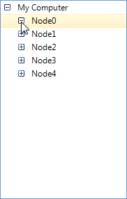
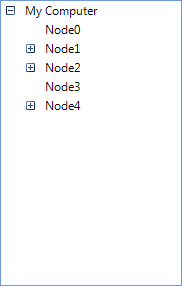

# Load On Demand


## 

The Load On Demand feature helps reduce performance and memory costs incurred when all nodes are loaded at one time. To benefit from this feature, you just need to handle the __NodesNeeded__ event where you can fill the parent nodes with subnodes.
          
RadTreeView supports two modes of lazy loading nodes:

* Full lazy mode. In this mode, the NodesNeeded event is fired when you try to expand a node. Before expanding a node, RadTreeView is not aware whether this node has children or not. Therefore, you get expander signs for all nodes, regardless of whether these nodes will provide data when the end-user will try to expand them. To enable this feature, you should set the __LazyMode__ to *true*.
            

* Partial lazy mode. This is the default mode of RadTreeView. In this mode the NodesNeeded event is fired for all directly accessible nodes without any action required from the end-user. When the end-user expands a node, the NodesNeeded event is fired for the subnodes of this node. In short you are filling the first sub-level of a parent node in advance. Because of that, the parent nodes are aware of whether they have child nodes or not, and as a result, RadTreeView can determine whether an explander sign is required or not. To enable this feature, you should set the __LazyMode__ property to *false* (this is the default value).
            

The event arguments of the NodesNeeded event contain the __Parent__ node that you are trying to expand and the __Nodes__ collection that you should fill with subnodes. The code snippet below demonstrates how you can handle the NodesNeeded event and load 5 nodes to any expanded node, except to the child nodes of the root node. We will add sub-nodes only to some of the nodes at the first level. This will allow you to see the difference between the full and the partial lazy modes.
        

>warning Please note that the BeginUpdate/EndUpdate functions that are used to improve the performance in other scenarios should not be used in Load on demand scenario, since it might lead to undesirable consequences. The reason for this is that during the NodesNeeded event we are loading nodes for a certain parent and calling the EndUpdate method will force the tree to start over, while the nodes loading is not yet finished. This might lead to undesired infinite recursion.
>

Here is the result of this code snippet in the context of different lazy modes:

{{source=..\SamplesCS\TreeView\DataBinding\LoadOnDemand.cs region=nodesNodes}} 
{{source=..\SamplesVB\TreeView\DataBinding\LoadOnDemand.vb region=nodesNodes}} 

````C#
void radTreeView1_NodesNeeded(object sender, NodesNeededEventArgs e)
{
    if (e.Parent == null)
    {
        LoadRootNodes(e.Nodes);
        return;
    }
    // If the parent node is one of the "My Computer" children, 
    // then add sub-nodes to this node depending on its index
    if (e.Parent.Level == 1)
    {
        if (e.Parent.Index % 3 == 0)
        {
            return;
        }
    }
    for (int i = 0; i < 5; i++)
    {
        RadTreeNode childNode = new RadTreeNode(string.Format("Node{0}", i));
        e.Nodes.Add(childNode);
    }
}
void LoadRootNodes(IList<RadTreeNode> nodes)
{
    RadTreeNode mcNode = new RadTreeNode("My Computer");
    nodes.Add(mcNode);
}

````
````VB.NET
Private Sub radTreeView1_NodesNeeded(ByVal sender As Object, ByVal e As NodesNeededEventArgs)
    If e.Parent Is Nothing Then
        LoadRootNodes(e.Nodes)
        Return
    End If
    ' If the parent node is one of the "My Computer" children, 
    ' then add sub-nodes to this node depending on its index
    If e.Parent.Level = 1 Then
        If e.Parent.Index Mod 3 = 0 Then
            Return
        End If
    End If
    For i As Integer = 0 To 4
        Dim childNode As New RadTreeNode(String.Format("Node{0}", i))
        e.Nodes.Add(childNode)
    Next i
End Sub
Private Sub LoadRootNodes(ByVal nodes As IList(Of RadTreeNode))
    Dim mcNode As New RadTreeNode("My Computer")
    nodes.Add(mcNode)
End Sub

````

{{endregion}} 

* If __LazyMode__ is *true*, here is the result that we will get. When the end-user tries expanding nodes that do not have any sub-nodes, the plus sign will turn into a minus sign, but nothing else would change:



* When __LazyMode__ is *false* no plus/minus signs appear next to some of the nodes, because for these nodes RadTreeView already knows that there will be no sub-nodes:


