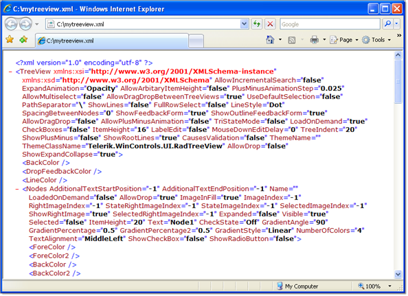

# Serialize/Deserialize to XML


## 

RadTreeView methods __LoadXML()__ and __SaveXML()__ serialize the contents and 
        state of the entire RadTreeView and its nodes. These methods can be useful when you want to save the data locally and without 
        needing to connect to a database for binding.

````xml
	
````


>note For direct access to the tree view XML as text use the __TreeViewXML__ property.
>


The contents of the saved XML file contain the properties for the RadTreeView as a whole and each of the nodes in the tree.

>note  __RadTreeView__ supports save/load functionality at design time via the[Property Builder]().
>

