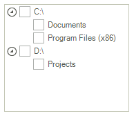

<table>
	<tr>
		<td>Product Version</td>
		<td>2018.3 911</td>
	</tr>
	<tr>
		<td>Product</td>
		<td>RadTreeView for WinForms</td>
	</tr>
</table>

# ToggleStateConverter

**RadTreeView** allows binding the check boxes to a custom property from the associated data object by specifying the RadTreeView.**CheckedMember** property. A common case is when the specified [CheckedMember]() is a property of custom type and it should be converted to **ToggleState** which is required by the check boxes in the tree view. This article demonstrates how you can modify the way a property is being displayed and edited by using custom TypeConverters. 
A [Type Converter]( https://msdn.microsoft.com/en-us/library/ayybcxe5.aspx) is used to convert values between data types. Here are the four main methods that are usually used when implementing a custom __Type Converter__.

* Override the __CanConvertFrom__ method that specifies which type the converter can convert from.

* Override the __ConvertFrom__ method that implements the conversion.

* Override the __CanConvertTo__ method that specifies which type the converter can convert to. 

* Override the __ConvertTo__ method that implements the conversion. 

Consider the **RadTreeView** is populated with **Item** objects having the following properties:

#### Item class

{{source=..\SamplesCS\TreeView\TreeViewToggleStateConverter.cs region=ItemObject}} 
{{source=..\SamplesVB\TreeView\TreeViewToggleStateConverter.vb region=ItemObject}} 

````C#
public class Item : System.ComponentModel.INotifyPropertyChanged
{
    public event PropertyChangedEventHandler PropertyChanged;
    protected virtual void OnPropertyChanged(string propertyName)
    {
        if (PropertyChanged != null)
        {
            PropertyChanged(this, new PropertyChangedEventArgs(propertyName));
        }
    }
    int m_id;
    int m_parentId;
    string m_name;
    string m_isActive;
    public Item(string name, string isActive, int parent_Id, int id)
    {
        this.m_name = name;
        this.m_isActive = isActive;
        this.m_parentId = parent_Id;
        this.m_id = id;
    }
    public int Id
    {
        get
        {
            return m_id;
        }
        set
        {
            if (this.m_id != value)
            {
                this.m_id = value;
                OnPropertyChanged("Id");
            }
        }
    }
    public int ParentId
    {
        get
        {
            return m_parentId;
        }
        set
        {
            if (this.m_parentId != value)
            {
                this.m_parentId = value;
                OnPropertyChanged("ParentId");
            }
        }
    }
    public string Name
    {
        get
        {
            return m_name;
        }
        set
        {
            if (this.m_name != value)
            {
                this.m_name = value;
                OnPropertyChanged("Name");
            }
        }
    }
    public string IsActive
    {
        get
        {
            return m_isActive;
        }
        set
        {
            if (this.m_isActive != value)
            {
                this.m_isActive = value;
                OnPropertyChanged("IsActive");
            }
        }
    }
}

````
````VB.NET
Public Class Item
    Implements System.ComponentModel.INotifyPropertyChanged
    Public Event PropertyChanged As PropertyChangedEventHandler Implements System.ComponentModel.INotifyPropertyChanged.PropertyChanged
    Protected Overridable Sub OnPropertyChanged(ByVal propertyName As String)
        RaiseEvent PropertyChanged(Me, New PropertyChangedEventArgs(propertyName))
    End Sub
    Private m_id As Integer
    Private m_parentId As Integer
    Private m_name As String
    Private m_isActive As String
    Public Sub New(ByVal name As String, ByVal isActive As String, ByVal parent_Id As Integer, ByVal id As Integer)
        Me.m_name = name
        Me.m_isActive = isActive
        Me.m_parentId = parent_Id
        Me.m_id = id
    End Sub
    Public Property Id As Integer
        Get
            Return m_id
        End Get
        Set(ByVal value As Integer)
            If Me.m_id <> value Then
                Me.m_id = value
                OnPropertyChanged("Id")
            End If
        End Set
    End Property
    Public Property ParentId As Integer
        Get
            Return m_parentId
        End Get
        Set(ByVal value As Integer)
            If Me.m_parentId <> value Then
                Me.m_parentId = value
                OnPropertyChanged("ParentId")
            End If
        End Set
    End Property
    Public Property Name As String
        Get
            Return m_name
        End Get
        Set(ByVal value As String)
            If Me.m_name <> value Then
                Me.m_name = value
                OnPropertyChanged("Name")
            End If
        End Set
    End Property
    Public Property IsActive As String
        Get
            Return m_isActive
        End Get
        Set(ByVal value As String)
            If Me.m_isActive <> value Then
                Me.m_isActive = value
                OnPropertyChanged("IsActive")
            End If
        End Set
    End Property
End Class

````

{{endregion}}

The tree view is populated with data as follows:

#### Bind RadTreeView 

{{source=..\SamplesCS\TreeView\TreeViewToggleStateConverter.cs region=PopulateTreeView}} 
{{source=..\SamplesVB\TreeView\TreeViewToggleStateConverter.vb region=PopulateTreeView}} 

````C#
BindingList<Item> items = new BindingList<Item>();
items.Add(new Item(@"C:\", "false", 0, 1));
items.Add(new Item(@"Documents", "false", 1, 2));
items.Add(new Item(@"Program Files (x86)", "false", 1, 3));
items.Add(new Item(@"D:\", "false", 0, 4));
items.Add(new Item(@"Projects", "false", 4, 5));
this.radTreeView1.DisplayMember = "Name";
this.radTreeView1.ChildMember = "Id";
this.radTreeView1.ParentMember = "ParentId";
this.radTreeView1.CheckedMember = "IsActive";
this.radTreeView1.DataSource = items;
this.radTreeView1.CheckBoxes = true;

````
````VB.NET
Dim items As BindingList(Of Item) = New BindingList(Of Item)()
items.Add(New Item("C:\", "false", 0, 1))
items.Add(New Item("Documents", "false", 1, 2))
items.Add(New Item("Program Files (x86)", "false", 1, 3))
items.Add(New Item("D:\", "false", 0, 4))
items.Add(New Item("Projects", "false", 4, 5))
Me.RadTreeView1.DisplayMember = "Name"
Me.RadTreeView1.ChildMember = "Id"
Me.RadTreeView1.ParentMember = "ParentId"
Me.RadTreeView1.CheckedMember = "IsActive"
Me.RadTreeView1.DataSource = items
Me.RadTreeView1.CheckBoxes = True

````

{{endregion}}

The specified **CheckedMember** is the Item.**IsActive** property which is typeof(string) indicating the *"true"* / *"false"* values. In order to convert these string values to a valid **ToggleState** you need to use a custom [Type Converter]( https://msdn.microsoft.com/en-us/library/ayybcxe5.aspx). The following code snippet illustrates a sample implementation:

#### Custom TypeConverter's implementation

{{source=..\SamplesCS\TreeView\TreeViewToggleStateConverter.cs region=TreeViewToggleConverter}} 
{{source=..\SamplesVB\TreeView\TreeViewToggleStateConverter.vb region=TreeViewToggleConverter}} 

````C#
public class CustomTypeConverter : TypeConverter
{
    public CustomTypeConverter()
    {
    }
    public override bool CanConvertFrom(ITypeDescriptorContext context, Type sourceType)
    {
        if (sourceType == typeof(ToggleState))
        {
            return true;
        }
        return base.CanConvertFrom(context, sourceType);
    }
    public override bool CanConvertTo(ITypeDescriptorContext context, Type destinationType)
    {
        if (destinationType == typeof(ToggleState))
        {
            return true;
        }
        return base.CanConvertTo(context, destinationType);
    }
    public override object ConvertFrom(ITypeDescriptorContext context, CultureInfo culture, object value)
    {
        if (value is ToggleState)
        {
            ToggleState state = (ToggleState)value;
            if (state == ToggleState.On)
            {
                return "true";
            }
            else
            {
                return "false";
            }
        }
        return base.ConvertFrom(context, culture, value);
    }
    public override object ConvertTo(ITypeDescriptorContext context, CultureInfo culture, object value, Type destinationType)
    {
        string v = Convert.ToString(value);
        if (v.ToLower() == "true" || v.ToLower() == "yes" || v.ToLower() == "on")
        {
            return ToggleState.On;
        }
        else if (v.ToLower() == "false" || v.ToLower() == "no" || v.ToLower() == "off")
        {
            return ToggleState.Off;
        }
        return base.ConvertTo(context, culture, value, destinationType);
    }
}

````
````VB.NET
Public Class CustomTypeConverter
    Inherits TypeConverter
    Public Sub New()
    End Sub
    Public Overrides Function CanConvertFrom(ByVal context As ITypeDescriptorContext, ByVal sourceType As Type) As Boolean
        If sourceType = GetType(ToggleState) Then
            Return True
        End If
        Return MyBase.CanConvertFrom(context, sourceType)
    End Function
    Public Overrides Function CanConvertTo(ByVal context As ITypeDescriptorContext, ByVal destinationType As Type) As Boolean
        If destinationType = GetType(ToggleState) Then
            Return True
        End If
        Return MyBase.CanConvertTo(context, destinationType)
    End Function
    Public Overrides Function ConvertFrom(ByVal context As ITypeDescriptorContext, ByVal culture As CultureInfo, ByVal value As Object) As Object
        If TypeOf value Is ToggleState Then
            Dim state As ToggleState = CType(value, ToggleState)
            If state = ToggleState.[On] Then
                Return "true"
            Else
                Return "false"
            End If
        End If
        Return MyBase.ConvertFrom(context, culture, value)
    End Function
    Public Overrides Function ConvertTo(ByVal context As ITypeDescriptorContext, ByVal culture As CultureInfo, ByVal value As Object, ByVal destinationType As Type) As Object
        Dim v As String = Convert.ToString(value)
        If v.ToLower() = "true" OrElse v.ToLower() = "yes" OrElse v.ToLower() = "on" Then
            Return ToggleState.[On]
        ElseIf v.ToLower() = "false" OrElse v.ToLower() = "no" OrElse v.ToLower() = "off" Then
            Return ToggleState.Off
        End If
        Return MyBase.ConvertTo(context, culture, value, destinationType)
    End Function
End Class

````

{{endregion}}

Now, you need to apply the custom **TypeConverter** to the RadTreeView.**ToggleStateConverter** property:

#### Set the ToggleStateConverter

{{source=..\SamplesCS\TreeView\TreeViewToggleStateConverter.cs region=SetCustomToggleConverter}} 
{{source=..\SamplesVB\TreeView\TreeViewToggleStateConverter.vb region=SetCustomToggleConverter}} 

````C#
this.radTreeView1.ToggleStateConverter = new CustomTypeConverter();

````
````VB.NET
Me.RadTreeView1.ToggleStateConverter = New CustomTypeConverter()

````

{{endregion}}

Now, you can toggle/untoggle the nodes and this will be properly reflected to the underlying data object:



Note that following this approach it is possible to convert any custom type to **ToggleState** and thus bind the check boxes in the tree view to any custom property that you have. It is just necessary to implement the specific conversion.

 
# See Also

* [Binding CheckBoxes]()

