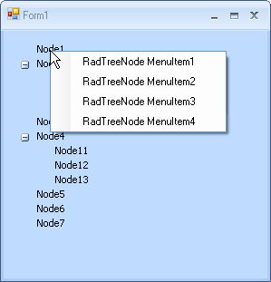
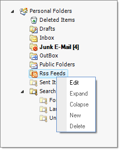

# Context Menus

Context menus can be added to a RadTreeView or to each individual node. Context menus for nodes take precedence over the menu for the RadTreeView. To add a context menu to your RadTreeView, you should drag and drop RadContextMenu component on your form and then create a RadContextMenuManager. This will add a __RadContextMenu__ property for RadTreeView and you will be able to set the RadContextMenu instance to this property.

You can also assign a RadContextMenu instance to an individual node. However, you do not need a [RadContextMenuManager](http://www.telerik.com/help/winforms/Assign_RadContextMenu_to_Telerik_and_non-Telerik_controls.html) for this purpose. You can simply use the RadTreeView Property Builder:

1. Drag and drop RadTreeView control on your form. 

2. Drag and drop RadContextMenu component on your form. Add several RadMenuItems to it.

3. Click the Smart-Tag of the RadContextMenu instance. Choose __Add ContextMenuManager__ from the Action Menu to create a RadContextMenuManager. A RadContextMenuManager instance will be created on the form and a __RadContextMenu__ property will become available for the RadTreeView instance. 

4. Set the RadContextMenu property to the RadContextMenu instance.

5. Create a new instance of RadContextMenu by a drag and drop operation. Add several RadMenuItems to it.

6. Open RadTreeView Property Builder and assign the second RadContextMenu instance to the desired nodes by setting the __ContextMenu__ property.

7. Run the project. As you can notice below, when you right click on a RadTreeNode we get the second RadContextMenu instance shown and when we right click just on the RadTreeView, the first RadContextMenu instance is shown.
    
    

In addition, __RadTreeView__ has a built-in context menu which is disabled by default. Enable the default menu by setting the __AllowDefaultContextMenu__ property to true. The built-in context menu has the following default items:

1. Edit - starts the tree view editor for the current node. 

1. Expand - expands the current node 

1. Collapse - collapses the current node 

1. New - create a new instance of the current node 

1. Delete -  deletes the current node

Add or remove "New" and "Delete from the context menu by setting the __AllowAddNewInContextMenu__ and __AllowDeleteInContextMenu__properties of RadTreeView.

