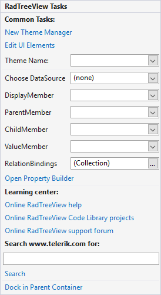

# Smart Tag

The Smart Tag for RadTreeView lets you quickly access common tasks involved with building RadTreeView elements and customizing appearance through themes.

* __New Theme Manager__: Adds a new __RadThemeManager__ component to the form.

* __Theme Name__: Select a theme name from the drop down list of themes available for that control. Selecting a theme allows you to change all aspects of the controls visual style at one time.

* __Learning Center__: Navigate to the Telerik help, code library projects or support forum.

* __Search__: Search the Telerik site for a given string.

* __Open__ [Property Builder](): Use the Property Builder to quickly create and arrange node structure and appearance.

* __Dock in parent container__: Docks RadTreeView into the parent container.
