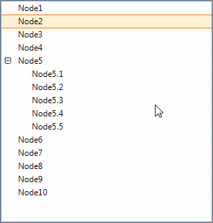
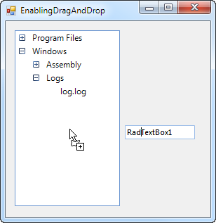

# Enabling Drag and Drop

The key RadTreeView boolean properties enable Drag and Drop functionality: __AllowDragDrop__,
        and __AllowDrop__.
      

* __AllowDragDrop__ enables the drag and drop functionality for a tree view control. Drag and drop functionality can also be used to reorder nodes.
          

* __AllowDrop__when true accepts data that the user drags onto it. This event is used to interact with drag and drop for standard Windows controls.
          

>Multiple nodes can be dragged if the RadTreeView __AllowMultiSelect__ property is true.
        

## AllowDragDrop

__AllowDragDrop__ when true enables fully automatic drag and drop. The selected node and child nodes are all moved to the target location with user interaction only.  No code is required. The following screenshots show drag and drop behaviors. Notice the visual cues that assist the user in navigating the tree.
        

<table><tr><td>

<b>Description</b></td><td>

<b>User Action</b></td></tr><tr><td>

"Node"2" is dropped on "Node8". The result is that "Node2" is added as a child node of "Node8".</td><td></td></tr><tr><td>

For the other cases the dashed line described there the dragged node will be inserted. In this case "Node9" is going to me placed between
                nodes "Node5.2" and "Node5.3". The result is that "Node9" will be added as a sibling of "Node5.2" and located just above "Node5.3". 
              </td><td></td></tr></table>

## AllowDrop 

__AllowDrop__ when true enables RadTreeView to accept data dropped onto it. This event can be used to allow interaction between standard Windows controls
          and RadTreeView. In the example below a RadTextBox control is dragged to a RadTreeNode.
        

To implement this functionality:

* Set __AllowDrop__for both RadTreeView and the RadTextBox control to true.
            

* Code the MouseDown event handler of the RadTextBox HostedControl to call the control's __DoDragDrop()__ method.
          
          

* Code the RadTreeView DragEnter event handler to set the arguments __Effects__ property.
            

* Code the RadTreeView DragDrop event handler to react to the drop operation. In the code sample below the RadTreeView __PointToClient()__ and __GetNodeAt()__ methods are used to retrieve the dropped node.
         

#### __[C#]__

{{region dragDrop}}
	        public EnablingDragAndDrop()
	        {
	            InitializeComponent();
	
	            radTextBox1.TextBoxElement.TextBoxItem.HostedControl.MouseDown +=new MouseEventHandler(textBox1_MouseDown);
	            radTreeView1.DragEnter+=new DragEventHandler(radTreeView_DragEnter);
	            radTreeView1.DragDrop+=new DragEventHandler(radTreeView_DragDrop);
	
	            radTreeView1.AllowDrop = true;
	            this.radTextBox1.AllowDrop = true;
	        }
	
	        private void textBox1_MouseDown(object sender, MouseEventArgs e)
	        {
	            this.radTextBox1.DoDragDrop(this.radTextBox1.Text, DragDropEffects.Copy | DragDropEffects.Move);
	        }
	
	        private void radTreeView_DragEnter(object sender, DragEventArgs e)
	        {
	            if (e.Data.GetDataPresent(DataFormats.Text))
	            {
	                e.Effect = DragDropEffects.Copy;
	            }
	            else
	            {
	                e.Effect = DragDropEffects.None;
	            }
	        }
	
	        private void radTreeView_DragDrop(object sender, DragEventArgs e)
	        {
	            Point p = radTreeView1.PointToClient(new Point(e.X, e.Y));
	            RadTreeNode hoverNode = radTreeView1.GetNodeAt(p.X, p.Y);
	            if (hoverNode == null)
	            {
	                radTreeView1.Nodes.Add(e.Data.GetData(DataFormats.Text).ToString());
	                return;
	            }
	            hoverNode.Nodes.Add(e.Data.GetData(DataFormats.Text).ToString());
	        }
	{{endregion}}

#### __[VB.NET]__

{{region dragDrop}}
	    Public Sub New()
	        InitializeComponent()
	
	        AddHandler RadTextBox1.TextBoxElement.TextBoxItem.HostedControl.MouseDown, AddressOf textBox1_MouseDown
	        AddHandler RadTreeView1.DragEnter, AddressOf radTreeView_DragEnter
	        AddHandler RadTreeView1.DragDrop, AddressOf radTreeView_DragDrop
	
	        RadTreeView1.AllowDrop = True
	        Me.RadTextBox1.AllowDrop = True
	    End Sub
	
	    Private Sub textBox1_MouseDown(ByVal sender As Object, ByVal e As MouseEventArgs)
	        Me.RadTextBox1.DoDragDrop(Me.RadTextBox1.Text, DragDropEffects.Copy Or DragDropEffects.Move)
	    End Sub
	
	    Private Sub radTreeView_DragEnter(ByVal sender As Object, ByVal e As DragEventArgs)
	        If e.Data.GetDataPresent(DataFormats.Text) Then
	            e.Effect = DragDropEffects.Copy
	        Else
	            e.Effect = DragDropEffects.None
	        End If
	    End Sub
	
	    Private Sub radTreeView_DragDrop(ByVal sender As Object, ByVal e As DragEventArgs)
	        Dim p As Point = RadTreeView1.PointToClient(New Point(e.X, e.Y))
	        Dim hoverNode As RadTreeNode = RadTreeView1.GetNodeAt(p.X, p.Y)
	        If hoverNode Is Nothing Then
	            RadTreeView1.Nodes.Add(e.Data.GetData(DataFormats.Text).ToString())
	            Return
	        End If
	        hoverNode.Nodes.Add(e.Data.GetData(DataFormats.Text).ToString())
	    End Sub
	    '#End Region
	
	    Protected Overrides Sub OnShown(e As System.EventArgs)
	        MyBase.OnShown(e)
	        AddNodes(RadTreeView1)
	    End Sub
	
	    Private Sub AddNodes(tree As RadTreeView)
	        Dim pf As New RadTreeNode("Program Files")
	
	        Dim telerikF As New RadTreeNode("Telerik")
	        telerikF.Nodes.Add(New RadTreeNode("Examples.exe"))
	        pf.Nodes.Add(telerikF)
	
	        Dim ieF As New RadTreeNode("Internet Explorer")
	        ieF.Nodes.Add(New RadTreeNode("iexplore.exe"))
	        pf.Nodes.Add(ieF)
	
	        Dim msSqlF As New RadTreeNode("Microsoft SQL")
	        msSqlF.Nodes.Add(New RadTreeNode("SampleDB.mdf"))
	        pf.Nodes.Add(msSqlF)
	
	        Dim msOF As New RadTreeNode("Microsoft Office")
	        msOF.Nodes.Add(New RadTreeNode("word.exe"))
	        pf.Nodes.Add(msOF)
	
	        Dim file As New RadTreeNode("Thumbs.db")
	        pf.Nodes.Add(file)
	
	        tree.Nodes.Add(pf)
	
	        Dim wf As New RadTreeNode("Windows")
	
	        Dim asF As New RadTreeNode("Assembly")
	        wf.Nodes.Add(asF)
	
	        Dim uiFile As New RadTreeNode("Telerik.WinControls.UI.dll")
	        asF.Nodes.Add(uiFile)
	
	        Dim thFile As New RadTreeNode("TelerikCommon.dll")
	        asF.Nodes.Add(thFile)
	
	        Dim logsF As New RadTreeNode("Logs")
	        wf.Nodes.Add(logsF)
	
	        Dim logFile As New RadTreeNode("log.log")
	        logsF.Nodes.Add(logFile)
	
	        tree.Nodes.Add(wf)
	    End Sub
	
	    ''#Region "dragEnding" 
	    'THIS FUNCTIONALITY (TO HAVE THE ARROW DIRECTION AND TO BE ABLE TO RESTRICT DROPPING A NODE AT CERTAIN PLACES)
	    ''SHOULD BE ADDED TO HELP, ONCE IT IS IMPLEMENTED
	    'Private Sub radTreeView1_DragEnding(ByVal sender As Object, ByVal e As RadTreeViewDragCancelEventArgs)
	    '    'NICK
	    '    'If e.Direction = Telerik.WinControls.ArrowDirection.Down Then
	    '    '    e.Cancel = True
	    '    'End If
	    '    'If e.Node.Text = "In Box" Then
	    '    '    e.Cancel = True
	    '    'End If
	    'End Sub
	    ''#End Region
	
	    ''#Region "expansion"
	    'Private _dragging As Boolean
	
	    'Private Sub radTreeView1_DragStarted(ByVal sender As Object, ByVal e As RadTreeViewDragEventArgs)
	    '    _dragging = True
	    'End Sub
	
	    'Private Sub radTreeView1_DragEnded(ByVal sender As Object, ByVal e As RadTreeViewDragEventArgs)
	    '    _dragging = False
	    'End Sub
	
	    'Private Sub radTreeView1_NodeExpandedChanged(ByVal sender As Object, ByVal e As RadTreeViewEventArgs)
	    '    If _dragging Then
	    '        If e.Node.Expanded Then
	    '            e.Node.Collapse()
	    '        End If
	    '    End If
	    'End Sub
	    ''#End Region
	
	    'Protected Overrides Sub OnLoad(ByVal e As EventArgs)
	    '    MyBase.OnLoad(e)
	
	    '    AddHandler RadTreeView1.DragEnding, AddressOf radTreeView1_DragEnding
	    '    AddHandler RadTreeView1.DragStarted, AddressOf radTreeView1_DragStarted
	    '    AddHandler RadTreeView1.DragEnded, AddressOf radTreeView1_DragEnded
	    '    AddHandler RadTreeView1.NodeExpandedChanged, AddressOf radTreeView1_NodeExpandedChanged
	    'End Sub
	End Class

