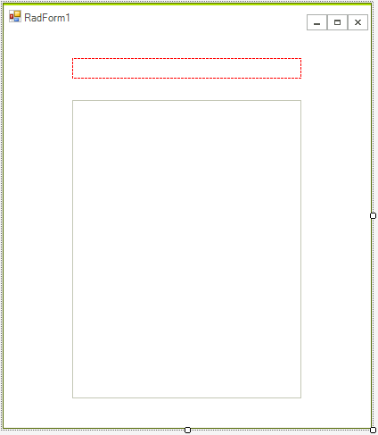
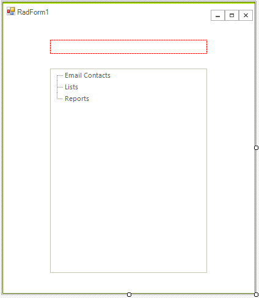

# Getting Started


The following tutorial will help you get started working with the __RadTreeView__ at design time and programmatically. Topics included are: 

* Associating breadcrumb component to the __RadTreeView.__

* Using the __RadTreeView__ designer to add and configure nodes.

* Programmatically adding and configuring nodes.

##  Getting Started Tutorial

1. Create a new Windows Forms Application.

1. On the form add a __RadBreadCrumb__ and __RadTreeView__.
            

1. In the Properties Window  for the __RadBreadCrumb__. Set the __DefaultTreeView__ property to point to the __RadTreeView__. The design should now look something like this.
    
    

1. Right click the __RadTreeView__ and select __Open Property Builder__ from the context menu. You will see a set of buttons on the left side of the __RadTreeView__ Property Builder and a preview of the tree view below the buttons. See [Property Builder]() topic for a complete  tour of functionality.
            

1. Click the far left button (a green "Plus" button that adds nodes) three times to add three nodes.

1. Click the first node and enter "Email Contacts" in the Text entry.

1. Click the second node and enter "Lists" in the __Text__ entry.
            

1. Click the third node and enter "Reports" in the __Text__ entry.
            

1. Click the RadTreeView Properties tab located in the left part of the Window.

1. Check the __Show Lines__.
            

1. Click OK to close the Property Builder.The design should now look something like the screenshot below.

    

1. In the form code add a "using" statement for Telerik.WinControls.UI

1. In the form's constructor add the code appearing below the __InitializeComponent()__ method call. This code creates new __RadTreeNode__ objects, populates them with text and attaches them to parent nodes.


{{source=..\SamplesCS\TreeView\GettingStarted.cs region=GettingStarted}} 
{{source=..\SamplesVB\TreeView\TreeViewGettingStarted.vb region=GettingStarted}} 

````C#
            
RadTreeNode node = radTreeView1.Nodes["Email Contacts"].Nodes.Add("Bob Tony");
node.Selected = true;
            
radTreeView1.Nodes["Email Contacts"].Nodes.Add("Sue Winchell");
radTreeView1.Nodes["Email Contacts"].Nodes.Add("Lui Sang");
radTreeView1.Nodes["Lists"].Nodes.Add("Priorities");
radTreeView1.Nodes["Lists"].Nodes.Add("Opportunities");
radTreeView1.Nodes["Lists"].Nodes.Add("Issues");
            
node = radTreeView1.Nodes["Reports"].Nodes.Add("June Sales");
node = radTreeView1.Nodes["Reports"].Nodes.Add("July Sales");
node = radTreeView1.Nodes["Reports"].Nodes.Add("First Quarter Summary");
node = radTreeView1.Nodes["Reports"].Nodes.Add("Second Quarter Summary");

````
````VB.NET
Dim node As RadTreeNode = RadTreeView1.Nodes("Email Contacts").Nodes.Add("Bob Tony")
node.Selected = True
RadTreeView1.Nodes("Email Contacts").Nodes.Add("Sue Winchell")
RadTreeView1.Nodes("Email Contacts").Nodes.Add("Lui Sang")
RadTreeView1.Nodes("Lists").Nodes.Add("Priorities")
RadTreeView1.Nodes("Lists").Nodes.Add("Opportunities")
RadTreeView1.Nodes("Lists").Nodes.Add("Issues")
node = RadTreeView1.Nodes("Reports").Nodes.Add("June Sales")
node = RadTreeView1.Nodes("Reports").Nodes.Add("July Sales")
node = RadTreeView1.Nodes("Reports").Nodes.Add("First Quarter Summary")
node = RadTreeView1.Nodes("Reports").Nodes.Add("Second Quarter Summary")

````

{{endregion}} 

14\. Run the application.


