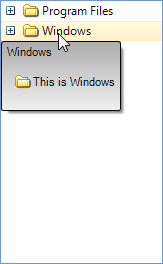

# Assign RadScreenTip to nodes

In order to assign __RadScreenTip__ to the nodes of RadTreeView you should use the __ScreenTipNeeded__ event.

If the item which needs a ScreenTip is a TreeNodeElement, you set the necessary properties of the globally instantiated __RadOffice2007ScreenTip__:



{{source=..\SamplesCS\TreeView\HowTo\TreeScreenTips.cs region=screenTip}} 
{{source=..\SamplesVB\TreeView\HowTo\TreeScreenTips.vb region=screenTip}} 

````C#
RadOffice2007ScreenTipElement screenTip = new RadOffice2007ScreenTipElement();
Size size = new Size(120, 70);
Padding pad = new Padding(2);
void radTreeView1_ScreenTipNeeded(object sender, Telerik.WinControls.ScreenTipNeededEventArgs e)
{
    TreeNodeElement node = e.Item as TreeNodeElement;
    if (node != null)
    {
        screenTip.MainTextLabel.Image = node.ImageElement.Image;
        screenTip.MainTextLabel.TextImageRelation = TextImageRelation.ImageBeforeText;
        screenTip.MainTextLabel.Padding = pad;
        screenTip.MainTextLabel.Text = "This is " + node.ContentElement.Text;
        screenTip.MainTextLabel.Margin = new System.Windows.Forms.Padding(10);
        screenTip.CaptionLabel.Padding = pad;
        screenTip.CaptionLabel.Text = node.ContentElement.Text;
        screenTip.EnableCustomSize = true;
        screenTip.AutoSize = false;
        screenTip.Size = size;
        node.ScreenTip = this.screenTip;
    }
}

````
````VB.NET
Private screenTip As New RadOffice2007ScreenTipElement()
Private Shadows size As New Size(120, 70)
Private pad As New Padding(2)
Private Sub radTreeView1_ScreenTipNeeded(ByVal sender As Object, ByVal e As Telerik.WinControls.ScreenTipNeededEventArgs)
    Dim node As TreeNodeElement = TryCast(e.Item, TreeNodeElement)
    If node IsNot Nothing Then
        screenTip.MainTextLabel.Image = node.ImageElement.Image
        screenTip.MainTextLabel.TextImageRelation = TextImageRelation.ImageBeforeText
        screenTip.MainTextLabel.Padding = pad
        screenTip.MainTextLabel.Text = "This is " & node.ContentElement.Text
        screenTip.MainTextLabel.Margin = New System.Windows.Forms.Padding(10)
        screenTip.CaptionLabel.Padding = pad
        screenTip.CaptionLabel.Text = node.ContentElement.Text
        screenTip.EnableCustomSize = True
        screenTip.AutoSize = False
        screenTip.Size = size
        node.ScreenTip = Me.screenTip
    End If
End Sub

````

{{endregion}} 


# See Also
* [Keep RadTreeView states on reset]()

