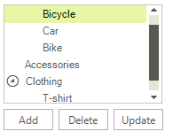
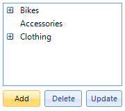
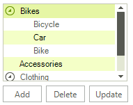

# Keep RadTreeView states on reset


## 

The __RadTreeView__ is a control that allows you to visualize hierarchical structures of data in the form of a tree.
        However, when in bound mode, when a change in the underlying data source occurs, the tree needs to repopulate itself in order to get the latest changes.
        As a result, the Expanded state of the available nodes, selection and scroll bar position are not kept. This article explains how to save the tree state
        prior the change and restore it afterwards.
      

The following code snippet demonstrates how to populate the __RadTreeView__ with hierarchical data.
      #_[C#]_

	


{{source=..\SamplesCS\TreeView\HowTo\KeepTreeViewStates.cs region=BindToObjectRelationalData}} 
{{source=..\SamplesVB\TreeView\HowTo\KeepTreeViewStates.vb region=BindToObjectRelationalData}} 

````C#
        
        public KeepTreeViewStates()
        {
            InitializeComponent();
            
            BindingList<ChildObject> bikesChildren = new BindingList<ChildObject>();
            bikesChildren.Add(new ChildObject(567, "Bicycle"));
            bikesChildren.Add(new ChildObject(456, "Car"));
            bikesChildren.Add(new ChildObject(789, "Bike"));
            
            BindingList<ChildObject> clothingChildren = new BindingList<ChildObject>();
            clothingChildren.Add(new ChildObject(352, "T-shirt"));
            clothingChildren.Add(new ChildObject(981, "Dress"));
            
            List<ParentObject> parents = new List<ParentObject>();
            parents.Add(new ParentObject(182,"Bikes", bikesChildren));
            parents.Add(new ParentObject(346,"Accessories", null));
            parents.Add(new ParentObject(291,"Clothing", clothingChildren));
            
            radTreeView1.DataSource = parents;
            radTreeView1.DisplayMember = "Title\\Description";
            radTreeView1.ChildMember = "Parents\\Children";
            radTreeView1.MultiSelect = true;
        }
        
        public class ParentObject
        {
            public int ID { get; set; }
            
            public string Title { get; set; }
            
            public BindingList<ChildObject> Children { get; set; }
            
            public ParentObject(int iD, string title, BindingList<ChildObject> children)
            {
                this.ID = iD;
                this.Title = title;
                this.Children = children;
            }
        }
        
        public class ChildObject: INotifyPropertyChanged
        { 
            public event PropertyChangedEventHandler PropertyChanged;
            
            private int id;
            private string description;
            
            public int ID
            {
                get
                {
                    return this.id;
                }
                set
                {
                    this.id = value;
                    OnPropertyChanged("ID");
                }
            }
            
            public string Description
            {
                get
                {
                    return this.description;
                }
                set
                {
                    this.description = value;
                    OnPropertyChanged("Description");
                }
            }
            
            public ChildObject(int iD, string description)
            {
                this.id = iD;
                this.description = description;
            }
            
            protected virtual void OnPropertyChanged(string propertyName)
            {
                if (PropertyChanged != null)
                {
                    PropertyChanged(this, new PropertyChangedEventArgs(propertyName));
                }
            }
        }
````
````VB.NET

    Public Sub New()
        InitializeComponent()

        Dim bikesChildren As New BindingList(Of ChildObject)()
        bikesChildren.Add(New ChildObject(567, "Bicycle"))
        bikesChildren.Add(New ChildObject(456, "Car"))
        bikesChildren.Add(New ChildObject(789, "Bike"))

        Dim clothingChildren As New BindingList(Of ChildObject)()
        clothingChildren.Add(New ChildObject(352, "T-shirt"))
        clothingChildren.Add(New ChildObject(981, "Dress"))

        Dim parents As New List(Of ParentObject)()
        parents.Add(New ParentObject(182, "Bikes", bikesChildren))
        parents.Add(New ParentObject(346, "Accessories", Nothing))
        parents.Add(New ParentObject(291, "Clothing", clothingChildren))

        RadTreeView1.DataSource = parents
        RadTreeView1.DisplayMember = "Title\Description"
        RadTreeView1.ChildMember = "Parents\Children"
        RadTreeView1.MultiSelect = True
    End Sub

    Public Class ParentObject
        Public Property ID() As Integer
            Get
                Return m_ID
            End Get
            Set(value As Integer)
                m_ID = value
            End Set
        End Property
        Private m_ID As Integer

        Public Property Title() As String
            Get
                Return m_Title
            End Get
            Set(value As String)
                m_Title = value
            End Set
        End Property
        Private m_Title As String

        Public Property Children() As BindingList(Of ChildObject)
            Get
                Return m_Children
            End Get
            Set(value As BindingList(Of ChildObject))
                m_Children = value
            End Set
        End Property
        Private m_Children As BindingList(Of ChildObject)

        Public Sub New(iD As Integer, title As String, children As BindingList(Of ChildObject))
            Me.ID = iD
            Me.Title = title
            Me.Children = children
        End Sub
    End Class

    Public Class ChildObject
    Implements System.ComponentModel.INotifyPropertyChanged

        Public Event PropertyChanged As PropertyChangedEventHandler Implements System.ComponentModel.INotifyPropertyChanged.PropertyChanged

        Private m_id As Integer
        Private m_description As String

        Public Property ID() As Integer
            Get
                Return Me.m_id
            End Get
            Set(value As Integer)
                Me.m_id = value
                OnPropertyChanged("ID")
            End Set
        End Property

        Public Property Description() As String
            Get
                Return Me.m_description
            End Get
            Set(value As String)
                Me.m_description = value
                OnPropertyChanged("Description")
            End Set
        End Property

        Public Sub New(iD As Integer, description As String)
            Me.m_id = iD
            Me.m_description = description
        End Sub

        Protected Overridable Sub OnPropertyChanged(propertyName As String)
            RaiseEvent PropertyChanged(Me, New PropertyChangedEventArgs(propertyName))
        End Sub
    End Class
````

{{endregion}} 


On the left figure, you can see the tree with some selected and expanded nodes and the scroll bar in the middle of the tree.
          On the right figure, you see how the tree is collapsed after we add a node to its data source.
        


|Initial state|After a change in the data source occurs|
|||

Unfortunately, a solution of this cannot be added to the control as it
          depends on the case and there has to be logic added for the specific case to be handled.To keep the expanded
          and selected state of RadTreeView after a change in the data source occurs, we can use a Dictionary with some
          unique value for a key i.e. this could be the node’s Text, DataBoundItem, Value, or even an ID taken from the
          DataBoundItem and store the state for the node in it. The following example demonstrates how to create a simple
          structure State, which will hold and describe the state of a node. The SaveExpandedStates method is used to recursively
          iterate all nodes in RadTreeView and populate a dictionary with the nodes information. The RestoreExpandedStates is 
          used to read the saved states from the dictionary, find the respective node and restore its state.
        #_[C#]_

	


{{source=..\SamplesCS\TreeView\HowTo\KeepTreeViewStates.cs region=SaveRestore}} 
{{source=..\SamplesVB\TreeView\HowTo\KeepTreeViewStates.vb region=SaveRestore}} 

````C#
        
        Dictionary<object, State> nodeStates = new Dictionary<object, State>();
        
        struct State
        {
            public bool Expanded { get; set; }
            
            public bool Selected { get; set; }
            
            public State(bool expanded, bool selected) : this()
            {
                this.Expanded = expanded;
                this.Selected = selected;
            }
        }
        
        private void SaveExpandedStates(RadTreeNode nodeToSave)
        {
            {
                if (nodeToSave != null && nodeToSave.DataBoundItem != null)
                {
                    if (! nodeStates.ContainsKey(nodeToSave.DataBoundItem))
                    {
                        nodeStates.Add(nodeToSave.DataBoundItem, new State(nodeToSave.Expanded, nodeToSave.Selected));
                    }
                    else
                    {
                        nodeStates[nodeToSave.DataBoundItem] = new State(nodeToSave.Expanded, nodeToSave.Selected);
                    }
                }
                foreach (RadTreeNode childNode in nodeToSave.Nodes)
                {
                    SaveExpandedStates(childNode);
                }
            }
        }
        
        private void RestoreExpandedStates(RadTreeNode nodeToRestore)
        {
            if (nodeToRestore != null && nodeToRestore.DataBoundItem != null &&
                nodeStates.ContainsKey(nodeToRestore.DataBoundItem))
            {
                nodeToRestore.Expanded = nodeStates[nodeToRestore.DataBoundItem].Expanded;
                nodeToRestore.Selected = nodeStates[nodeToRestore.DataBoundItem].Selected;
            }
            
            foreach (RadTreeNode childNode in nodeToRestore.Nodes)
            {
                RestoreExpandedStates(childNode);
            }
        }
````
````VB.NET

    Private nodeStates As New Dictionary(Of Object, State)()

    Private Structure State
        Public Property Expanded() As Boolean
            Get
                Return m_Expanded
            End Get
            Set(value As Boolean)
                m_Expanded = value
            End Set
        End Property
        Private m_Expanded As Boolean

        Public Property Selected() As Boolean
            Get
                Return m_Selected
            End Get
            Set(value As Boolean)
                m_Selected = value
            End Set
        End Property
        Private m_Selected As Boolean

        Public Sub New(expanded As Boolean, selected As Boolean)
            Me.Expanded = expanded
            Me.Selected = selected
        End Sub
    End Structure

    Private Sub SaveExpandedStates(nodeToSave As RadTreeNode)
        If True Then
            If nodeToSave IsNot Nothing AndAlso nodeToSave.DataBoundItem IsNot Nothing Then
                If Not nodeStates.ContainsKey(nodeToSave.DataBoundItem) Then
                    nodeStates.Add(nodeToSave.DataBoundItem, New State(nodeToSave.Expanded, nodeToSave.Selected))
                Else
                    nodeStates(nodeToSave.DataBoundItem) = New State(nodeToSave.Expanded, nodeToSave.Selected)
                End If
            End If
            For Each childNode As RadTreeNode In nodeToSave.Nodes
                SaveExpandedStates(childNode)
            Next
        End If
    End Sub

    Private Sub RestoreExpandedStates(nodeToRestore As RadTreeNode)
        If nodeToRestore IsNot Nothing AndAlso nodeToRestore.DataBoundItem IsNot Nothing AndAlso nodeStates.ContainsKey(nodeToRestore.DataBoundItem) Then
            nodeToRestore.Expanded = nodeStates(nodeToRestore.DataBoundItem).Expanded
            nodeToRestore.Selected = nodeStates(nodeToRestore.DataBoundItem).Selected
        End If

        For Each childNode As RadTreeNode In nodeToRestore.Nodes
            RestoreExpandedStates(childNode)
        Next
    End Sub
````

{{endregion}} 


Once we have these methods implemented, we can use the dictionary to save the RadTreeView state prior the change occurs and restore it afterwards.
          In the example below, we are also saving and restoring the scroll bar position.
        #_[C#]_

	


{{source=..\SamplesCS\TreeView\HowTo\KeepTreeViewStates.cs region=KeepTreeViewStates}} 
{{source=..\SamplesVB\TreeView\HowTo\KeepTreeViewStates.vb region=KeepTreeViewStates}} 

````C#
        
        private void radButtonAdd_Click(object sender, EventArgs e)
        {
            int scrollBarValue = radTreeView1.VScrollBar.Value;           
            foreach (RadTreeNode nodeToSave in radTreeView1.Nodes)
            {
                SaveExpandedStates(nodeToSave);
            }
            
            ParentObject parent = radTreeView1.Nodes[0].DataBoundItem as ParentObject;
            parent.Children.Add(new ChildObject(673,"New child"));    
            
            radTreeView1.TreeViewElement.Update(RadTreeViewElement.UpdateActions.ItemAdded);
            
            foreach (RadTreeNode nodeToRestore in radTreeView1.Nodes)
            {
                RestoreExpandedStates(nodeToRestore);
            }
            radTreeView1.VScrollBar.Value = scrollBarValue;
        }
        
        private void radButtonDelete_Click(object sender, EventArgs e)
        {
            int scrollBarValue = radTreeView1.VScrollBar.Value;           
            foreach (RadTreeNode nodeToSave in radTreeView1.Nodes)
            {
                SaveExpandedStates(nodeToSave);
            }
            
            ParentObject parent = radTreeView1.Nodes[0].DataBoundItem as ParentObject;
            parent.Children.Clear();
            
            radTreeView1.TreeViewElement.Update(RadTreeViewElement.UpdateActions.ItemRemoved);
            
            foreach (RadTreeNode nodeToRestore in radTreeView1.Nodes)
            {
                RestoreExpandedStates(nodeToRestore);
            }
            radTreeView1.VScrollBar.Value = scrollBarValue;
        }
        
        private void radButtonUpdate_Click(object sender, EventArgs e)
        {
            int scrollBarValue = radTreeView1.VScrollBar.Value;           
            foreach (RadTreeNode nodeToSave in radTreeView1.Nodes)
            {
                SaveExpandedStates(nodeToSave);
            }
            
            ParentObject parent = radTreeView1.Nodes[2].DataBoundItem as ParentObject;
            parent.Children[1].Description = "New description";
            
            foreach (RadTreeNode nodeToRestore in radTreeView1.Nodes)
            {
                RestoreExpandedStates(nodeToRestore);
            }
            radTreeView1.VScrollBar.Value = scrollBarValue;
        }
````
````VB.NET

    Private Sub radButtonAdd_Click(sender As Object, e As EventArgs) Handles RadButtonAdd.Click
        Dim scrollBarValue As Integer = RadTreeView1.VScrollBar.Value
        For Each nodeToSave As RadTreeNode In RadTreeView1.Nodes
            SaveExpandedStates(nodeToSave)
        Next

        Dim parent As ParentObject = TryCast(RadTreeView1.Nodes(0).DataBoundItem, ParentObject)
        parent.Children.Add(New ChildObject(673, "New child"))

        RadTreeView1.TreeViewElement.Update(RadTreeViewElement.UpdateActions.ItemAdded)

        For Each nodeToRestore As RadTreeNode In RadTreeView1.Nodes
            RestoreExpandedStates(nodeToRestore)
        Next
        RadTreeView1.VScrollBar.Value = scrollBarValue
    End Sub

    Private Sub radButtonDelete_Click(sender As Object, e As EventArgs) Handles RadButtonDelete.Click
        Dim scrollBarValue As Integer = RadTreeView1.VScrollBar.Value
        For Each nodeToSave As RadTreeNode In RadTreeView1.Nodes
            SaveExpandedStates(nodeToSave)
        Next

        Dim parent As ParentObject = TryCast(RadTreeView1.Nodes(0).DataBoundItem, ParentObject)
        parent.Children.Clear()

        RadTreeView1.TreeViewElement.Update(RadTreeViewElement.UpdateActions.ItemRemoved)

        For Each nodeToRestore As RadTreeNode In RadTreeView1.Nodes
            RestoreExpandedStates(nodeToRestore)
        Next
        RadTreeView1.VScrollBar.Value = scrollBarValue
    End Sub

    Private Sub radButtonUpdate_Click(sender As Object, e As EventArgs) Handles RadButtonUpdate.Click
        Dim scrollBarValue As Integer = RadTreeView1.VScrollBar.Value
        For Each nodeToSave As RadTreeNode In RadTreeView1.Nodes
            SaveExpandedStates(nodeToSave)
        Next

        Dim parent As ParentObject = TryCast(RadTreeView1.Nodes(2).DataBoundItem, ParentObject)
        parent.Children(1).Description = "New description"

        For Each nodeToRestore As RadTreeNode In RadTreeView1.Nodes
            RestoreExpandedStates(nodeToRestore)
        Next
        RadTreeView1.VScrollBar.Value = scrollBarValue
    End Sub
````

{{endregion}} 


Now, using these methods the tree states will be restored accordingly.
        


|Initial state|After a change in the data source occurs|
|||
