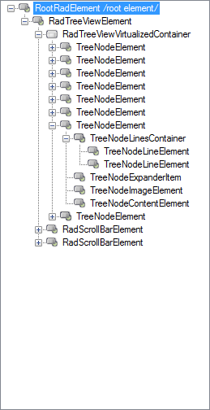

# Structure

>caption Figure 1: RadTreeView Structure

        

1. __TreeNodeElement:__ Represents the entire node element. Contains all other elements.
2. __TreeNodeImageElement:__ Used for displaying an image. 
3. __TreeNodeExpanderItem:__ Used for expanding/collapsing child nodes if any.
4. __TreeNodeLineElement:__ Displays a line that connects the nodes.
5. __TreeNodeContentElement:__ Shows the the node text. Can display additional image as well.

# Elements Hierarchy

>caption Figure 2: Elements Hierarchy

 