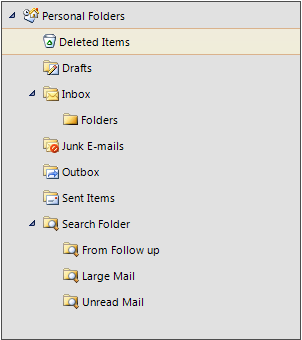
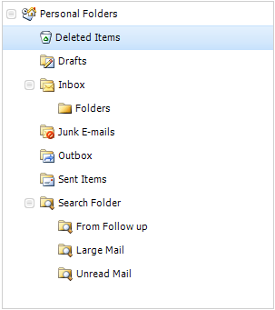
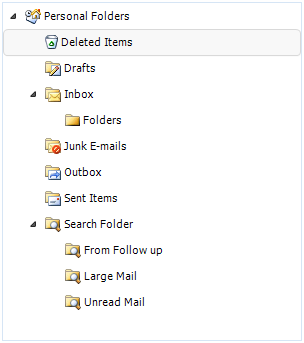

# Themes

The control is shipped with a rich set of themes that allow you to easily build slick interfaces with the look-and-feel of Windows, Office, Outlook, etc. The themes can be easily switched using a single property.

|    |    |
|----|----|
|TelerikMetro |Office2013Dark |Office2013Light|
|Windows 8 |VisualStudio2012Dark |VisualStudio2012Light |
|TelerikMetroBlue |Office2010Black |Office2010Silver |
|ControlDefault |Aqua |Breeze |
|Desert |HighContrastBlack |Office2007Black|
|Office2007Silver |Windows7 |Office2010Blue |
|TelerikMetroTouch |||
