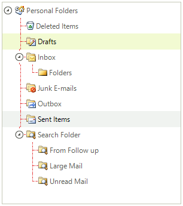
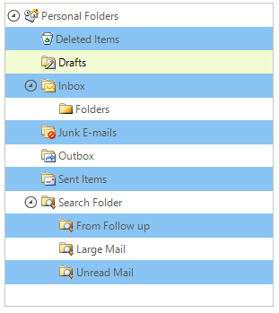

# Tree Lines and Rows

## 

To display lines connecting nodes in RadTreeView set the __ShowLines__property to true. Control the appearance of the lines
          using the __LineStyle__ and __LineColor__ properties. __LineStyle__is
          of type __TreeLineStyle__ and includes the following members __Solid__, __Dash__,
          __Dot__, __DashDot__, __DashDotDot__.
        

#### __[C#] __

{{source=..\SamplesCS\TreeView\GettingStarted.cs region=lines}}
	            
	            radTreeView1.ShowLines = true;
	            radTreeView1.LineStyle = TreeLineStyle.DashDot;
	            
	{{endregion}}

#### __[VB.NET] __

{{source=..\SamplesVB\TreeView\TreeViewGettingStarted.vb region=lines}}
	        RadTreeView1.ShowLines = True
	        RadTreeView1.LineStyle = TreeLineStyle.DashDot
	{{endregion}}

To select rows spanning the entire width of RadTreeView (rather than just the node label), set the __FullRowSelect__property
          to true and __ShowLines__ to false. In addition you can set the alternating row color by setting the
          __AllowAlternatingRowColor__ and __AlternatingRowColor__ properties.
        

#### __[C#] __

{{source=..\SamplesCS\TreeView\GettingStarted.cs region=AlternatingRowColor}}
	        
	            radTreeView1.TreeViewElement.AllowAlternatingRowColor = true;
	            radTreeView1.TreeViewElement.AlternatingRowColor = Color.LightBlue;
	
	{{endregion}}

#### __[VB.NET] __

{{source=..\SamplesVB\TreeView\TreeViewGettingStarted.vb region=AlternatingRowColor}}
	        RadTreeView1.TreeViewElement.AllowAlternatingRowColor = True
	        RadTreeView1.TreeViewElement.AlternatingRowColor = Color.LightBlue
	{{endregion}}

