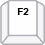

# Keyboard Navigation

## Keyboard Navigation

The user can navigate __RadTreeView__ and control treeview modes using the following keyboard commands:  
        
<table><tr><td></td><td>

<b>Key</b></td><td>

<b>Description</b></td></tr><tr><td></td><td>

Up Arrow </td><td>

moves the selection up in the nodes hierarchy</td></tr><tr><td></td><td>

Down Arrow
              </td><td>

moves the selection down in the nodes hierarchy</td></tr><tr><td></td><td>

Left Arrow
              </td><td>

collapses a node
              </td></tr><tr><td></td><td>

Right Arrow
              </td><td>

expands a node</td></tr><tr><td></td><td>

Enter
              </td><td>

expands/collapses a node</td></tr><tr><td></td><td>

Space
              </td><td>

Toggles node's check box</td></tr><tr><td></td><td>

PageUp
              </td><td>

scrolls the scrolling area up with one frame (page)</td></tr><tr><td></td><td>

PageDown
              </td><td>

scrolls the scrolling area down with one frame (page)</td></tr><tr><td></td><td>

F2
              </td><td>

activates tree's editor and places it on the selected node</td></tr><tr><td></td><td>

Esc
              </td><td>

deactivates tree's editor</td></tr><tr><td></td><td>

Home
              </td><td>

moves the selection to the first visible node</td></tr><tr><td></td><td>

End
              </td><td>

moves the selection to the last visible node</td></tr></table>

## Keyboard Search

RadTreeView allows navigation through the visible nodes by using keyboard. Two scenarios are
          supported by default:
        

* Pressing a character will select consequently each node starting with this character
            

* Typing more than one character will navigate to the first node matching the typed string
            

To enable this functionality a single property setting is needed:
        

#### __[C#] __

{{source=..\SamplesCS\TreeView\Usability1\TreeViewUsabilityKeyboardNavigation.cs region=KeyboardSearchEnabled}}
	            radTreeView1.KeyboardSearchEnabled = true;
	{{endregion}}

#### __[VB.NET] __

{{source=..\SamplesVB\TreeView\Usability1\TreeViewUsabilityKeyboardNavigation.vb region=KeyboardSearchEnabled}}
	        radTreeView1.KeyboardSearchEnabled = True
	        '#End Region
	
	        '#region KeyboardSearchResetInterval
	        radTreeView1.KeyboardSearchResetInterval = 500
	{{endregion}}

Another property of interest is the __KeyboardSearchResetInterval__. It is used to determine what time between keystrokes will be considered as typing.
          Consequent keystrokes with performed faster than the specified interval will be considered typing and once the time elapses, the matching node (if such)
          will be selected. Here is how to access this property to change the value of the timer:
        

#### __[C#] __

{{source=..\SamplesCS\TreeView\Usability1\TreeViewUsabilityKeyboardNavigation.cs region=KeyboardSearchResetInterval}}
	            radTreeView1.TreeViewElement.KeyboardSearchResetInterval = 500;
	{{endregion}}

#### __[VB.NET] __

{{source=..\SamplesVB\TreeView\Usability1\TreeViewUsabilityKeyboardNavigation.vb region=KeyboardSearchResetInterval}}
	        radTreeView1.KeyboardSearchResetInterval = 500
	{{endregion}}

