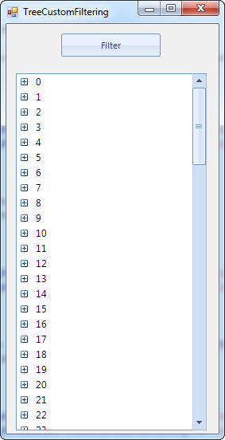
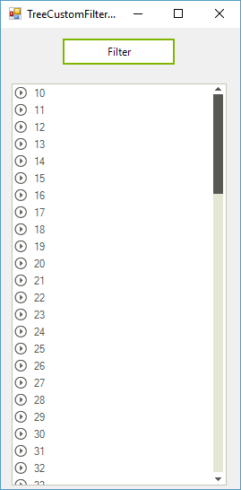

# Custom Filtering


## 

Custom filtering is a flexible mechanism for filtering RadTreeView nodes by using custom logic.
        	It has a higher priority than the applied FilterDescriptors.
        

In order to apply custom logic for filtering, you have to create a 
        	[Predicate](http://msdn.microsoft.com/en-us/library/bfcke1bz.aspx). Here is an example of a __Predicate__ which will return just the
		nodes which text is longer than one char:
        

#_[C#] Creating predicate_

	


{{source=..\SamplesCS\TreeView\WorkingWithNodes\TreeCustomFiltering.cs region=CustomFiltering2}} 
{{source=..\SamplesVB\TreeView\WorkingWithNodes\TreeCustomFiltering.vb region=CustomFiltering2}} 

````C#
        private bool FilterNode(RadTreeNode node)
        {
            if (node.Text.Length > 1)
            {
                return true;
            }

            return false;
        }
````
````VB.NET
    Private Function FilterNode(node As RadTreeNode) As Boolean
        If node.Text.Length > 1 Then
            Return True
        End If

        Return False
    End Function
    '
````

{{endregion}} 


To set the __Predicate__ to RadTreeView, use the
    	__FilterPredicate__ property of the control:
    	

#_[C#] Applying predicate_

	


{{source=..\SamplesCS\TreeView\WorkingWithNodes\TreeCustomFiltering.cs region=CustomFiltering1}} 
{{source=..\SamplesVB\TreeView\WorkingWithNodes\TreeCustomFiltering.vb region=CustomFiltering1}} 

````C#
            radTreeView1.TreeViewElement.FilterPredicate = FilterNode;
````
````VB.NET
        RadTreeView1.TreeViewElement.FilterPredicate = AddressOf FilterNode
        '
````

{{endregion}} 


At the end, in order to apply the filter to the control, just set the __Filter__
    		property to any string, which will invoke the filtering operation:
    	

#_[C#] Invoke filtering_

	


{{source=..\SamplesCS\TreeView\WorkingWithNodes\TreeCustomFiltering.cs region=CustomFiltering3}} 
{{source=..\SamplesVB\TreeView\WorkingWithNodes\TreeCustomFiltering.vb region=CustomFiltering3}} 

````C#
        private void radButton1_Click(object sender, EventArgs e)
        {
            this.radTreeView1.Filter = "Custom";
        }
````
````VB.NET
    Private Sub RadButton1_Click(sender As System.Object, e As System.EventArgs) Handles RadButton1.Click
        Me.RadTreeView1.Filter = "Custom"
    End Sub
    '
````

{{endregion}} 


| Here you have nodes from 1-100 | After the filtering the nodes are only from 10-100, since nodes 1-9 contain just one char as text |
| ------ | ------ |
|||
