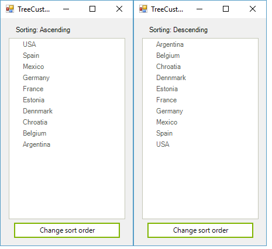

# Custom Sorting

## 

Custom sorting is a flexible mechanism which allows you to replace the default sorting 
      		logic with your own logic. The custom sorting operation has higher priority that the default sorting.
       

To apply your own logic for sorting, you have to create a class which inherits from __TreeNodeComparer__
        	and override its __Compare__ method, where you can add your custom logic. Here is a sample
        	where we will reverse the sorting of the tree i.e. when sorting *Ascending* 
        	we will actually sort in *Descending* order and vice versa. 
        

#### __[C#] Creating custom comparer__

{{source=..\SamplesCS\TreeView\WorkingWithNodes\TreeCustomSorting.cs region=CustomSorting3}}
	    class MyComparer : TreeNodeComparer
	    {
	        public MyComparer(RadTreeViewElement treeView)
	            : base(treeView)
	        {
	
	        }
	
	        public override int Compare(RadTreeNode x, RadTreeNode y)
	        {
	            if (this.TreeViewElement.SortOrder == SortOrder.Descending)
	            {
	                return x.Text.CompareTo(y.Text);
	            }
	
	            return x.Text.CompareTo(y.Text) * -1;
	        }
	    }
	{{endregion}}

#### __[VB.NET] Creating custom comparer__

{{source=..\SamplesVB\TreeView\WorkingWithNodes\TreeCustomSorting.vb region=CustomSorting3}}
	    Class MyComparer
	        Inherits TreeNodeComparer
	        Public Sub New(treeView As RadTreeViewElement)
	
	            MyBase.New(treeView)
	        End Sub
	
	        Public Overrides Function Compare(x As RadTreeNode, y As RadTreeNode) As Integer
	            If Me.TreeViewElement.SortOrder = SortOrder.Descending Then
	                Return x.Text.CompareTo(y.Text)
	            End If
	
	            Return x.Text.CompareTo(y.Text) * -1
	        End Function
	    End Class
	{{endregion}}

Once the comparer is created we have to assign it to the RadTreeView control:

#### __[C#] Assign the custom comparer__

{{source=..\SamplesCS\TreeView\WorkingWithNodes\TreeCustomSorting.cs region=CustomSorting1}}
	            radTreeView1.TreeViewElement.Comparer = new MyComparer(this.radTreeView1.TreeViewElement);
	{{endregion}}

#### __[VB.NET] Assign the custom comparer__

{{source=..\SamplesVB\TreeView\WorkingWithNodes\TreeCustomSorting.vb region=CustomSorting1}}
	        RadTreeView1.TreeViewElement.Comparer = New MyComparer(Me.RadTreeView1.TreeViewElement)
	{{endregion}}

That is all that you have to do. To test this scenario, you can add a button and a label
    		to the form, where you will change and print the sort order. This will allow you to check
    		whether the sorting is reversed:
    	

#### __[C#]__

{{source=..\SamplesCS\TreeView\WorkingWithNodes\TreeCustomSorting.cs region=CustomSorting2}}
	        private void radButton1_Click(object sender, EventArgs e)
	        {
	            if (radTreeView1.SortOrder == SortOrder.None)
	            {
	                radTreeView1.SortOrder = SortOrder.Ascending;
	                radLabel1.Text = "Sorting: Ascending";
	            }
	            else if (radTreeView1.SortOrder == SortOrder.Ascending)
	            {
	                radTreeView1.SortOrder = SortOrder.Descending;
	                radLabel1.Text = "Sorting: Descending";
	            }
	            else
	            {
	                radTreeView1.SortOrder = SortOrder.None;
	                radLabel1.Text = "Sorting: None";
	            }
	        }
	{{endregion}}

#### __[VB.NET]__

{{source=..\SamplesVB\TreeView\WorkingWithNodes\TreeCustomSorting.vb region=CustomSorting2}}
	    Private Sub RadButton1_Click(sender As System.Object, e As System.EventArgs)
	        If RadTreeView1.SortOrder = SortOrder.None Then
	            RadTreeView1.SortOrder = SortOrder.Ascending
	            radLabel1.Text = "Sorting: Ascending"
	        ElseIf RadTreeView1.SortOrder = SortOrder.Ascending Then
	            RadTreeView1.SortOrder = SortOrder.Descending
	            radLabel1.Text = "Sorting: Descending"
	        Else
	            RadTreeView1.SortOrder = SortOrder.None
	            RadLabel1.Text = "None"
	        End If
	    End Sub
	{{endregion}}

<table><tr><td></td><td></td></tr></table>
