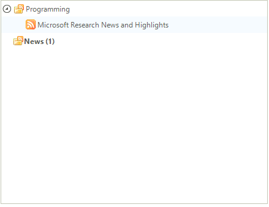

# Filtering Nodes


RadTreeView supports filtering of its nodes according to their __Text__ property. In order to apply a filter, you should set the __Filter__ property of RadTreeView to the desired text value. 
        
For example, if we have this RadTreeView instance:


and we set the Filter property as shown below:

{{source=..\SamplesCS\TreeView\WorkingWithNodes\WorkingWithNodes1.cs region=filter}} 
{{source=..\SamplesVB\TreeView\WorkingWithNodes\WorkingWithNodes1.vb region=filter}} 

````C#
this.radTreeView1.Filter = "new";

````
````VB.NET
Me.RadTreeView1.Filter = "new"

````

{{endregion}} 

we will get this look of RadTreeView at the end:


