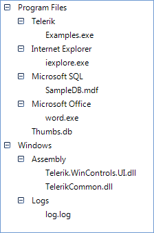

# Formatting Nodes

Similar to RadGridView, RadTreeView uses UI Virtualization. Its visual nodes (TreeNodeElement) are reused by the data nodes (RadTreeNode) which bring increased performance and optimized memory footprint. You can easily format node element by handling the __NodeFormatting__ event. The arguments of this event return the visual Node (and the data Node that is currently assigned to it) that is currently formatted and which you can additionally style.


The purpose of the example that follows is to demonstrate how you can show different images for the RadTreeView nodes depending on their logical state. We are going to simulate a tree of files and folders displaying an image of a closed folder when a node that contains other nodes is collapsed and displaying an image of an opened folder when a node that contains other nodes is expanded.
        

1. Let's fill RadTreeView with some sample nodes which represent files and folders:

    

1. Then, add three images as project resources. These images will indicate if a node is a file, an opened folder or a closed folder
            

1. Handle the NodeFormatting event implementing, setting the image to the Image property of the ImageElement.This element is responsible for containing the image of the visual NodeElement:

{{source=..\SamplesCS\TreeView\WorkingWithNodes\NodeFormatting.cs region=nodeFormatting}} 
{{source=..\SamplesVB\TreeView\WorkingWithNodes\NodeFormatting.vb region=nodeFormatting}} 

````C#
Bitmap folderOpen = SamplesCS.Properties.Resources.folder_open;
Bitmap folderClose = SamplesCS.Properties.Resources.folder_close;
Bitmap file = SamplesCS.Properties.Resources.file;
void radTreeView1_NodeFormatting(object sender, TreeNodeFormattingEventArgs e)
{
    if (e.Node.Nodes.Count > 0)
    {
        if (e.Node.Expanded)
        {
            e.NodeElement.ImageElement.Image = folderOpen;
        }
        else
        {
            e.NodeElement.ImageElement.Image = folderClose;
        }
    }
    else
    {
        e.NodeElement.ImageElement.Image = file;
    }
}

````
````VB.NET
Private folderOpen As Bitmap = My.Resources.folder_open
Private folderClose As Bitmap = My.Resources.folder_close
Private file As Bitmap = My.Resources.file
Private Sub radTreeView1_NodeFormatting(ByVal sender As Object, ByVal e As TreeNodeFormattingEventArgs)
    If e.Node.Nodes.Count > 0 Then
        If e.Node.Expanded Then
            e.NodeElement.ImageElement.Image = folderOpen
        Else
            e.NodeElement.ImageElement.Image = folderClose
        End If
    Else
        e.NodeElement.ImageElement.Image = file
    End If
End Sub

````

{{endregion}} 


>note Please note that you should always provide an 'else' clause for each 'if' clause that you have in the implementation of the NodeFormatting event. Skipping this operation will lead to incorrect images applied to the inappropriate nodes.
>


>note It is also important that we are accessing the project resources outside the NodeFormatting event handler. Accessing project resources is a time consuming operation and since NodeFormatting is fired for every visible node, you may experience performance issues if you try to access such resources in the event handler.
>

