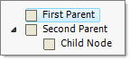
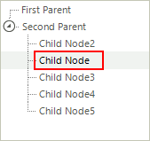

# Reordering Nodes

There are two methods for reordering nodes:

* Using drag and drop the RadTreeView user can reorder the nodes at runtime. In this scenario the developer doesn't have direct control over the node order and the reordering is performed directly by the user. 

* The developer sets the node ordering logic in code.

## Programmatic Reordering

Use the __Insert()__and __Add()__methods of the RadTreeView Nodes collection to reorder nodes programmatically. The code snippet below demonstrates how this is done using the __Add()__method.

#### __[C#]__

{{region reordering}}
	            // Create two parent nodes
	            RadTreeNode parentNode1 = new RadTreeNode("First Parent");
	            RadTreeNode parentNode2 = new RadTreeNode("Second Parent");
	            // Add the parent nodes to tree view's nodes collection
	            this.radTreeView1.Nodes.Add(parentNode1);
	            this.radTreeView1.Nodes.Add(parentNode2);
	            // Create a child node
	            RadTreeNode childNode = new RadTreeNode("Child Node");
	            // Add the child node to the first parent's nodes collection
	            parentNode1.Nodes.Add(childNode);
	            // Remove the child from the first parent collection and add it to the second parent nodes collection
	            parentNode1.Nodes.Remove(childNode);
	            parentNode2.Nodes.Add(childNode);
	{{endregion}}

#### __[VB.NET]__

{{region reordering}}
	        ' Create two parent nodes
	        Dim parentNode1 As New RadTreeNode("First Parent")
	        Dim parentNode2 As New RadTreeNode("Second Parent")
	        ' Add the parent nodes to tree view's nodes collection
	        Me.RadTreeView1.Nodes.Add(parentNode1)
	        Me.RadTreeView1.Nodes.Add(parentNode2)
	        ' Create a child node
	        Dim childNode As New RadTreeNode("Child Node")
	        ' Add the child node to the first parent's nodes collection
	        parentNode1.Nodes.Add(childNode)
	        ' Remove the child from the first parent collection and add it to the second parent nodes collection
	        parentNode1.Nodes.Remove(childNode)
	        parentNode2.Nodes.Add(childNode)
	        '#End Region
	
	        '#Region bringIntoView
	        Dim lastRootNode As RadTreeNode = RadTreeView1.Nodes(RadTreeView1.Nodes.Count - 1)
	        RadTreeView1.BringIntoView(lastRootNode.Nodes(lastRootNode.Nodes.Count - 1))
	        '#End Region
	
	        '#Region editing
	        RadTreeView1.AllowEdit = True
	        ' set the SelectedNode - this node will be edited  
	        RadTreeView1.SelectedNode = RadTreeView1.Nodes(0)
	        ' this will start edit on selected node
	        RadTreeView1.BeginEdit()
	        '#End Region
	
	        '#Region selectedNode
	        RadTreeView1.SelectedNode = RadTreeView1.Nodes(0)
	        '#End Region
	
	        '#Region selectMultiNodes
	        RadTreeView1.MultiSelect = True
	        Dim Node1 As New RadTreeNode("Inbox")
	        Dim Node2 As New RadTreeNode("Deleted Items")
	        Dim Node3 As New RadTreeNode("Outbox")
	        Dim Node4 As New RadTreeNode("Sent")
	        RadTreeView1.Nodes.Add(Node1)
	        RadTreeView1.Nodes.Add(Node2)
	        RadTreeView1.Nodes.Add(Node3)
	        RadTreeView1.Nodes.Add(Node4)
	        Node3.Selected = True
	        Node4.Selected = True
	        '#End Region
	
	        '#region filter
	        Me.RadTreeView1.Filter = "new"
	{{endregion}}

The highlights of the code snippet are the last three lines where a __RadTreeNode__ is created, added to the "First Parent", then added to the "Second Parent". The result is that the "Child Node" is moved to the nodes collection of the "Second Parent".

To move a node into a collection of multiple nodes instead of adding it to the bottom of the collection, use the __Insert()__method of the __Nodes__collection. The Insert() method takes as parameters the index that the node should be placed in and a reference to the node that will be inserted. The code snippet below shows how to reposition a node using the __Insert()__ method.

In the sample code below, two parent nodes are created, a single node is added to the the first parent and multiple nodes are added to the second parent. Then the single child node is inserted to the second parent. The result is that the child node is moved to the "Second Parent" nodes collection. Notice that the nodes collection is zero based so that an index parameter of "1" places the node to the second position in the nodes collection.

#### __[C#]__

{{region insertingNodes}}
	            // Create two parent nodes
	            RadTreeNode parentNode1 = new RadTreeNode("First Parent");
	            RadTreeNode parentNode2 = new RadTreeNode("Second Parent");
	            // Add the parent nodes to tree view's nodes collection
	            this.radTreeView1.Nodes.Add(parentNode1);
	            this.radTreeView1.Nodes.Add(parentNode2);
	            // Create child nodes
	            RadTreeNode childNode = new RadTreeNode("Child Node");
	            RadTreeNode childNode2 = new RadTreeNode("Child Node2");
	            RadTreeNode childNode3 = new RadTreeNode("Child Node3");
	            RadTreeNode childNode4 = new RadTreeNode("Child Node4");
	            RadTreeNode childNode5 = new RadTreeNode("Child Node5");
	            // Add a single child node to the parentNode1 nodes collection and
	            // multiple nodes to the parentNode2 nodes collection
	            parentNode1.Nodes.Add(childNode);
	            parentNode2.Nodes.Add(childNode2);
	            parentNode2.Nodes.Add(childNode3);
	            parentNode2.Nodes.Add(childNode4);
	            parentNode2.Nodes.Add(childNode5);
	            // Insert the childNode instance to the parentNode2 nodes collection
	            parentNode2.Nodes.Insert(1, childNode);
	{{endregion}}

#### __[VB.NET]__

{{region insertingNodes}}
	        ' Create two parent nodes
	        Dim parentNode1 As New RadTreeNode("First Parent")
	        Dim parentNode2 As New RadTreeNode("Second Parent")
	        ' Add the parent nodes to tree view's nodes collection
	        Me.RadTreeView1.Nodes.Add(parentNode1)
	        Me.RadTreeView1.Nodes.Add(parentNode2)
	        ' Create child nodes
	        Dim childNode As New RadTreeNode("Child Node")
	        Dim childNode2 As New RadTreeNode("Child Node2")
	        Dim childNode3 As New RadTreeNode("Child Node3")
	        Dim childNode4 As New RadTreeNode("Child Node4")
	        Dim childNode5 As New RadTreeNode("Child Node5")
	        ' Add a single child node to the parentNode1 nodes collection and
	        ' multiple nodes to the parentNode2 nodes collection
	        parentNode1.Nodes.Add(childNode)
	        parentNode2.Nodes.Add(childNode2)
	        parentNode2.Nodes.Add(childNode3)
	        parentNode2.Nodes.Add(childNode4)
	        parentNode2.Nodes.Add(childNode5)
	        ' Insert the childNode instance to the parentNode2 nodes collection
	        parentNode2.Nodes.Insert(1, childNode)
	        '#End Region
	    End Sub
	
	    Private Sub OptionList()
	        '#Region optionList
	        Dim Node1 As New RadTreeNode("Node1")
	        Node1.Expanded = True
	        Node1.CheckType = ChildListType.OptionList
	        Dim Node2 As New RadTreeNode("Node2")
	        Dim Node3 As New RadTreeNode("Node3")
	        Dim Node4 As New RadTreeNode("Node4")
	        RadTreeView1.Nodes.Add(Node1)
	        RadTreeView1.Nodes.Add(Node2)
	        Node1.Nodes.Add(Node3)
	        Node1.Nodes.Add(Node4)
	        '#End Region
	    End Sub
	
	    '#Region doubleClick
	    Private Sub radTreeView1_DoubleClick(ByVal sender As Object, ByVal e As EventArgs)
	        Dim args As MouseEventArgs = TryCast(e, MouseEventArgs)
	        Dim clickedNode As RadTreeNode = RadTreeView1.GetNodeAt(args.X, args.Y)
	        If clickedNode IsNot Nothing Then
	            MessageBox.Show("Node Text: " & clickedNode.Text & "  Node Value: " & clickedNode.Tag)
	        End If
	    End Sub
	    '#End Region
	
	    '#Region addNodes
	    Private Sub AddNodes()
	        Dim Node1 As New RadTreeNode("Node1")
	        Node1.Tag = 1234
	        Node1.BackColor = Color.Blue
	        Dim Node2 As New RadTreeNode("Node2")
	        Dim Node3 As New RadTreeNode("Node3")
	        Dim Node4 As New RadTreeNode("Node4")
	        RadTreeView1.Nodes.Add(Node1)
	        RadTreeView1.Nodes.Add(Node2)
	        Node1.Nodes.Add(Node3)
	        Node2.Nodes.Add(Node4)
	        'Alternative methods for adding nodes
	        'RadTreeNode Node1 = radTreeView1.Nodes.Add("Node1");
	        'RadTreeNode Node2 = radTreeView1.Nodes.Add("Node2");
	        'Node1.Nodes.Add("Node3");
	        'Node2.Nodes.Add("Node4");
	    End Sub
	    '#End Region
	
	    '#Region removeNodes
	    Private Sub RemoveNodes()
	        'Remove a single node
	        RadTreeView1.Nodes(0).Remove()
	        ' removes all nodes from TreeView
	        RadTreeView1.Nodes.Clear()
	    End Sub
	    '#End Region
	End Class

