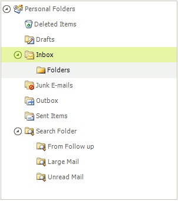
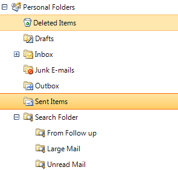

# Selecting Nodes


## Selecting a Single Node

To select a node use the __Selected__ property of __RadTreeNode__. The following example demonstrates how to do it.

{{source=..\SamplesCS\TreeView\WorkingWithNodes\WorkingWithNodes1.cs region=selectedNode}} 
{{source=..\SamplesVB\TreeView\WorkingWithNodes\WorkingWithNodes1.vb region=selectedNode}} 

````C#
radTreeView1.SelectedNode = radTreeView1.Nodes[0];

````
````VB.NET
RadTreeView1.SelectedNode = RadTreeView1.Nodes(0)
'#End Region
'#Region selectMultiNodes
RadTreeView1.MultiSelect = True
Dim Node1 As New RadTreeNode("Inbox")
Dim Node2 As New RadTreeNode("Deleted Items")
Dim Node3 As New RadTreeNode("Outbox")
Dim Node4 As New RadTreeNode("Sent")
RadTreeView1.Nodes.Add(Node1)
RadTreeView1.Nodes.Add(Node2)
RadTreeView1.Nodes.Add(Node3)
RadTreeView1.Nodes.Add(Node4)
Node3.Selected = True
Node4.Selected = True
'#End Region
'#region filter
Me.RadTreeView1.Filter = "new"

````

{{endregion}} 

## Selecting Multiple Nodes

To enable the multiple selection the __MultiSelect__ property of   __RadTreeView__ must be set to __true.__ The default value is __false__.


| __Selection__ | __Example__ | __Description__ |
|---------------|-------------|-----------------|
| __Single Selection__ ||The user can select a single node by clicking the node.|
| __Multiple Selection using the Shift key__ ||To select a continuous series of multiple nodes at one time hold the Shift key and click on a node using the mouse. That will select all nodes between the first selected node and the node that was just clicked. The screenshot shows nodes selected between "Deleted Items" and "Large Mail".|
| __Multiple Selection using the Ctrl key__ ||To select multiple nodes in distributed throughout the RadTreeView, hold the Ctrl key and click on each node using the mouse. That will select the clicked node but not unselect the previously selected nodes. The screenshot shows the "Deleted Items" and "Send Items" nodes selected.|

## Selecting Multiple Nodes Programmatically

To select multiple nodes through the API, just set the Selected property of the desired nodes to true. The example below adds four nodes, then selects the last two nodes.

{{source=..\SamplesCS\TreeView\WorkingWithNodes\WorkingWithNodes1.cs region=selectMultiNodes}} 
{{source=..\SamplesVB\TreeView\WorkingWithNodes\WorkingWithNodes1.vb region=selectMultiNodes}} 

````C#
radTreeView1.MultiSelect = true;
RadTreeNode Node1 = new RadTreeNode("Inbox");
RadTreeNode Node2 = new RadTreeNode("Deleted Items");
RadTreeNode Node3 = new RadTreeNode("Outbox");
RadTreeNode Node4 = new RadTreeNode("Sent");
radTreeView1.Nodes.Add(Node1);
radTreeView1.Nodes.Add(Node2);
radTreeView1.Nodes.Add(Node3);
radTreeView1.Nodes.Add(Node4);
Node3.Selected = true;
Node4.Selected = true;

````
````VB.NET
RadTreeView1.MultiSelect = True
Dim Node1 As New RadTreeNode("Inbox")
Dim Node2 As New RadTreeNode("Deleted Items")
Dim Node3 As New RadTreeNode("Outbox")
Dim Node4 As New RadTreeNode("Sent")
RadTreeView1.Nodes.Add(Node1)
RadTreeView1.Nodes.Add(Node2)
RadTreeView1.Nodes.Add(Node3)
RadTreeView1.Nodes.Add(Node4)
Node3.Selected = True
Node4.Selected = True
'#End Region
'#region filter
Me.RadTreeView1.Filter = "new"

````

{{endregion}}
