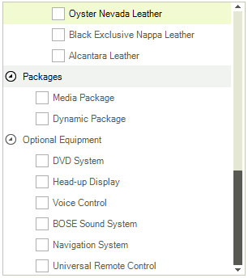
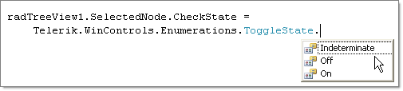
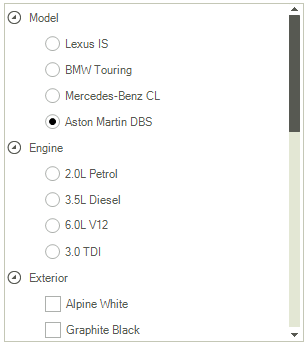

# Using Checkboxes

Enable checkboxes by setting the RadTreeView __CheckBoxes__ boolean property to true. By default all nodes display checkboxes if 
      the __Checkboxes__property is true. To suppress showing a checkbox next to a particular RadTreeNode set the node 
        __CheckType__ property to *None*. To check a node programmatically, use the __Checked__ or 
        __CheckState__ property of RadTreeNode. When the user clicks a checkbox the __NodeCheckChanged__event 
        fires passing in a RadTreeViewEventArgs that contains the checked Node.

## Tri-State Checkboxes

Tri-state checkboxes in addition to having checked and unchecked states also have a "indeterminate" state. To enable this
        feature set the __TriStateMode__ property of RadTreeView to true. The screen shot below shows that "Node1" is in 
          __Indeterminate__ state to indicate that its children are not all checked.

>When __TriStateMode__ is set to true, the __CheckBoxes__ property is also set to true automatically.

To programmatically set the state when __TriStateMode__ is true assign the __CheckState__ 
        property one of the __ToggleState__ enumeration values.

## Option Tree Support

__RadTreeView__ the supports option trees that allows radio buttons and
            check boxes to be mixed in order to form an arbitrary complex option tree.
            The only limitation is that all sibling nodes must have either check boxes or radio buttons.
            Check boxes and radio buttons can be mixed in a single __RadTreeNodeCollection__.
        The __RadTreeNode__property that control the type of option element to 
        be shown (check box or radio button) is __CheckType:__

#### __[C#]__

{{source=..\SamplesCS\TreeView\WorkingWithNodes\WorkingWithNodes1.cs region=optionList}}
	            RadTreeNode Node1 = new RadTreeNode("Node1");
	            Node1.Expanded = true;
	            Node1.CheckType = CheckType.RadioButton;
	            RadTreeNode Node2 = new RadTreeNode("Node2");
	            RadTreeNode Node3 = new RadTreeNode("Node3");
	            RadTreeNode Node4 = new RadTreeNode("Node4");
	            radTreeView1.Nodes.Add(Node1);
	            radTreeView1.Nodes.Add(Node2);
	            Node1.Nodes.Add(Node3);
	            Node1.Nodes.Add(Node4);
	{{endregion}}

#### __[VB.NET]__

{{source=..\SamplesVB\TreeView\WorkingWithNodes\WorkingWithNodes1.vb region=optionList}}
	        Dim Node1 As New RadTreeNode("Node1")
	        Node1.Expanded = True
	        Node1.CheckType = ChildListType.OptionList
	        Dim Node2 As New RadTreeNode("Node2")
	        Dim Node3 As New RadTreeNode("Node3")
	        Dim Node4 As New RadTreeNode("Node4")
	        RadTreeView1.Nodes.Add(Node1)
	        RadTreeView1.Nodes.Add(Node2)
	        Node1.Nodes.Add(Node3)
	        Node1.Nodes.Add(Node4)
	        '#End Region
	    End Sub
	
	    '#Region doubleClick
	    Private Sub radTreeView1_DoubleClick(ByVal sender As Object, ByVal e As EventArgs)
	        Dim args As MouseEventArgs = TryCast(e, MouseEventArgs)
	        Dim clickedNode As RadTreeNode = RadTreeView1.GetNodeAt(args.X, args.Y)
	        If clickedNode IsNot Nothing Then
	            MessageBox.Show("Node Text: " & clickedNode.Text & "  Node Value: " & clickedNode.Tag)
	        End If
	    End Sub
	    '#End Region
	
	    '#Region addNodes
	    Private Sub AddNodes()
	        Dim Node1 As New RadTreeNode("Node1")
	        Node1.Tag = 1234
	        Node1.BackColor = Color.Blue
	        Dim Node2 As New RadTreeNode("Node2")
	        Dim Node3 As New RadTreeNode("Node3")
	        Dim Node4 As New RadTreeNode("Node4")
	        RadTreeView1.Nodes.Add(Node1)
	        RadTreeView1.Nodes.Add(Node2)
	        Node1.Nodes.Add(Node3)
	        Node2.Nodes.Add(Node4)
	        'Alternative methods for adding nodes
	        'RadTreeNode Node1 = radTreeView1.Nodes.Add("Node1");
	        'RadTreeNode Node2 = radTreeView1.Nodes.Add("Node2");
	        'Node1.Nodes.Add("Node3");
	        'Node2.Nodes.Add("Node4");
	    End Sub
	    '#End Region
	
	    '#Region removeNodes
	    Private Sub RemoveNodes()
	        'Remove a single node
	        RadTreeView1.Nodes(0).Remove()
	        ' removes all nodes from TreeView
	        RadTreeView1.Nodes.Clear()
	    End Sub
	    '#End Region
	End Class

